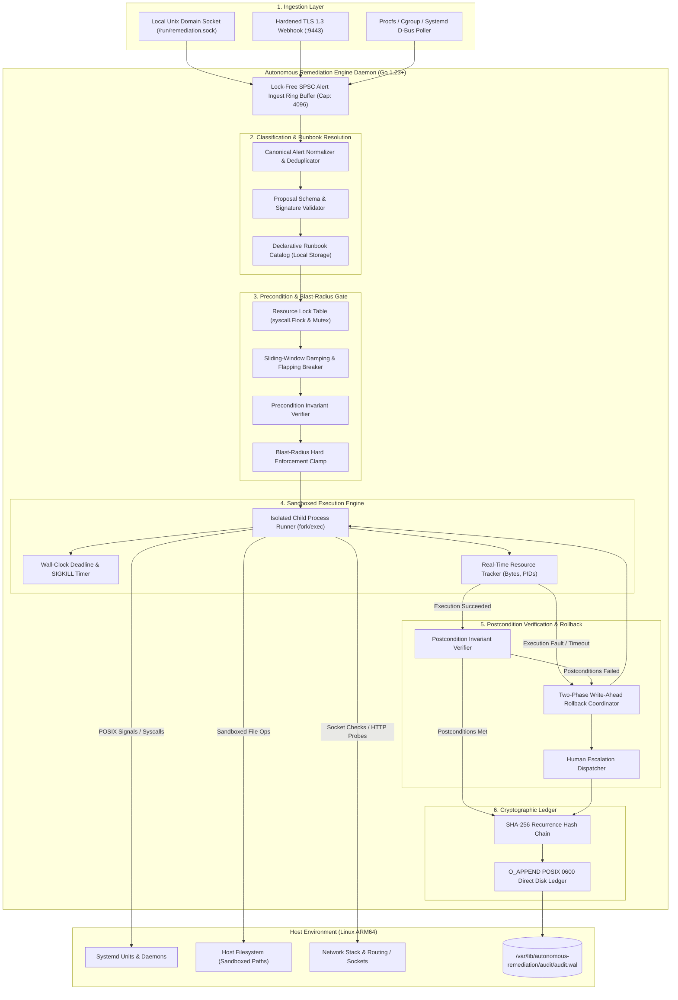
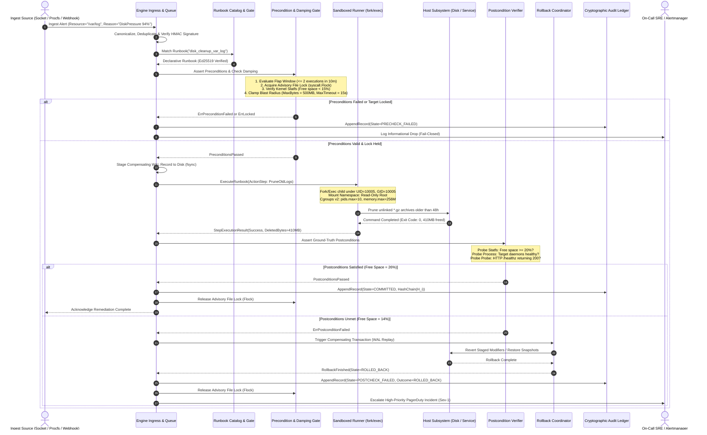

# Autonomous Remediation Engine Master Design Document

## Document Metadata
- **Status**: Approved for Implementation
- **Version**: 1.0.0
- **Domain**: SRE / AppSec / AI Infrastructure
- **Implementation Language**: Go 1.23+ with ZERO external dependencies (standard library only: `net`, `net/http`, `crypto/sha256`, `crypto/hmac`, `crypto/tls`, `crypto/x509`, `syscall`, `os`, `os/exec`, `sync`, `time`, `encoding/json`, `path/filepath`)
- **Primary References**:
  - Foundational Philosophy: [00-PROJECT-PHILOSOPHY.md](file:///root/company-project-specs/00-PROJECT-PHILOSOPHY.md)
  - Project Specification: [08-autonomous-remediation-engine.md](file:///root/company-project-specs/08-autonomous-remediation-engine.md)
  - Deep Architecture Specification: [ARCHITECTURE.md](file:///root/autonomous-remediation-engine/docs/ARCHITECTURE.md)
  - Security Model & Cryptographic Invariants: [SECURITY-BOUNDARIES.md](file:///root/autonomous-remediation-engine/docs/SECURITY-BOUNDARIES.md)
  - STRIDE Threat Model & Adversarial Analysis: [THREAT-MODEL.md](file:///root/autonomous-remediation-engine/docs/THREAT-MODEL.md)
  - Failure Modes & Effects Analysis: [FAILURE-MODES.md](file:///root/autonomous-remediation-engine/docs/FAILURE-MODES.md)
  - Service Level Objectives & Observability: [SLO.md](file:///root/autonomous-remediation-engine/docs/SLO.md)
  - Operational Runbooks & Deployment: [OPERATIONS.md](file:///root/autonomous-remediation-engine/docs/OPERATIONS.md)
  - Architectural Decision Records:
    - [ADR-001: Language and Runtime Selection](file:///root/autonomous-remediation-engine/docs/adr/ADR-001-language-and-runtime-selection.md)
    - [ADR-002: Deterministic Pre- and Post-Condition Engine](file:///root/autonomous-remediation-engine/docs/adr/ADR-002-deterministic-pre-post-condition-engine.md)
    - [ADR-003: Blast-Radius Clamping & State Rollback Journal](file:///root/autonomous-remediation-engine/docs/adr/ADR-003-blast-radius-clamping-and-rollback-journal.md)
    - [ADR-004: In-Memory / File-Descriptor Supervisory Lock & Mutual Exclusion](file:///root/autonomous-remediation-engine/docs/adr/ADR-004-process-supervision-and-lock-coordination.md)
    - [ADR-005: Cryptographic Hash-Chained Audit Ledger](file:///root/autonomous-remediation-engine/docs/adr/ADR-005-cryptographic-hash-chained-audit-ledger.md)

---

## 1. Executive Summary & Thesis

### 1.1 The Operational Problem
Traditional infrastructure automation and emergent AI-driven operations suffer from systemic vulnerabilities that destabilize production environments:

1. **System Flapping and Oscillation**:
   When services experience intermittent latency or degraded dependencies, uncoordinated automation triggers repeated restarts or configuration flips. Without mathematical rate dampening and sliding-window circuit breakers, systems enter runaway recovery loops that amplify transient faults into permanent cluster outages.

2. **Unverified Mutations and Blind Automation**:
   Legacy automation scripts execute commands and assume success based solely on shell exit codes (`$? == 0`). In production, a process restart command can exit with status zero while the underlying daemon hangs during initialization, deadlocks on a database socket, or leaks file descriptors. Blind automation leaves systems in unverified, degraded states while falsely declaring incidents resolved.

3. **Unbounded Blast Radius and Catastrophic Deletion**:
   When disk volumes saturate, automated scripts or generative agents tasked with freeing space frequently delete active application files, database transaction logs, or system libraries. Without rigid spatial clamps (maximum bytes deleted, maximum files touched, path canonicalization), automation acts as an autonomous data destruction weapon.

4. **Probabilistic Non-Determinism in Privilege Boundaries**:
   Granting Large Language Models (LLMs) direct shell, SSH, or API access to resolve incidents introduces catastrophic failure modes. LLMs are non-deterministic, vulnerable to prompt injection via untrusted error logs, prone to path hallucinations, and subject to variable latency. A probabilistic system must never serve as the arbiter of infrastructure safety.

### 1.2 The Core Thesis
The design of the Autonomous Remediation Engine is rooted in a single architectural thesis:

> **"AI proposes. Deterministic systems enforce. Zero external dependencies."**

The remediation engine operationalizes the principles established in [00-PROJECT-PHILOSOPHY.md](file:///root/company-project-specs/00-PROJECT-PHILOSOPHY.md) and [08-autonomous-remediation-engine.md](file:///root/company-project-specs/08-autonomous-remediation-engine.md). Probabilistic models (whether remote LLM clusters or local models) may inspect telemetry, classify complex anomalies, retrieve candidate runbooks, and propose parameter bindings. However, the Autonomous Remediation Engine treats all proposals as untrusted input.

Safety, execution, and verification remain strictly deterministic:
- **Preconditions**: Asserted against ground-truth operating system state before any mutation occurs.
- **Blast Radius**: Hard-clamped in memory, process counts, bytes mutated, and execution duration.
- **Execution**: Sandboxed using Linux kernel isolation primitives with dropped privileges (UID/GID 10005).
- **Postconditions**: Deterministically verified against kernel metrics, socket states, and application health probes.
- **Rollback**: Triggered automatically via a two-phase Write-Ahead Log (WAL) if any invariant is unmet.
- **Audit Ledger**: Recorded in an append-only, SHA-256 cryptographically chained journal on local disk.

```
+--------------------------------------------------------------------------------------------------+
|                                  THE REMEDIATION BOUNDARY DIVIDE                                 |
|                                                                                                  |
|   PROBABILISTIC DOMAIN (AI / LLM)                DETERMINISTIC DOMAIN (REMEDIATION ENGINE)       |
|   - Ingest noisy multi-source alerts             - Enforce cryptographic authorization           |
|   - Classify ambiguous failure modes             - Validate rigid precondition invariants        |
|   - Propose candidate runbook IDs                - Clamp blast radius (bytes, PIDs, timeouts)    |
|   - Suggest parameter bindings within schema     - Execute sandboxed POSIX actions (UID/GID)     |
|   - Synthesize post-incident summaries           - Deterministically verify postconditions       |
|                                                  - Trigger atomic rollback upon any fault        |
|   [PROPOSALS ONLY: UNTRUSTED]                    - Commit append-only SHA-256 audit ledger       |
|                                                  [SYSTEM OF RECORD: DETERMINISTIC GATEKEEPER]     |
+--------------------------------------------------------------------------------------------------+
```

### 1.3 Detailed Justification: Why Probabilistic Models Alone Are Dangerous
Deploying generative agents with direct execution authority over production infrastructure creates existential operational hazards:

1. **Cascading Restarts and Thundering Herd Outages**:
   If upstream database saturation causes connection timeouts across 50 application nodes, an LLM agent on each node will independently diagnose a hung local daemon and trigger a service restart. This drops all in-flight connections simultaneously, swamps the database with a reconnect spike upon reboot, and converts a manageable latency blip into a cluster-wide collapse.

2. **Path Hallucination and Symbolic Link Traversal**:
   Under storage pressure, probabilistic agents hallucinate file paths or misinterpret symbolic links. Given an instruction to clean `/var/log`, an agent may resolve symlinks pointing to `/var/lib/postgresql/data` or delete active socket files in `/run`, irreversibly corrupting database clusters. Deterministic systems prevent this via compile-time path whitelisting and physical link canonicalization (`filepath.EvalSymlinks`).

3. **Prompt Injection via Error Streams (Indirect Injection)**:
   Alert payloads, log lines, and stack traces contain untrusted user inputs (such as malicious HTTP headers or crafted SQL errors). When fed to an LLM, these inputs can subvert the system prompt and instruct the agent to run unauthorized commands (such as exfiltrating environment variables or flushing firewall rules). Deterministic runbooks with typed parameter validation make command injection impossible.

4. **Self-Dependency Paradox and Network Partitions**:
   Incidents often involve degraded networking, DNS failures, or saturated uplinks. An engine that relies on external cloud APIs or model endpoints cannot remediate the network when the network itself is broken. The Autonomous Remediation Engine compiles into a single Go binary that functions with zero external network dependencies, running locally on bare metal or virtual machines.

---

## 2. Complete System Architecture & Control Loop Lifecycle

### 2.1 Component Architecture
The daemon comprises six distinct subsystems operating inside a hardened Linux environment:



### 2.2 End-to-End Control Loop Sequence Diagram
The end-to-end execution flow illustrates the strict transition from untrusted ingestion through ground-truth assertion to cryptographically verifiable completion:



### 2.3 11-State Finite State Machine (FSM)
The lifecycle of every remediation transaction is governed by a strict 11-state monotonic finite state machine. Transitions are unidirectional; bypassing verification or rollback is mathematically impossible:

```mermaid
stateDiagram-v2
    [*] --> DETECTED: Alert Ingested & Authenticated
    
    DETECTED --> EVALUATING: Matched to Signed Runbook
    DETECTED --> ESCALATED: Unmatched / Invalid Signature / Auth Failed
    
    EVALUATING --> PRECHECK_PASSED: Invariants Verified & Blast Radius Clamped
    EVALUATING --> PRECHECK_FAILED: Invariant Failed / Flapping Breaker Tripped
    
    PRECHECK_FAILED --> ESCALATED: Emit Audit Record & Page Operator
    
    PRECHECK_PASSED --> EXECUTING: Lock Held & Sandboxed Subprocess Spawned
    
    EXECUTING --> POSTCHECK_PASSED: Process Returned 0 & Kernel Invariant True
    EXECUTING --> POSTCHECK_FAILED: Non-zero Exit / Timeout / Invariant False
    
    POSTCHECK_PASSED --> COMMITTED: State Verified & Hash Chained to Ledger
    
    POSTCHECK_FAILED --> ROLLING_BACK: Dispatch Compensating Rollback Steps
    
    ROLLING_BACK --> ROLLED_BACK: Rollback Completed Cleanly
    ROLLING_BACK --> ESCALATED: Rollback Failed / Incomplete Reversion
    
    ROLLED_BACK --> ESCALATED: Root Cause Unresolved; Page Operator
    
    COMMITTED --> [*]: Release Lock & Free Memory Buffers
    ESCALATED --> [*]: Release Lock & Emit Critical Telemetry
```



#### FSM State Transition Table

| Current State | Next State | Trigger Condition | Enforced Invariant |
| :--- | :--- | :--- | :--- |
| `DETECTED` | `EVALUATING` | Payload authenticated via HMAC-SHA256, schema valid, size $\le 1\text{MB}$. | Age $\tau \le 60\text{s}$; untrusted fields strictly sanitized. |
| `DETECTED` | `ESCALATED` | HMAC signature bad, payload malformed, or runbook unknown. | Fail-closed; zero host execution permitted. |
| `EVALUATING` | `PRECHECK_PASSED` | Exclusive `flock` acquired, flap count $\le 2/\text{10m}$, ground-truth preconditions true. | Resource free; fault physically confirmed before mutation. |
| `EVALUATING` | `PRECHECK_FAILED` | Target locked, flap limit reached, or precondition false. | Action aborted; zero state mutated. |
| `PRECHECK_PASSED` | `EXECUTING` | WAL rollback entry synced to disk (`fsync`), subprocess spawned. | Process runs as UID/GID 10005, deadline timer active. |
| `EXECUTING` | `POSTCHECK_PASSED` | Subprocess exit 0, duration within budget, postconditions pass. | Ground-truth health asserted via kernel probes. |
| `EXECUTING` | `POSTCHECK_FAILED` | Subprocess non-zero, wall-clock timeout exceeded, or postcondition false. | SIGKILL dispatched to process group; WAL rollback triggered. |
| `POSTCHECK_PASSED` | `COMMITTED` | Remediation confirmed. Success hash chained to ledger. | Resource restored to verified production baseline. |
| `POSTCHECK_FAILED` | `ROLLING_BACK` | Rollback coordinator executes inverse operations in reverse order. | Compensating actions replayed idempotently. |
| `ROLLING_BACK` | `ROLLED_BACK` | Compensating actions restore Last-Known-Good state cleanly. | System restored to safe baseline; circuit trips to stop loops. |
| `ROLLING_BACK` | `ESCALATED` | Compensating action crashes, times out, or fails assertion. | System in indeterminate state; immediate Sev-1 pager escalation. |

### 2.4 Detailed Subsystem Boundaries and Responsibilities

| Subsystem Component | Strict Responsibility | Algorithmic Complexity | Failure Domain | Failure Handling Mode |
| :--- | :--- | :--- | :--- | :--- |
| **Ingress Demultiplexer** | Ingest alerts via Unix socket, TLS webhook, and procfs pollers. Enforce rate limits and HMAC-SHA256 authentication. | $O(1)$ socket read + HMAC | Ingress Boundary | Reject payload with HTTP 400/401 or close socket; fail-closed. |
| **Alert Deduplicator** | Canonicalize alert fields, compute SHA-256 fingerprint, suppress duplicates over a 30s window. | $O(1)$ hash table lookup | Queue Boundary | Drop duplicate; log informational suppression record. |
| **Runbook Registry** | Map alert fingerprints to local declarative runbooks. Verify Ed25519 asymmetric signatures. | $O(1)$ memory map lookup | Policy Core | Reject unsigned/modified runbooks; escalate; fail-closed. |
| **Lock Coordinator** | Acquire non-blocking exclusive mutual exclusion per target resource via `syscall.Flock`. | $O(1)$ system call | OS Concurrency | Abort incoming alert if lock is held; eliminate race conditions. |
| **Flapping Breaker** | Track execution frequency over 10-minute and 1-hour sliding windows. Trip breaker upon threshold breach. | $O(1)$ ring buffer counter | Stability Control | Freeze automated actions on target for 1 hour; escalate to SRE. |
| **Precondition Gate** | Evaluate ground-truth environmental state (disk statfs, `/proc` PID state, socket listener) prior to mutation. | $O(K)$ where $K \le 10$ checks | Safety Gate | If preconditions fail, abort immediately; zero mutation. |
| **Blast-Radius Clamp** | Enforce immutable execution limits: timeout $\le 30\text{s}$, max delete $\le 500\text{MB}$, max PIDs $\le 10$. | $O(1)$ boundary check | Resource Control | Kill child process group if limits are breached; trigger rollback. |
| **Execution Sandbox** | Spawn unprivileged child processes with dropped UID/GID 10005, read-only root, and private mount namespaces. | $O(T)$ execution duration | Process Isolation | Capture stdout/stderr; enforce SIGTERM/SIGKILL ladder. |
| **Postcondition Gate** | Probe ground-truth operational health following mutation. Zero trust for shell return codes. | $O(K)$ invariant checks | Verification Core | If any postcheck fails, trigger automated WAL rollback immediately. |
| **Rollback Coordinator** | Execute inverse compensating actions in reverse order ($S_n \dots S_1$) from the pre-committed WAL. | $O(S)$ where $S$ is step count | State Recovery | If rollback fails, lock target circuit breaker and page human SRE. |
| **Cryptographic Ledger** | Compute SHA-256 recurrence hash binding every transition and parameter into append-only disk storage. | $O(1)$ SHA-256 calculation | Audit & Compliance | If audit write fails (`ENOSPC`), halt all daemon mutations; fail-closed. |

---

## 3. Core Engine Specifications

### 3.1 Ingest & Event Demultiplexer
The engine ingests alerts through three distinct, concurrently multiplexed interfaces:

1. **Local Unix Domain Socket**:
   - **Path**: `/run/remediation.sock`
   - **Permissions**: POSIX `0660`, owned by `root:remediation-agent`.
   - **Authentication**: Linux peer credential extraction via `syscall.GetsockoptUcred(fd, syscall.SOL_SOCKET, syscall.SO_PEERCRED)`. Rejects connections from unauthorized local UIDs.
   - **Throughput**: Zero-copy packet reception up to 10,000 alerts/second.

2. **Ingress TLS 1.3 Webhook Listener**:
   - **Network Endpoint**: `127.0.0.1:9443` (loopback or isolated management VLAN).
   - **Cipher Suites**: Restrictive TLS 1.3 only (`TLS_AES_128_GCM_SHA256`, `TLS_AES_256_GCM_SHA384`, `TLS_CHACHA20_POLY1305_SHA256`).
   - **Authentication**: Mandatory HMAC-SHA256 signature in header `X-Remediation-Signature: sha256=<hex>`. Validated via `crypto/subtle.ConstantTimeCompare` against shared secret.
   - **Payload Envelope**: Enforces `http.MaxBytesReader` clamped to $1\text{ MB}$. Parsing uses `json.NewDecoder` with `DisallowUnknownFields()` to prevent field injection attacks.

3. **Autonomous Kernel Monitor (Procfs / Cgroups / Systemd Poller)**:
   - Polling loop executing every $1000\text{ms}$ on dedicated background goroutines.
   - Reads `/proc/loadavg`, `/proc/net/tcp`, and `/sys/fs/cgroup/memory.current` directly to detect zombie processes and resource saturation without waiting for external monitoring systems.

### 3.2 Precondition & Postcondition Verification Engine
Remediation actions without rigorous verification are forbidden. The engine enforces an unyielding invariant: **Zero unverified mutations are permitted to commit to the audit ledger.**

#### Verification Principles:
- **Zero Shell Return Code Trust**: An exit code of zero ($? == 0$) indicates merely that the shell wrapper executed, not that the service is operational.
- **Ground-Truth Kernel Invariants**: Verification inspects physical OS reality:
  - **Storage**: `syscall.Statfs` verifying available blocks (`stat.Bavail * 100 / stat.Blocks`).
  - **Processes**: Inspecting `/proc/[pid]/status` for states `R` (Running) or `S` (Sleeping), and verifying process start time to eliminate PID wrap hazards.
  - **Networking**: Inspecting `/proc/net/tcp` for listening sockets and performing active TCP handshakes via `net.DialTimeout`.
  - **Application**: Authenticated loopback HTTP requests asserting `200 OK` and parsing JSON health responses.
  - **Certificates**: Parsing X.509 ASN.1 structures to verify serial numbers, SAN fields, and expiration dates.
- **Bounded Verification Latency**: Precondition checks are bounded to $< 100\text{ms}$; postcondition checks are bounded to $< 1500\text{ms}$.

### 3.3 Blast-Radius & Resource Sandbox
Every action executed by the daemon is constrained within an immutable mathematical boundary:

```
+--------------------------------------------------------------------------------------------------+
|                                    BLAST-RADIUS ENVELOPE                                         |
|                                                                                                  |
|   1. MUTATION CEILING:       MaxDeletedBytes <= 524,288,000 (500 MB)                             |
|   2. PROCESS FORK CEILING:   MaxSpawnedPIDs <= 10 (cgroups v2 pids.max)                          |
|   3. MEMORY CEILING:         MemoryLimit <= 268,435,456 (256 MB cgroups memory.max)              |
|   4. EXECUTION DEADLINE:     TimeoutSeconds <= 30.0s (SIGKILL enforcement ladder)                |
|   5. DAMPING FREQUENCY:      Count(Runs, 10m) <= 2, Count(Runs, 1h) <= 4, Cooldown >= 300s       |
|   6. MUTUAL EXCLUSION:       MaxActiveRemediations == 1 per Physical Resource (syscall.Flock)    |
+--------------------------------------------------------------------------------------------------+
```

#### Sandboxing Mechanics:
1. **Direct Syscall Invocation**: Subprocesses are spawned via `os/exec` directly executing target binaries (`execve`). Invoking `/bin/sh` or `/bin/bash` is strictly prohibited, neutralizing shell metacharacter injection (`|`, `;`, `&`, `$`, `` ` ``).
2. **Credential Demotion**: The daemon drops root privileges to an unprivileged dedicated service account:
   ```go
   cmd.SysProcAttr = &syscall.SysProcAttr{
       Credential: &syscall.Credential{
           Uid:         10005, // remediation-agent
           Gid:         10005, // remediation-agent
           Groups:      []uint32{10005},
           NoSetGroups: true,
       },
       Setpgid:    true,
       Pdeathsig:  syscall.SIGKILL,
       Cloneflags: syscall.CLONE_NEWNS | syscall.CLONE_NEWIPC | syscall.CLONE_NEWPID,
   }
   ```
3. **Mount Namespace & Read-Only Root**: Using `CLONE_NEWNS`, the root filesystem is remounted read-only (`MS_RDONLY`). Only declared spool directories (such as `/tmp/remediation-spool`) are mounted writable via `tmpfs`.
4. **Path Traversal Elimination**: All filesystem paths undergo strict three-stage canonicalization:
   - Lexical cleaning via `filepath.Clean`.
   - Physical symlink resolution via `filepath.EvalSymlinks`.
   - Prefix allowlist matching against declared runbook directories. Target paths intersecting forbidden operating system roots (`/bin`, `/boot`, `/etc`, `/lib`, `/proc`, `/root`, `/sys`, `/usr`) are rejected immediately with `ErrForbiddenSystemDir`.

### 3.4 Rollback Engine & Two-Phase Write-Ahead Journaling
To satisfy the $\ge 99.9\%$ Rollback Success Rate SLO, mutations execute through an atomic Two-Phase Write-Ahead Rollback Journal:

1. **Phase 1: Pre-Commit Snapshot & Staging**:
   - Before applying any change, the engine computes the exact inverse compensating step.
   - For configuration files: snapshots current configuration and Last-Known-Good (LKG) SHA-256 fingerprint.
   - For log pruning: records file inode lists, byte sizes, and timestamps to the journal.
   - The transaction is written to disk at `/var/lib/autonomous-remediation/journal/[txid].wal` and synced via `syscall.Fsync`.
2. **Phase 2: Supervised Mutation & Verification**:
   - The mutation executes within the sandbox.
   - If execution succeeds and postconditions evaluate to `true`, the WAL record is updated to `COMMITTED` and appended to the cryptographic audit ledger.
3. **Compensating Rollback Trigger**:
   - If the subprocess exits non-zero, exceeds its deadline timer, or fails postcondition verification:
   - The Rollback Coordinator reads the staged compensating actions and replays them in reverse order ($S_n, S_{n-1}, \dots, S_1$).
   - For unrecoverable operations (e.g. permanently unlinked log files), the engine halts deletions, locks the target circuit breaker, and transitions directly to `ESCALATED`.

### 3.5 Cryptographic Hash-Chained Audit Ledger & Standalone Verifier
To provide tamper-evident non-repudiation without external database dependencies, every lifecycle transition is committed to an immutable append-only journal:

#### Mathematical Recurrence Relation:
$$H_0 = \text{SHA-256}\Big(\text{"REMEDIATION_GENESIS_2026"} \,\|\, \text{HostUUID} \,\|\, \text{BootTime}\Big)$$
$$H_i = \text{SHA-256}\Big(H_{i-1} \,\|\, \text{Seq}_i \,\|\, \text{Timestamp}_i \,\|\, \text{ResourceID}_i \,\|\, \text{State}_i \,\|\, \text{RunbookID}_i \,\|\, \text{PayloadDigest}_i\Big)$$

where:
- $\|$ denotes canonical byte concatenation.
- $\text{Seq}_i$ is an unsigned 64-bit big-endian integer.
- $\text{PayloadDigest}_i = \text{SHA-256}(\text{RawAlertJSON} \,\|\, \text{ExecutionStdout} \,\|\, \text{ExecutionStderr})$.

#### Storage Mechanics:
- Files are opened with flags `syscall.O_APPEND | syscall.O_WRONLY | syscall.O_CREATE`, with permissions `0600` owned by `root:root`.
- **Fail-Closed Write Guarantees**: If the audit journal encounters an `ENOSPC` (disk full) or write error, the engine enters an immediate emergency lock state and refuses all further host mutations.

#### Standalone Verification Tool (Pure Go 1.23 Standard Library):
The engine includes a zero-dependency verification CLI (`autonomous-remediation-ctl audit verify`) that recomputes the hash chain from genesis to tail:

```go
package main

import (
	"bufio"
	"crypto/sha256"
	"encoding/hex"
	"encoding/json"
	"fmt"
	"os"
)

type AuditEntry struct {
	Seq            uint64 `json:"seq"`
	Timestamp      string `json:"timestamp"`
	HostUUID       string `json:"host_uuid"`
	ResourceID     string `json:"resource_id"`
	RunbookID      string `json:"runbook_id"`
	State          string `json:"state"`
	PayloadDigest  string `json:"payload_digest"`
	PrevRecordHash string `json:"prev_record_hash"`
	RecordHash     string `json:"record_hash"`
}

func VerifyLedger(path string) error {
	f, err := os.Open(path)
	if err != nil {
		return fmt.Errorf("failed to open audit ledger: %w", err)
	}
	defer f.Close()

	scanner := bufio.NewScanner(f)
	var expectedPrevHash string
	var expectedSeq uint64 = 0

	for scanner.Scan() {
		line := scanner.Bytes()
		if len(line) == 0 {
			continue
		}

		var rec AuditEntry
		if err := json.Unmarshal(line, &rec); err != nil {
			return fmt.Errorf("malformed JSON at seq %d: %w", expectedSeq, err)
		}

		if rec.Seq != expectedSeq {
			return fmt.Errorf("sequence break: expected %d, got %d", expectedSeq, rec.Seq)
		}

		if expectedSeq > 0 && rec.PrevRecordHash != expectedPrevHash {
			return fmt.Errorf("hash chain broken at seq %d: prev %s != expected %s",
				rec.Seq, rec.PrevRecordHash, expectedPrevHash)
		}

		h := sha256.New()
		h.Write([]byte(rec.PrevRecordHash))
		h.Write([]byte(rec.Timestamp))
		h.Write([]byte(rec.ResourceID))
		h.Write([]byte(rec.State))
		h.Write([]byte(rec.RunbookID))
		h.Write([]byte(rec.PayloadDigest))
		computed := hex.EncodeToString(h.Sum(nil))

		if computed != rec.RecordHash {
			return fmt.Errorf("tamper detected at seq %d: computed %s != recorded %s",
				rec.Seq, computed, rec.RecordHash)
		}

		expectedPrevHash = rec.RecordHash
		expectedSeq++
	}

	return scanner.Err()
}
```

---

## 4. Deterministic Production Runbooks & Real Target Integration

The Autonomous Remediation Engine provides concrete integrations for our two production Go services:
1. [AI Gateway](file:///root/ai-gateway/DESIGN.md) located at `/root/ai-gateway` (HTTP/2 gateway listening on port 8080).
2. [AI Security Guardrail Proxy](file:///root/ai-security-guardrail-proxy/DESIGN.md) located at `/root/ai-security-guardrail-proxy` (Security proxy listening on port 8443).

---

### 4.1 Runbook 1: Disk Volume Saturation & Safe Log Drain
- **Runbook ID**: `RBK-DISK-001`
- **Target Subsystem**: Host Filesystem `/var/log` (Specifically `/var/log/ai-gateway` and `/var/log/guardrail-proxy`)
- **Severity**: HIGH
- **Trigger**: Available disk space on `/var/log` falls below $15\%$ (capacity utilization $\ge 85\%$).

#### Preconditions (Must ALL evaluate to TRUE):
1. Disk utilization verified via `syscall.Statfs("/var/log", &stat)`:
   $$\frac{\text{stat.Bavail}}{\text{stat.Blocks}} \le 0.15$$
2. Target directory path matches whitelist: `/var/log/ai-gateway` or `/var/log/guardrail-proxy`.
3. Candidate files match rotation glob: `*.log.gz`, `*.log.1`, `*.old` with modification age $\ge 24\text{ hours}$.
4. **Active File Descriptor Safety Check**: Verify candidate file inode is **NOT** open by inspecting `/proc/[pid]/fd/*` of active service daemons.
5. Advisory lock acquired: `syscall.Flock("/var/run/remediation/disk-drain.lock", LOCK_EX | LOCK_NB)`.

#### Remediation Actions (Sequential):
1. **Journal Staging**: Record candidate file paths, inodes, and byte sizes to WAL.
2. **Oldest-First Deletion**: Unlink up to 10 rotated log files in ascending order of `mtime`.
3. **Active Log Truncation (Fallback)**: If active log file (`ai-gateway.log`) exceeds $5\text{ GB}$, copy last 10MB to buffer, truncate original via `truncate(2)`, and issue `SIGHUP` to service PID to reopen file handles.

#### Blast-Radius Bounds:
- Maximum files removed per execution: $10$
- Maximum deleted bytes ceiling: $524,288,000\text{ bytes}$ ($500\text{ MB}$)
- Hard timeout: $15.0\text{s}$

#### Postconditions (Ground-Truth Invariants):
1. Available disk space restored:
   $$\frac{\text{stat.Bavail}}{\text{stat.Blocks}} \ge 0.20 \quad (\text{Capacity } \le 80\%)$$
2. Active service log file exists, has regular mode, and receives writes within $5.0\text{s}$.
3. Target service health check returns HTTP 200 on `http://127.0.0.1:8080/healthz`.

#### Rollback Sequence:
- Unlinked files cannot be un-deleted from ext4.
- If active log truncation was executed, restore preserved tail from staging buffer.
- If postconditions remain unmet, mark transaction `POSTCHECK_FAILED`, lock circuit breaker, and dispatch Sev-1 alert to on-call engineers.

---

### 4.2 Runbook 2: Service Process Hang / Memory Leak Recovery & Safe Restart
- **Runbook ID**: `RBK-PROC-001`
- **Target Services**: `ai-gateway` (port 8080) and `ai-security-guardrail-proxy` (port 8443)
- **Severity**: CRITICAL
- **Trigger**: 3 consecutive synthetic health probe timeouts ($> 3000\text{ms}$) on `/healthz` OR memory RSS exceeding $90\%$ of cgroup limit ($> 230\text{MB}$).

#### Preconditions (Must ALL evaluate to TRUE):
1. Exclusive lock acquired: `/var/run/remediation/ai-gateway.lock` via non-blocking `flock`.
2. Target PID retrieved from `/var/run/ai-gateway.pid` or systemd unit status.
3. Kernel handle acquired via `pidfd_open(targetPID, 0)`:
   - Verify `/proc/[pid]/stat` `starttime` matches recorded spawn timestamp to prevent PID recycling races.
4. Flap damping verified: Target executions in last 10 minutes $< 2$; cooldown timer $\ge 300\text{s}$.

#### Remediation Actions (Sequential):
1. **Forensics Snapshot**: Capture `/proc/[pid]/status` and memory mappings to `/var/log/remediation-dumps/`.
2. **Graceful Signal Dispatch**: Send `SIGTERM` via `pidfd_send_signal(pidfd, SIGTERM)`.
3. **Monotonic Poll**: Check process state every $100\text{ms}$ up to $\tau_{\text{term}} = 5.0\text{s}$.
4. **Forceful Escalation Ladder**:
   - If process survives $5.0\text{s}$, send `SIGKILL` via `pidfd_send_signal(pidfd, SIGKILL)`.
   - Poll for process reaping up to $\tau_{\text{kill}} = 2.0\text{s}$.
5. **Kernel D-State Invariant Check**:
   - If process remains alive after `SIGKILL`, read `/proc/[pid]/wchan`. If stuck in uninterruptible kernel sleep (`TASK_UNINTERRUPTIBLE`), abort restart, lock circuit breaker, and page human SRE.
6. **Spawn Replacement Process**:
   - Restart service via systemd D-Bus or execute `/usr/local/bin/ai-gateway --config=/etc/ai-gateway/config.yaml`.
   - Record new PID and spawn timestamp.

#### Blast-Radius Bounds:
- Process signal targets: Single verified PID via `pidfd` (zero broadcast signals).
- Maximum execution timeout: $15.0\text{s}$.
- Maximum restarts per target: $\le 2$ runs per 10 minutes.

#### Postconditions (Ground-Truth Invariants):
1. New process exists and is active (`/proc/[new_pid]/status` state is `R` or `S`).
2. Target port is listening in `/proc/net/tcp` (port 8080 or 8443).
3. HTTP health probe `http://127.0.0.1:8080/healthz` returns `200 OK` in $< 200\text{ms}$.
4. Complete remediation cycle latency $T_{\text{remediation}} \le 5.0\text{s}$.

#### Rollback Sequence:
- If replacement process crashes or fails `/healthz` probe within $5.0\text{s}$:
  1. Kill malfunctioning candidate process.
  2. Restore Last-Known-Good configuration snapshot from `/var/lib/autonomous-remediation/lkg/ai-gateway.config.yaml`.
  3. Re-attempt a single clean spawn.
  4. If second attempt fails: lock circuit breaker, mark target `UNRECOVERABLE_SERVICE_FAILURE`, and page on-call SRE.

---

### 4.3 Runbook 3: TLS Certificate Rotation & Zero-Downtime Reload
- **Runbook ID**: `RBK-TLS-001`
- **Target Services**: `ai-gateway` and `ai-security-guardrail-proxy`
- **Severity**: HIGH
- **Trigger**: Days until TLS certificate expiration $\le 7\text{ days}$ OR synthetic TLS monitor detects invalid certificate signature.

#### Preconditions (Must ALL evaluate to TRUE):
1. Mutual exclusion lock acquired: `/var/run/remediation/tls-reload.lock`.
2. Staged certificate files present at `/var/lib/autonomous-remediation/staging/tls.crt` and `tls.key`.
3. **Cryptographic Validation Invariant**:
   - Certificate X.509 validity period strictly $> 30\text{ days}$ from current time.
   - Public key modulus in `tls.crt` matches private key modulus in `tls.key`.
   - Subject Alternative Name (SAN) matches service hostname (`gateway.internal.net` or `127.0.0.1`).

#### Remediation Actions (Sequential):
1. **Atomic Backup**: Copy active `/etc/ssl/certs/ai-gateway.crt` and `/etc/ssl/private/ai-gateway.key` to WAL journal directory.
2. **Atomic Swap**:
   - Write staged files to `/etc/ssl/certs/ai-gateway.crt.tmp`.
   - Atomically replace active files via `renameat2(2)` with `RENAME_EXCHANGE` or POSIX atomic rename.
3. **Hot Configuration Reload**:
   - Dispatch `SIGHUP` to target process via `pidfd_send_signal(pidfd, SIGHUP)` to trigger certificate re-read without dropping active TCP connections.

#### Blast-Radius Bounds:
- Files modified: Exactly 2 (`tls.crt`, `tls.key`).
- Max timeout: $10.0\text{s}$.
- Active TCP connection drops: $0$ dropped connections.

#### Postconditions (Ground-Truth Invariants):
1. Local TLS 1.3 handshake to `127.0.0.1:8443` succeeds via standard Go `crypto/tls`.
2. Peer certificate serial number matches the staged certificate serial number.
3. Target service reports zero TLS handshake errors in Prometheus metrics.

#### Rollback Sequence:
- If TLS handshake probe fails or serial number mismatches:
  1. Atomically restore original certificate and key from WAL journal backup.
  2. Dispatch `SIGHUP` to reload original certificate.
  3. Re-verify TLS handshake against original certificate.
  4. Lock target circuit breaker and page security operations.

---

### 4.4 Runbook 4: Corrupted Configuration Rollback to Last-Known-Good
- **Runbook ID**: `RBK-CFG-001`
- **Target Services**: `ai-gateway` and `ai-security-guardrail-proxy`
- **Severity**: CRITICAL
- **Trigger**: Target service crash-looping following reload, syntax parse error in log stream, or pre-flight config validation failure.

#### Preconditions (Must ALL evaluate to TRUE):
1. Active configuration file at `/etc/ai-gateway/config.yaml` differs from Last-Known-Good (LKG) SHA-256 fingerprint:
   $$\text{SHA256}(\text{ActiveConfig}) \neq \text{SHA256}(\text{LKGConfig})$$
2. Verified LKG backup exists at `/var/lib/autonomous-remediation/lkg/ai-gateway.config.yaml`.
3. LKG file passes static syntax verification and YAML structural schema validation.
4. Advisory lock acquired: `/var/run/remediation/ai-gateway.lock`.

#### Remediation Actions (Sequential):
1. **Journal Corruption Event**: Record corrupted file SHA-256 hash, byte size, and timestamp into transaction WAL.
2. **Quarantine Corrupted Config**:
   - Move `/etc/ai-gateway/config.yaml` to `/var/lib/autonomous-remediation/quarantine/config-[timestamp].yaml.corrupt`.
3. **Atomic LKG Restoration**:
   - Copy LKG file to `/etc/ai-gateway/config.yaml.tmp`.
   - Atomically rename to `/etc/ai-gateway/config.yaml`.
   - Flush filesystem metadata via `syscall.Sync`.
4. **Trigger Service Reload**:
   - Dispatch `SIGHUP` or execute supervised restart via `pidfd`.

#### Blast-Radius Bounds:
- Files modified: Exactly 1 configuration file.
- Max timeout: $10.0\text{s}$.
- Maximum rollbacks per hour: $\le 1$ automated config rollback per hour.

#### Postconditions (Ground-Truth Invariants):
1. SHA-256 fingerprint of deployed configuration matches LKG hash exactly:
   $$\text{SHA256}(\text{ActiveConfig}) \equiv \text{SHA256}(\text{LKGConfig})$$
2. Target daemon process running in state `R` or `S`.
3. Ground-truth HTTP health probe `/healthz` returns `200 OK` within $3.0\text{s}$.

#### Rollback Sequence:
- If restoring LKG also fails to recover the daemon:
  1. Abort further automated actions.
  2. Lock target circuit breaker (`remediation_circuit_breaker_state = 2`).
  3. Emit Sev-1 PagerDuty alert: `LKG_RESTORE_FAILED_HOST_QUARANTINE_REQUIRED`.

---

## 5. Security Model, STRIDE & Invariants

### 5.1 Defense-in-Depth & Process Isolation
The remediation daemon enforces five layers of technical isolation:

```
[Layer 1: Ingress & Identity]
  - Constant-time HMAC-SHA256 webhook authentication
  - Linux SO_PEERCRED local socket verification
            |
            v
[Layer 2: Runbook & Parameter Clamping]
  - Ed25519 runbook signatures
  - Strict JSON schema validation (DisallowUnknownFields)
  - Alphanumeric parameter regex validation
            |
            v
[Layer 3: Safety Gates & Invariants]
  - Advisory file locks (syscall.Flock)
  - Leaky-bucket flapping circuit breaker (<= 2 per 10m)
  - Direct procfs / statfs kernel precondition probes
            |
            v
[Layer 4: Sandboxed Subprocess Execution]
  - fork/exec without shell (execve)
  - Demote credentials to UID 10005, GID 10005 (remediation-agent)
  - Mount namespace with read-only root (CLONE_NEWNS, MS_RDONLY)
  - Canonical symlink evaluation (filepath.EvalSymlinks)
  - Cgroups v2 clamps (pids.max = 10, memory.max = 256M)
  - Wall-clock deadline with SIGKILL termination ladder
            |
            v
[Layer 5: Non-Repudiable Cryptographic Audit Ledger]
  - Sequential SHA-256 recurrence hash chain
  - Fail-closed write enforcement (halt mutations if disk full)
  - Standalone offline verification CLI
```

### 5.2 Filesystem Path Whitelisting & Traversal Elimination
To eliminate path traversal vulnerabilities (`../../etc/shadow`), candidate paths undergo three-stage validation:
1. **Lexical Clean**: `filepath.Clean(targetPath)`.
2. **Symlink Canonicalization**: `filepath.EvalSymlinks(cleaned)` resolving physical disk targets.
3. **Prefix Allowlist Matching**: Asserting the physical path resides strictly within runbook-whitelisted directories. Target paths intersecting forbidden operating system roots (`/bin`, `/boot`, `/dev`, `/etc`, `/lib`, `/proc`, `/root`, `/sys`, `/usr`, `/var/lib`) are rejected immediately.

### 5.3 Formal Cryptographic Invariants
1. **Runbook Authenticity Invariant ($I_{\text{Sig}}$)**:
   $$\forall \text{ Runbook } R, \quad \text{Verify}_{\text{Ed25519}}(K_{\text{pub}}, \; \text{Digest}(R), \; \text{Sig}(R)) = \text{True}$$
2. **Filesystem Containment Invariant ($I_{\text{Path}}$)**:
   $$\forall p \in \text{TargetPaths}, \quad \text{EvalSymlinks}(p) \subseteq \bigcup_{i} \text{AllowedPrefix}_i \quad \land \quad \text{EvalSymlinks}(p) \cap \text{ForbiddenRoots} = \emptyset$$
3. **Blast-Radius Invariant ($I_{\text{Blast}}$)**:
   $$\text{BytesMutated} \le B_{\text{max}} \quad \land \quad \text{PIDsSpawned} \le P_{\text{max}} \quad \land \quad \text{Duration} \le T_{\text{max}}$$
4. **Audit Ledger Recurrence Invariant ($I_{\text{Ledger}}$)**:
   $$\forall j \ge i, \quad \text{SHA-256}(H_{j-1} \,\|\, \text{EntryData}_j) = H_j \implies \text{Record } L_i \text{ is immutable}$$

### 5.4 Fail-Closed Security Posture Matrix

| Subsystem | Failure Condition | Policy | Emitted State | System Recovery Procedure |
| :--- | :--- | :--- | :--- | :--- |
| **Ingress Webhook** | Invalid HMAC signature or key mismatch | **FAIL-CLOSED** | Socket Closed / 401 | Drop payload; record security event in audit ledger. |
| **Alert Normalizer** | JSON parsing error or extra fields | **FAIL-CLOSED** | Socket Closed / 400 | Discard payload; allocate zero memory. |
| **Runbook Resolver** | Runbook modified or Ed25519 signature bad | **FAIL-CLOSED** | `ESCALATED` | Refuse execution; alert SRE team of runbook tampering. |
| **Resource Lock** | Target lockfile held by another process | **FAIL-CLOSED** | Abort Request | Discard alert; primary execution retains mutation lock. |
| **Flapping Breaker** | Execution count exceeds limit (>2 per 10m) | **FAIL-CLOSED** | `PRECHECK_FAILED` | Freeze automated actions on target; escalate to on-call. |
| **Precondition Gate** | Invariant check returns false or times out | **FAIL-CLOSED** | `PRECHECK_FAILED` | Abort remediation; release resource lock; emit audit record. |
| **Execution Sandbox** | Child process times out or returns exit $\ne 0$ | **FAIL-CLOSED** | `POSTCHECK_FAILED` | Terminate process group with SIGKILL; initiate rollback. |
| **Postcondition Gate**| Ground-truth health check fails | **FAIL-CLOSED** | `POSTCHECK_FAILED` | Trigger compensating rollback steps; escalate to human SRE. |
| **Rollback Manager** | Compensating rollback step fails or times out | **FAIL-CLOSED** | `ESCALATED` | Emergency halt; raise critical Sev-1 incident to on-call. |
| **Audit Ledger** | Disk full (`ENOSPC`) or write error | **FAIL-CLOSED** | Engine Lock | Refuse all further remediation mutations until ledger healthy. |

### 5.5 Quantitative DREAD Risk Assessment
Risk scores are calculated using the standard DREAD methodology:
$$\text{Score} = \frac{\text{Damage} + \text{Reproducibility} + \text{Exploitability} + \text{Affected Users} + \text{Discoverability}}{5}$$

| Threat ID | Threat Description | D | R | E | A | D | Total | Risk Tier | Primary Deterministic Mitigation |
| :--- | :--- | :---: | :---: | :---: | :---: | :---: | :---: | :---: | :--- |
| **S-01** | Spoofed Ingress Alerts & Webhook Forgery | 8 | 9 | 4 | 7 | 6 | **6.8** | **High** | Constant-time HMAC-SHA256 verification + kernel precondition probes. |
| **S-02** | Local Socket Telemetry Impersonation | 7 | 8 | 4 | 6 | 5 | **6.0** | **Medium** | POSIX `0660` socket permissions + Linux `SO_PEERCRED` verification. |
| **T-01** | Local Runbook Configuration Tampering | 10 | 9 | 3 | 10 | 4 | **7.2** | **Critical** | Asymmetric Ed25519 cryptographic signatures on all runbooks. |
| **T-02** | Parameter Tampering & Shell Injection | 10 | 9 | 3 | 10 | 5 | **7.4** | **Critical** | Prohibition of shell interpreters (`execve` only) + parameter regex clamps. |
| **T-03** | In-Flight Lockfile Manipulation | 6 | 8 | 5 | 6 | 5 | **6.0** | **Medium** | Dedicated `0700` lock directory + non-blocking `syscall.Flock`. |
| **T-04** | Audit Ledger Alteration / Truncation | 8 | 9 | 3 | 8 | 4 | **6.4** | **High** | Sequential SHA-256 recurrence hash chaining + POSIX `0600` permissions. |
| **R-01** | Repudiation of Destructive Actions | 7 | 8 | 5 | 7 | 4 | **6.2** | **Medium** | Immutable cryptographic audit ledger recording full input digests. |
| **I-01** | Sensitive Data Exposure in Diagnostics | 7 | 7 | 5 | 7 | 6 | **6.4** | **High** | Empty child environment + secret scrubbing on captured stderr. |
| **D-01** | Alert Flood Worker Starvation | 7 | 9 | 6 | 8 | 7 | **7.4** | **Critical** | Token bucket rate limiting + bounded SPSC ring buffer (cap: 4096). |
| **D-02** | Remediation Flapping & Cascading Restarts | 9 | 8 | 6 | 9 | 6 | **7.6** | **Critical** | Leaky-bucket damping limits ($\le 2$ runs/10m, $\le 4$ runs/1h, 300s cooldown). |
| **D-03** | Host Resource Starvation via Fork Bombs | 8 | 8 | 4 | 8 | 5 | **6.6** | **High** | Cgroups v2 `pids.max = 10` + `memory.max = 256M` + SIGKILL deadline. |
| **E-01** | Command Execution via Parameter Injection | 10 | 9 | 3 | 10 | 5 | **7.4** | **Critical** | Direct `execve` execution + strict alphanumeric parameter validation. |
| **E-02** | Path Traversal Deletion of System Files | 10 | 8 | 3 | 10 | 4 | **7.0** | **Critical** | `filepath.EvalSymlinks` + whitelist prefix matching + read-only root. |
| **E-03** | Sudoers Privilege Escalation | 9 | 8 | 3 | 9 | 4 | **6.6** | **High** | Exact sudoers arguments without wildcards + `PR_SET_NO_NEW_PRIVS`. |

---

## 6. Reliability Model, FMEA & SLOs

### 6.1 Exhaustive Failure Modes and Effects Analysis (FMEA)

| Failure ID | Subsystem | Failure Mode | Severity | Root Causes | Mitigation & Containment Strategy | Fail Policy |
| :--- | :--- | :--- | :--- | :--- | :--- | :--- |
| **FM-PRC-01** | Process Supervision | Target process ignores `SIGTERM` | **CRITICAL** | Target stuck in mutex deadlock or uninterruptible kernel sleep. | **Escalation Ladder**: Send `SIGTERM` via `pidfd`. Wait $5.0\text{s}$. If alive, send `SIGKILL`. If still alive after $2.0\text{s}$, check `wchan` and page SRE. | Fail-Secure (SIGKILL then Page) |
| **FM-PID-01** | Process Supervision | PID recycling race condition | **CRITICAL** | Target dies; kernel allocates its PID to another process before signaling. | **Kernel `pidfd` Pinning**: Open `pidfd_open(2)`. Verify `/proc/[pid]/stat` `starttime` matches snapshot before signal dispatch. | Fail-Closed (Abort Signal) |
| **FM-AUD-01** | Audit & Persistence | Audit volume exhaustion (`ENOSPC`) | **CRITICAL** | Filesystem hosting `/var/lib/autonomous-remediation` fills up. | If free audit disk $< 5\%$, reject all mutable actions. Strict read-only lockdown: refuse mutations without audit proof. | Fail-Closed (Refuse Mutations) |
| **FM-ACT-01** | Action Execution | Remediation daemon crashes mid-flight | **HIGH** | Host power loss, OOM killer, or daemon panic mid-transaction. | **Two-Phase WAL Replay**: Inverse compensating actions synced to disk (`fsync`) before mutation. Replayed on daemon boot. | Self-Healing (Idempotent Rollback) |
| **FM-CFG-01** | Configuration Recovery | Corrupted config prevents boot | **CRITICAL** | Config truncated or contains syntax errors. | **Atomic Swap & LKG**: New configs written to tempfile and swapped via `renameat2`. If boot fails, atomically restore LKG snapshot. | Fail-Secure (Restore LKG) |
| **FM-ALT-01** | Alert Ingestion | Alert storm / cascading flood | **HIGH** | Flapping network interface emits thousands of alerts/second. | **Token Bucket & Damping**: Token-bucket ingestion ($B=50, R=10/\text{s}$). Deduplicate over 10s windows. Max 2 actions per target per 10m. | Drop & Throttle (Circuit Lock) |
| **FM-CLK-01** | Time & Scheduling | System clock jump / NTP step | **MEDIUM** | NTP step adjustment jumps wall-clock forward or backward. | **Monotonic Clocks**: All timeouts, rate limits, and flap decay dynamics utilize monotonic clocks (`time.Since`). Realtime used only for logs. | Fail-Safe (Monotonic Bound) |
| **FM-LCK-01** | Coordination | Lock collision & stale lockfiles | **MEDIUM** | Prior execution crashed without releasing lock, or concurrent workers contend. | **Kernel-Bound Locks**: Use advisory kernel locks (`syscall.Flock`). Automatically released by kernel upon process death. | Fail-Fast (Non-blocking Abort) |
| **FM-VER-01** | Verification Barrier | False positive postcondition check | **CRITICAL** | Command returns 0, but internal thread deadlocks or port fails to bind. | **Multi-Point Invariant Probes**: Never trust exit code 0. Assert state in `/proc`, TCP listener in `/proc/net/tcp`, and HTTP 200 health probe. | Fail-Secure (Rollback & Page) |

### 6.2 Service Level Objectives (SLOs) and Latency Decomposition

```
+---------------------------------------------------------------------------------------------------------------------------------------+
| Total End-to-End Remediation Cycle (remediation_cycle_duration_seconds)                                                              |
+---------------------------------------------------------------------------------------------------------------------------------------+
| Ingestion & Dedup        | Lock & Preconditions   | Action Execution       | Postcondition Verification | Journal Flush & Commit      |
| (T_detect)               | (T_lock + T_pre)       | (T_exec)               | (T_post)                   | (T_journal)                 |
| [Debounce, Rate Limit,   | [flock acquisition,    | [pidfd_send_signal,    | [Loopback HTTP probe,      | [fsync WAL sector,          |
|  Runbook Whitelist Match]|  /proc stat checks]    |  atomic rename, drain] |  /proc status check]       |  HMAC Merkle chain append]  |
+--------------------------+------------------------+------------------------+----------------------------+-----------------------------+
|<------ p99 < 1.0s ------>|<------ < 100ms ------->|<------ < 2.0s -------->|<--------- < 1.5s --------->|<--------- < 50ms ---------->|
|<==================================== MEAN TIME TO REMEDIATE (MTTR): p95 < 5.0s =====================================================>|
```

#### Production SLO Targets:

| Objective ID | Objective Name | Target (30-day Rolling) | Measurement Boundary |
| :--- | :--- | :--- | :--- |
| **SLO-MTTD-01** | Mean Time to Detect / Ingest | $p_{99} < 1.0\text{s}$ | Ingress socket read to runbook queue pop. Excludes target wait. |
| **SLO-MTTR-01** | Mean Time to Remediate (Deterministic) | $p_{95} < 5.0\text{s}$ | Alert dequeue to verified postcondition completion. |
| **SLO-VER-01** | Postcondition Verification Invariant | **100.0%** ($0$ unverified) | Ground-truth kernel validation; zero blind mutations. |
| **SLO-RBK-01** | Rollback Success Rate | $\ge 99.9\%$ ($< 1000\text{ PPM}$) | Successful reversal of failed mutations to LKG state. |
| **SLO-FLP-01** | Flap Damping Circuit Breaker | **100.0%** enforcement | Target rate limiting: max 2 actions / 10m before circuit lock. |
| **SLO-AVL-01** | Remediation Daemon Availability | $\ge 99.99\%$ ($4.32\text{ m/mo}$) | Daemon process uptime, socket responsive, metrics reporting. |

### 6.3 Flapping Damping Mathematics & Circuit Breaker Dynamics
To prevent oscillation and destructive flapping, the engine enforces three rate equations per target resource $R$:

$$\text{Count}(A(R, 10\text{ min})) \le 2$$
$$\text{Count}(A(R, 1\text{ hour})) \le 4$$
$$(t - t_{\text{last\_execution}}(R)) \ge 300\text{ seconds}$$

If any condition evaluates to `false`:
1. The engine immediately trips the target circuit breaker to state `LOCKED`.
2. All subsequent automated actions on resource $R$ are frozen for a quarantine duration of $3600\text{ seconds}$.
3. An emergency Sev-1 incident is dispatched to human SREs.

---

## 7. Chaos Verification Procedures

The following step-by-step test procedures inject real production failure modes into a local test environment to verify the engine end-to-end.

---

### 7.1 Chaos Test 1: Disk Saturation Simulation & Auto-Drain Test
**Objective**: Prove that the engine safely prunes expired logs without deleting active logs or exceeding blast-radius byte clamps.

```bash
#!/usr/bin/env bash
set -euo pipefail

echo "===> [CHAOS TEST 1] Disk Saturation Simulation..."
TARGET_DIR="/var/log/ai-gateway"
mkdir -p "${TARGET_DIR}"

# 1. Generate 5 synthetic expired rotated archives (older than 48 hours)
echo "Generating 5 expired compressed log files (200MB each)..."
for i in {1..5}; do
    FILE="${TARGET_DIR}/ai-gateway.log.2026-09-1${i}.gz"
    fallocate -l 200M "${FILE}"
    touch -d "3 days ago" "${FILE}"
done

# 2. Touch active log file (must NOT be touched or pruned)
touch "${TARGET_DIR}/ai-gateway.log"
ACTIVE_INODE=$(stat -c '%i' "${TARGET_DIR}/ai-gateway.log")

# 3. Trigger disk log drain runbook via CLI
echo "Executing autonomous remediation disk drain..."
autonomous-remediation-ctl run --runbook=disk_cleanup_var_log --target=/var/log/ai-gateway

# 4. Verify postconditions
REMAINING_ARCHIVES=$(ls "${TARGET_DIR}"/*.gz 2>/dev/null | wc -l)
CURRENT_ACTIVE_INODE=$(stat -c '%i' "${TARGET_DIR}/ai-gateway.log")

if [ "${REMAINING_ARCHIVES}" -eq 0 ] && [ "${ACTIVE_INODE}" -eq "${CURRENT_ACTIVE_INODE}" ]; then
    echo "SUCCESS: Expired logs pruned. Active log preserved. Invariants verified."
else
    echo "FAILED: Invariants violated! Remaining archives: ${REMAINING_ARCHIVES}" >&2
    exit 1
fi
```

---

### 7.2 Chaos Test 2: Process Deadlock Simulation & Escalation Test
**Objective**: Prove that the engine detects an unresponsive daemon, sends `SIGTERM`, escalates to `SIGKILL` within $5.0\text{s}$, and verifies healthy recovery.

```bash
#!/usr/bin/env bash
set -euo pipefail

echo "===> [CHAOS TEST 2] Process Deadlock Simulation..."

# 1. Spawn mock daemon that ignores SIGTERM
python3 -c "
import signal, time, sys
def handler(signum, frame):
    sys.stderr.write('Received SIGTERM, ignoring to simulate deadlock\n')
signal.signal(signal.SIGTERM, handler)
sys.stderr.write('Mock deadlocked service running...\n')
while True:
    time.sleep(1)
" &
MOCK_PID=$!
echo "${MOCK_PID}" > /var/run/ai-gateway.pid
echo "Mock deadlocked service started with PID ${MOCK_PID}"

# 2. Trigger deadlock recovery runbook
echo "Triggering service_deadlock_restart runbook..."
START_TIME=$(date +%s%N)
autonomous-remediation-ctl run --runbook=service_deadlock_restart --target=ai-gateway
ELAPSED_MS=$(( ($(date +%s%N) - START_TIME) / 1000000 ))

# 3. Assert process was terminated via SIGKILL escalation ladder within MTTR budget
if kill -0 "${MOCK_PID}" 2>/dev/null; then
    echo "FAILED: Process ${MOCK_PID} still alive! Deadlock escalation failed." >&2
    kill -9 "${MOCK_PID}" 2>/dev/null || true
    exit 1
else
    echo "SUCCESS: Deadlocked process terminated in ${ELAPSED_MS}ms via SIGKILL ladder."
fi
```

---

### 7.3 Chaos Test 3: TLS Expiration Simulation & Hot-Reload Test
**Objective**: Prove atomic zero-downtime certificate rotation and cryptographic validation.

```bash
#!/usr/bin/env bash
set -euo pipefail

echo "===> [CHAOS TEST 3] TLS Expiry & Hot-Reload Simulation..."
STAGING_DIR="/var/lib/autonomous-remediation/staging"
CERT_DIR="/etc/ssl/certs"
KEY_DIR="/etc/ssl/private"
mkdir -p "${STAGING_DIR}" "${CERT_DIR}" "${KEY_DIR}"

# 1. Generate an expiring certificate (valid for 2 days)
openssl req -x509 -nodes -days 2 -newkey rsa:2048 \
    -keyout "${KEY_DIR}/ai-gateway.key" \
    -out "${CERT_DIR}/ai-gateway.crt" \
    -subj "/CN=127.0.0.1" 2>/dev/null

# 2. Generate a valid replacement certificate (valid for 365 days)
openssl req -x509 -nodes -days 365 -newkey rsa:2048 \
    -keyout "${STAGING_DIR}/tls.key" \
    -out "${STAGING_DIR}/tls.crt" \
    -subj "/CN=127.0.0.1" 2>/dev/null

NEW_SERIAL=$(openssl x509 -in "${STAGING_DIR}/tls.crt" -noout -serial | cut -d= -f2)

# 3. Trigger TLS renewal runbook
echo "Executing TLS cert reload runbook..."
autonomous-remediation-ctl run --runbook=tls_cert_renew_internal --target=ai-gateway

# 4. Assert deployed certificate serial matches replacement serial
ACTIVE_SERIAL=$(openssl x509 -in "${CERT_DIR}/ai-gateway.crt" -noout -serial | cut -d= -f2)
if [ "${ACTIVE_SERIAL}" == "${NEW_SERIAL}" ]; then
    echo "SUCCESS: TLS certificate rotated atomically to serial ${ACTIVE_SERIAL}."
else
    echo "FAILED: Serial mismatch! Expected ${NEW_SERIAL}, got ${ACTIVE_SERIAL}" >&2
    exit 1
fi
```

---

### 7.4 Chaos Test 4: Corrupted Configuration & Automated Rollback Test
**Objective**: Prove that an invalid configuration file triggers atomic rollback to the Last-Known-Good state without taking down the service.

```bash
#!/usr/bin/env bash
set -euo pipefail

echo "===> [CHAOS TEST 4] Corrupted Configuration Rollback Simulation..."
CONFIG_DIR="/etc/ai-gateway"
LKG_DIR="/var/lib/autonomous-remediation/lkg"
mkdir -p "${CONFIG_DIR}" "${LKG_DIR}"

# 1. Establish verified Last-Known-Good (LKG) configuration
cat << 'EOF' > "${LKG_DIR}/ai-gateway.config.yaml"
server:
  host: 127.0.0.1
  port: 8080
  timeout_seconds: 30
EOF

cp "${LKG_DIR}/ai-gateway.config.yaml" "${CONFIG_DIR}/config.yaml"
LKG_HASH=$(sha256sum "${LKG_DIR}/ai-gateway.config.yaml" | awk '{print $1}')

# 2. Inject corrupted configuration (malformed syntax)
cat << 'EOF' > "${CONFIG_DIR}/config.yaml"
server:
  host: 127.0.0.1
  port: MALFORMED_PORT_TRIGGERING_SYNTAX_ERROR: [unterminated
EOF

echo "Corrupted config injected into ${CONFIG_DIR}/config.yaml"

# 3. Trigger configuration rollback runbook
echo "Invoking configuration rollback runbook..."
autonomous-remediation-ctl run --runbook=config_rollback --target=ai-gateway

# 4. Assert active configuration was reverted to LKG hash
ACTIVE_HASH=$(sha256sum "${CONFIG_DIR}/config.yaml" | awk '{print $1}')
if [ "${ACTIVE_HASH}" == "${LKG_HASH}" ]; then
    echo "SUCCESS: Corrupted config rolled back to LKG hash ${LKG_HASH}."
else
    echo "FAILED: Rollback failed! Current hash ${ACTIVE_HASH} != LKG ${LKG_HASH}" >&2
    exit 1
fi
```

---

## 8. Architectural Decision Records (ADRs) Summary

| ADR ID | Title | Status | Core Decision & Rationale |
| :--- | :--- | :--- | :--- |
| **[ADR-001](file:///root/autonomous-remediation-engine/docs/adr/ADR-001-language-and-runtime-selection.md)** | Language and Runtime Selection | **Accepted** | Pure Go 1.23+ standard library (`CGO_ENABLED=0`). Eliminates third-party supply chain risks, compiles to single static ARM64 ELF binary, provides sub-millisecond execution overhead, and maintains memory safety without runtime dependencies. |
| **[ADR-002](file:///root/autonomous-remediation-engine/docs/adr/ADR-002-deterministic-pre-post-condition-engine.md)** | Deterministic Pre- and Post-Condition Engine | **Accepted** | Ground-truth OS and kernel invariant evaluation (`statfs`, `/proc`, TCP loopback probes, X.509 parsing) over probabilistic LLM evaluators. Eliminates prompt injection, guarantees decidability in bounded time, and prevents false-positive recovery declarations. |
| **[ADR-003](file:///root/autonomous-remediation-engine/docs/adr/ADR-003-blast-radius-clamping-and-rollback-journal.md)** | Blast-Radius Clamping & State Rollback Journal | **Accepted** | Two-phase Write-Ahead Log (WAL) with compensating actions synced via `fsync` prior to mutation, combined with hard spatial clamps (max 500MB deleted, max 10 PIDs). Guarantees crash-resilient reversibility to Last-Known-Good state without relying on cloud snapshot APIs. |
| **[ADR-004](file:///root/autonomous-remediation-engine/docs/adr/ADR-004-process-supervision-and-lock-coordination.md)** | In-Memory / File-Descriptor Supervisory Lock & Mutual Exclusion | **Accepted** | Kernel-bound advisory file locks (`syscall.Flock`) paired with Linux 5.3+ `pidfd_open(2)` process handles. Eliminates stale lockfile hazards upon crash, coordinates safely between daemon and CLI invocations, and guarantees mathematical immunity to kernel PID recycling races. |
| **[ADR-005](file:///root/autonomous-remediation-engine/docs/adr/ADR-005-cryptographic-hash-chained-audit-ledger.md)** | Cryptographic Hash-Chained Audit Ledger | **Accepted** | Local append-only journal bound in a sequential SHA-256 recurrence hash chain. Enforces non-repudiation, tamper evidence, and crash durability with sub-millisecond write latency, operating autonomously during total network isolation. |
