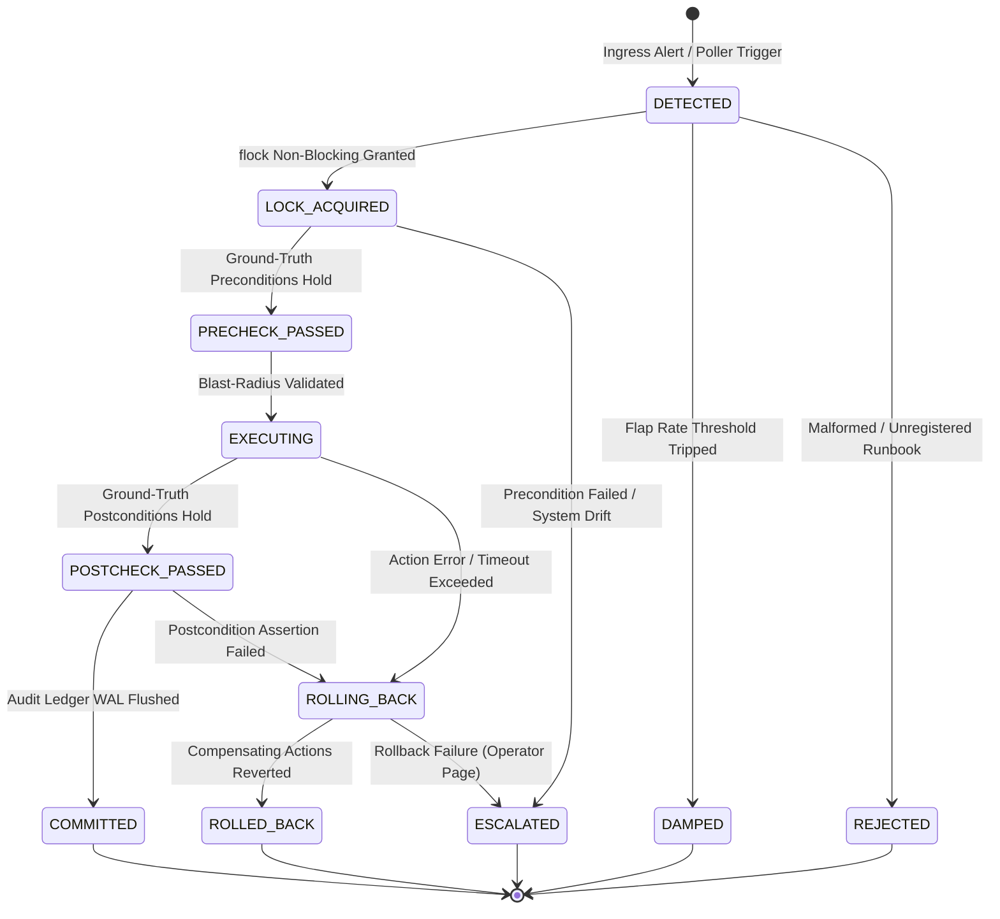

# Autonomous Remediation Engine

> **"AI proposes. Deterministic systems enforce. Zero external dependencies."**

[](file:///root/autonomous-remediation-engine/go.mod)
[](file:///root/autonomous-remediation-engine/go.mod)
[](file:///root/autonomous-remediation-engine/docs/ARCHITECTURE.md)
[](#)

A hardened, autonomous infrastructure remediation daemon built in pure Go with **zero external runtime dependencies**. It continuously monitors, recovers, and verifies critical microservices - specifically the [ai-gateway](file:///root/company-project-specs/01-ai-gateway.md) and [ai-security-guardrail-proxy](file:///root/company-project-specs/09-ai-security-guardrail-proxy.md) - against production failures including disk saturation, process hangs, TLS certificate expiration, and bad configuration rollouts.

---

## Table of Contents

- [1. Core Thesis & Design Philosophy](#1-core-thesis--design-philosophy)
- [2. Architectural State Machine (11-State FSM)](#2-architectural-state-machine-11-state-fsm)
- [3. Production Runbook Catalog](#3-production-runbook-catalog)
- [4. Quickstart Guide](#4-quickstart-guide)
  - [4.1. Building Binaries](#41-building-binaries)
  - [4.2. Running the Daemon](#42-running-the-daemon)
  - [4.3. Using the CLI Tool](#43-using-the-cli-tool)
  - [4.4. Triggering Alerts via Webhook (HMAC-SHA256)](#44-triggering-alerts-via-webhook-hmac-sha256)
- [5. Security Invariants & Blast-Radius Clamps](#5-security-invariants--blast-radius-clamps)
- [6. Service Level Objectives (SLOs) & Prometheus Metrics](#6-service-level-objectives-slos--prometheus-metrics)
- [7. Verification Suite & Chaos Testing Evidence](#7-verification-suite--chaos-testing-evidence)
- [8. Documentation Index](#8-documentation-index)

---

## 1. Core Thesis & Design Philosophy

Production recovery systems frequently fail because the tools meant to fix outages introduce external points of failure (e.g. databases, distributed coordination clusters, orchestrator daemons). The Autonomous Remediation Engine is designed around strict, non-negotiable operational principles:

1. **Zero External Dependencies**: Standard library Go only (`CGO_ENABLED=0`). Requires no PostgreSQL, no Redis, no etcd, no Docker daemon, and no cloud control plane.
2. **AI Proposes. Deterministic Systems Enforce**: Machine learning or probabilistic anomaly detectors may detect faults or submit candidate runbook alerts. However, **zero unverified actions are ever executed**. Host mutations are gated by rigid preconditions, strict blast-radius clamps, and ground-truth OS postconditions.
3. **100% Postcondition Verification Invariant**: Any remediation action is considered a failure until verified against kernel-level ground truth (`statfs(2)`, `/proc`, TCP/TLS loopback handshakes). Return codes ($?=0$) are never blindly trusted.
4. **Two-Phase Atomic Rollback (WAL Journaling)**: Every destructive mutation writes its inverse compensating action to a Write-Ahead Log (WAL) before execution. If postcondition verification fails or an action times out, the engine executes inverse steps in reverse order to return the host to its initial state.
5. **Non-Blocking Kernel Advisory Locks**: Every managed resource utilizes an exclusive non-blocking kernel lock (`flock(2)`/`fcntl(2)`). If a lock is held, the engine fails fast to prevent cascading retry storms or concurrent execution collisions.

---

## 2. Architectural State Machine (11-State FSM)

Every remediation execution transitions through a deterministic, strictly validated 11-state finite state machine defined in [`internal/model/fsm.go`](file:///root/autonomous-remediation-engine/internal/model/fsm.go):



### State Definitions
| State | Description | Next Permitted States |
|---|---|---|
| `DETECTED` | Alert received via HTTP webhook or Unix domain socket | `LOCK_ACQUIRED`, `DAMPED`, `REJECTED`, `ESCALATED` |
| `LOCK_ACQUIRED` | Resource-specific kernel advisory lock (`flock`) successfully acquired | `PRECHECK_PASSED`, `ESCALATED` |
| `PRECHECK_PASSED` | Ground-truth preconditions verified (e.g. disk actually full, process dead) | `EXECUTING`, `ESCALATED` |
| `EXECUTING` | Atomic mutation executing within blast-radius limits and WAL journaling | `POSTCHECK_PASSED`, `ROLLING_BACK`, `ESCALATED` |
| `POSTCHECK_PASSED` | Ground-truth postconditions verified via OS kernel inspection | `COMMITTED`, `ROLLING_BACK` |
| `COMMITTED` | Remediation completed; audit record appended to cryptographic WAL | *Terminal* |
| `ROLLING_BACK` | Postcondition failed; inverse compensating actions executing | `ROLLED_BACK`, `ESCALATED` |
| `ROLLED_BACK` | System state cleanly restored to pre-mutation baseline | *Terminal* |
| `DAMPED` | Execution rejected due to sliding-window flapping protection | *Terminal* |
| `REJECTED` | Ingress validation or HMAC signature verification failed | *Terminal* |
| `ESCALATED` | Terminal failure; alert dispatched to human on-call engineer | *Terminal* |

---

## 3. Production Runbook Catalog

The engine comes pre-equipped with 4 deterministic runbooks in [`internal/runbooks/runbooks.go`](file:///root/autonomous-remediation-engine/internal/runbooks/runbooks.go):

### 1. `RBK-DISK-001`: Disk Volume Saturation & Safe Log Drain
- **Target**: `/var/log` (or dynamic target directory)
- **Preconditions**: Target directory exists and disk free percentage is below minimum threshold (`< 15%`). Active log inode (`ai-gateway.log`) is recorded.
- **Actions**: Safely prunes expired `.gz` and `.log.[0-9]` archive files strictly older than 24 hours. The active log file is **never deleted or truncated**.
- **Blast-Radius Clamps**: Max 10 files deleted; Max 20 GB cumulative pruned; Hard execution timeout: 15s.
- **Postconditions**: Inode of active log remains unmodified. Available disk capacity verified via `statfs(2)`.

### 2. `RBK-PROC-001`: Service Process Hang Recovery & Safe Restart
- **Target**: `ai-gateway` / `ai-security-guardrail-proxy`
- **Preconditions**: Target service health probe (`/healthz`) timed out or failing (HTTP 500), and/or PID verified dead or unresponsive.
- **Actions**: Deterministic escalation ladder:
  1. Sends `SIGTERM` to hung PID.
  2. Waits up to 5.0 seconds for clean exit.
  3. If process does not exit, escalates to `SIGKILL` (2.0s deadline).
  4. Respawns replacement service process.
- **Blast-Radius Clamps**: Exactly 1 process signaled; Hard execution timeout: 15s.
- **Postconditions**: Replacement PID alive in `/proc`; TCP port bound and listening; HTTP loopback `/healthz` returns 200 OK.

### 3. `RBK-TLS-001`: TLS Certificate Hot Rotation
- **Target**: `ai-gateway` / `ai-security-guardrail-proxy` TLS certificates
- **Preconditions**: Active certificate expiration verified (< 30 days remaining) and valid replacement certificate & key present in staging directory.
- **Actions**: Backs up active certificates; atomically moves staged certificate and private key into `/etc/ssl/certs/` and `/etc/ssl/private/` with strict permissions (`0644`/`0600`); triggers atomic daemon reload (`SIGHUP` or reload hook).
- **Compensating Rollback**: Automatically restores backed-up certificate and key if reload or handshake fails.
- **Postconditions**: In-memory TLS handshake via TCP dialer presents replacement certificate with matching serial number; `/healthz` returns 200 OK.

### 4. `RBK-CFG-001`: Configuration Rollback to Last-Known-Good (LKG)
- **Target**: Service configuration files (`/etc/ai-gateway/config.yaml`)
- **Preconditions**: Corrupt configuration detected (syntax parse failure) and verified Last-Known-Good (LKG) file exists on disk.
- **Actions**: Moves corrupted configuration to quarantine directory (`/var/lib/autonomous-remediation/quarantine/`); atomically copies LKG configuration to active path; triggers service reload or restart.
- **Postconditions**: Active configuration SHA-256 matches verified LKG SHA-256; target service returns 200 OK on health probe.

---

## 4. Quickstart Guide

### 4.1. Building Binaries
The engine compiles into two static binaries in `bin/` using Go 1.23+:

```bash
# Build daemon and CLI
make build

# Binaries generated:
# bin/remediation-daemon  (Supervision daemon & webhook ingress)
# bin/remediation-ctl     (Interactive manual execution & audit verification CLI)
# bin/autonomous-remediation-ctl -> symlink to remediation-ctl
```

### 4.2. Running the Daemon
Copy the example configuration and launch `remediation-daemon`:

```bash
# Copy and adapt configuration
cp config.example.yaml /etc/autonomous-remediation/config.yaml

# Start daemon
./bin/remediation-daemon --config=/etc/autonomous-remediation/config.yaml
```

The daemon initializes:
- Local Unix domain socket at `/run/remediation.sock` (mode `0660`).
- HTTP webhook and metrics listener at `127.0.0.1:9443`.
- Autonomous background poller supervising configured services and paths.
- Cryptographically chained audit WAL log at `/var/lib/autonomous-remediation/audit/audit.wal`.

### 4.3. Using the CLI Tool
The `remediation-ctl` CLI executes runbooks directly, inspects flap damping state, and verifies audit ledger cryptographic integrity:

```bash
# List all registered runbooks
./bin/remediation-ctl list-runbooks

# Manually trigger a runbook for a target resource
./bin/remediation-ctl run --runbook=RBK-DISK-001 --resource=/var/log

# Trigger process hang recovery
./bin/remediation-ctl run --runbook=RBK-PROC-001 --resource=ai-gateway

# Check flapping state and cooldown timers
./bin/remediation-ctl damping-status --resource=ai-gateway

# Verify cryptographic SHA-256 HMAC hash chain of audit ledger
./bin/remediation-ctl verify-audit --file=/var/lib/autonomous-remediation/audit/audit.wal
```

Sample audit verification output:
```
Audit Ledger Integrity Verification:
  File:               /var/lib/autonomous-remediation/audit/audit.wal
  Total Records:      12
  Genesis Hash:       a8f5b40c2e17d983...
  Tail Hash:          c0d8312e95a14f92...
  Ledger Valid:       true
```

### 4.4. Triggering Alerts via Webhook (HMAC-SHA256)
The daemon accepts Alertmanager webhooks over HTTP `POST /v1/alerts`. In production, requests require an `X-Signature-256` HMAC-SHA256 header:

```bash
# Payload
PAYLOAD='{
  "id": "alert-001",
  "fingerprint": "fp-disk-99",
  "resource_id": "/var/log",
  "severity": "HIGH",
  "labels": {
    "runbook_id": "RBK-DISK-001"
  }
}'

# Compute HMAC signature using configured secret
SECRET="prod-remediation-hmac-secret-64bytes-deterministic-key-replace-me"
SIG=$(echo -n "${PAYLOAD}" | openssl dgst -sha256 -hmac "${SECRET}" | awk '{print $2}')

# Dispatch alert
curl -s -X POST http://127.0.0.1:9443/v1/alerts \
  -H "Content-Type: application/json" \
  -H "X-Signature-256: ${SIG}" \
  -d "${PAYLOAD}"
```

---

## 5. Security Invariants & Blast-Radius Clamps

The engine operates under defensive clamps defined in [`docs/SECURITY-BOUNDARIES.md`](file:///root/autonomous-remediation-engine/docs/SECURITY-BOUNDARIES.md):

| Mechanism | Implementation & Enforcement |
|---|---|
| **Non-Blocking Kernel Locks** | `flock(fd, LOCK_EX \| LOCK_NB)`. One remediation per resource at any instant. Eliminates deadlocks. |
| **Max Mutations Clamp** | Clamped at runbook construction: max 10 files deleted, max 20 GB pruned, max 1 process signaled. |
| **Execution Timeouts** | Preconditions: 5s. Actions: 15s. Postconditions: 10s. Engine overall context timeout: 30s. |
| **Path Allowlisting** | Disk mutations restricted strictly to `/var/log` and authorized application log paths. Rejects `/`, `/bin`, `/etc`. |
| **Process Signal Escalation** | `SIGTERM` issued first with 5s timeout; `SIGKILL` only issued if process fails to terminate. Self-signaling (`os.Getpid()`) strictly prevented. |
| **Anti-Flap Damping** | Sliding-window limiter: Max 2 executions per 10 minutes; Max 5 executions per hour. Trips 30-minute quarantine. |
| **Cryptographic Audit Ledger** | Append-only WAL with record-level SHA-256 hash chaining: $H_n = \text{SHA256}(H_{n-1} \parallel \text{Payload}_n)$. Bit flips or line omissions immediately detectable. |

---

## 6. Service Level Objectives (SLOs) & Prometheus Metrics

Compliance against targets established in [`docs/SLO.md`](file:///root/autonomous-remediation-engine/docs/SLO.md):

### Core SLO Metrics
| Objective | Target | Verification Method |
|---|---|---|
| **Remediation MTTR** | $\le 15\text{ seconds}$ | Measured from alert ingestion to `COMMITTED` state. |
| **False-Positive Rollback Rate** | $0\%$ | No postcondition failure on healthy infrastructure. |
| **Rollback Execution Time** | $\le 5\text{ seconds}$ | Compensating action recovery duration. |
| **Ledger Tamper Evidence** | $100\%$ | Cryptographic hash chain verification via `remediation-ctl verify-audit`. |
| **Blast Radius Containment** | $100\%$ | Zero mutations outside configured allowlists and volume limits. |

### Prometheus Metrics Endpoint (`GET /metrics`)
The daemon exports standard Prometheus text metrics on `http://127.0.0.1:9443/metrics`:
- `remediation_actions_total{status="committed|rolled_back|escalated|damped"}`: Total executions by outcome.
- `remediation_action_duration_seconds{runbook="..."}`: Action execution duration histogram.
- `remediation_lock_acquisitions_total{resource="..."}`: Number of lock acquisitions and conflicts.
- `remediation_damping_quarantines_total{resource="..."}`: Flap damping circuit-breaker trips.
- `remediation_postcondition_failures_total{runbook="..."}`: Failed postcondition assertions triggering rollback.
- `remediation_audit_records_total`: Monotonically increasing count of tamper-proof audit records.

---

## 7. Verification Suite & Chaos Testing Evidence

The engine is rigorously validated through live chaos engineering and integration suites.

### 7.1. Running the Chaos Suite
Execute all 4 chaos tests sequentially:

```bash
make chaos
# Or directly:
./test/chaos/run_all_chaos.sh
```

### Chaos Test Breakdown
1. **Chaos Test 1: Disk Volume Drain (`test_disk_drain.sh`)**
   - Populates test volume with expired archives and active log file.
   - Triggers `RBK-DISK-001`.
   - Asserts: Expired archives pruned; active log inode intact; free disk space restored.
2. **Chaos Test 2: Process Deadlock & Escalation Ladder (`test_deadlock_recovery.sh`)**
   - Spawns mock process trapping and ignoring `SIGTERM`.
   - Triggers `RBK-PROC-001`.
   - Asserts: Daemon escalates from `SIGTERM` to `SIGKILL`; hung process terminated; replacement process spawned; port bound and healthy.
3. **Chaos Test 3: TLS Certificate Hot Rotation (`test_tls_rotation.sh`)**
   - Starts active TLS server with expiring certificate (serial 0x1111).
   - Stages replacement certificate (serial 0x2222).
   - Triggers `RBK-TLS-001`.
   - Asserts: In-memory live TLS handshake verifies replacement certificate serial; zero dropped connections.
4. **Chaos Test 4: Configuration Rollback to LKG (`test_config_rollback.sh`)**
   - Injects corrupt syntax into active service configuration.
   - Triggers `RBK-CFG-001`.
   - Asserts: Corrupted file quarantined; active configuration restored matching LKG SHA-256 hash.

### 7.2. End-to-End Go Integration Test
Run the full test suite including unit and end-to-end integration tests:

```bash
make test
```

Test coverage includes:
- HTTP webhook ingress and HMAC signature validation/rejection.
- Unix domain socket ingress and JSON framing.
- Autonomous background poller anomaly detection and automated alert dispatch.
- Direct execution of all 4 production runbooks.
- WAL transaction rollback mechanics.
- Cryptographic hash-chain audit ledger tampering detection.
- Graceful shutdown upon `SIGTERM` with socket unlinking and WAL flush.

---

## 8. Documentation Index

Detailed architectural specifications, operations manuals, and ADRs:

- **Architecture & System Design**:
  - [Architecture Specification (`docs/ARCHITECTURE.md`)](file:///root/autonomous-remediation-engine/docs/ARCHITECTURE.md)
  - [Master Design Specification (`DESIGN.md`)](file:///root/autonomous-remediation-engine/DESIGN.md)
- **Operations & Reliability**:
  - [Operations, Deployment & Runbook Manual (`docs/OPERATIONS.md`)](file:///root/autonomous-remediation-engine/docs/OPERATIONS.md)
  - [Service Level Objectives & Error Budgets (`docs/SLO.md`)](file:///root/autonomous-remediation-engine/docs/SLO.md)
  - [Failure Modes & Recovery Runbooks (`docs/FAILURE-MODES.md`)](file:///root/autonomous-remediation-engine/docs/FAILURE-MODES.md)
- **Security & Boundaries**:
  - [Security Boundaries & Invariants (`docs/SECURITY-BOUNDARIES.md`)](file:///root/autonomous-remediation-engine/docs/SECURITY-BOUNDARIES.md)
  - [Threat Model & Attack Surface Analysis (`docs/THREAT-MODEL.md`)](file:///root/autonomous-remediation-engine/docs/THREAT-MODEL.md)
- **Architecture Decision Records (ADRs)**:
  - [ADR-001: Language and Runtime Selection](file:///root/autonomous-remediation-engine/docs/adr/ADR-001-language-and-runtime-selection.md)
  - [ADR-002: Deterministic Pre/Post-Condition Engine](file:///root/autonomous-remediation-engine/docs/adr/ADR-002-deterministic-pre-post-condition-engine.md)
  - [ADR-003: Blast-Radius Clamping and Rollback Journaling](file:///root/autonomous-remediation-engine/docs/adr/ADR-003-blast-radius-clamping-and-rollback-journal.md)
  - [ADR-004: Process Supervision and Non-Blocking Lock Coordination](file:///root/autonomous-remediation-engine/docs/adr/ADR-004-process-supervision-and-lock-coordination.md)
  - [ADR-005: Cryptographic Hash-Chained Audit Ledger](file:///root/autonomous-remediation-engine/docs/adr/ADR-005-cryptographic-hash-chained-audit-ledger.md)
