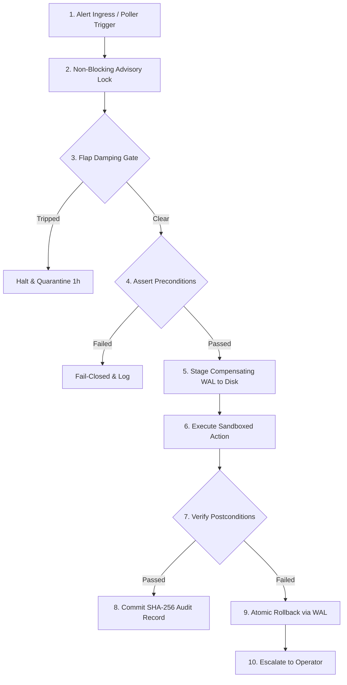

# Autonomous Remediation Engine

Autonomous, self-healing infrastructure daemon for Linux servers and edge nodes. Detects system faults, enforces blast-radius limits, verifies operating system ground truth before and after every mutation, and automatically rolls back if recovery fails.

Compiled as a single static binary with zero external runtime dependencies. Runs directly on bare metal, virtual machines, or container hosts.

---

## Key Features

- **Ground-Truth Verification**: Evaluates physical OS state (`statfs`, `/proc`, TCP sockets, loopback HTTP health probes). Never relies on shell exit codes (`$? == 0`).
- **Blast-Radius Clamps**: Enforces immutable spatial and temporal boundaries (maximum bytes deleted, maximum processes spawned, hard execution timeouts).
- **Two-Phase Write-Ahead Rollback (WAL)**: Stages compensating reverse operations to disk before applying mutations. Automatically restores the Last-Known-Good (LKG) baseline if postconditions fail.
- **Flapping Circuit Breaker**: Mathematical rate damping ($\le 2$ runs per 10 minutes, $\le 4$ runs per hour, 300s cooldown) prevents runaway restart loops from cascading into cluster outages.
- **Cryptographic Audit Ledger**: Records all state transitions and payload digests in an append-only SHA-256 recurrence hash chain for non-repudiation.
- **AI-Assisted Incident Triage**: Integrates with OpenAI- and NVIDIA-compatible LLM endpoints to analyze unstructured logs and propose runbooks, while all execution and verification remain strictly deterministic.
- **Multiplexed Ingress**: Accepts alerts via local Unix domain socket (POSIX `0660` with peer credential checks), hardened HTTP webhook (with HMAC-SHA256 signatures), or built-in autonomous background polling.
- **Prometheus Observability**: Exposes native metrics on `/metrics` covering execution latency, success/failure counts, rollback events, and circuit breaker states.
- **Zero External Dependencies**: Pure Go 1.23+ standard library implementation. Requires no external database (no Redis, PostgreSQL, or etcd), no Docker daemon, and no cloud provider APIs.

---

## Architecture & Workflow

Every remediation request is processed through an 11-state monotonic state machine:



---

## Production Runbooks

The engine includes 4 pre-configured runbooks for critical server workloads:

### 1. Log Volume Exhaustion (`RBK-DISK-001`)
- **Problem**: Log directories (`/var/log`) fill beyond 85% capacity, threatening system stability.
- **Mechanism**: Verifies disk capacity via `statfs`, scans for rotated archives (`*.log.gz`, `*.old`, `*.log.1`), verifies active service file handles via `/proc/*/fd/*` to ensure active logs are never touched, and unlinks up to 10 oldest archives.
- **Postconditions**: Asserts free space $> 20\%$ and confirms active log inode is unchanged.
- **Limits**: Maximum 10 files, maximum 500 MB per run, 15s timeout.

### 2. Service Hang & Deadlock Recovery (`RBK-PROC-001`)
- **Problem**: Background service (e.g. API gateway or proxy) hangs on a deadlocked socket or memory leak.
- **Mechanism**: Detects consecutive health check timeouts on `/healthz`, verifies PID start time to prevent PID recycling races, sends `SIGTERM`, waits up to 5s, escalates to `SIGKILL` if deadlocked, spawns a clean replacement process, and verifies loopback listening ports.
- **Postconditions**: New PID is active, target port is listening in `/proc/net/tcp`, and HTTP health probe returns `200 OK`.
- **Limits**: Single target PID, 15s timeout.

### 3. TLS Certificate Rotation (`RBK-TLS-001`)
- **Problem**: TLS certificates approach expiration or become invalid.
- **Mechanism**: Pre-validates staged certificate validity ($> 30\text{ days}$) and key modulus match, takes an atomic backup of active cert/key, swaps files atomically, and issues `SIGHUP` reload to the service.
- **Postconditions**: Live TLS handshake on target port presents the new certificate serial number and service remains healthy.
- **Rollback**: Restores original cert/key from backup and re-issues `SIGHUP` if verification fails.

### 4. Corrupted Configuration Rollback (`RBK-CFG-001`)
- **Problem**: Malformed configuration rollouts cause startup crash loops.
- **Mechanism**: Detects health failures, moves the corrupted configuration to a quarantine directory, restores the verified Last-Known-Good (LKG) configuration snapshot, and restarts the service.
- **Postconditions**: Service starts cleanly, matches LKG SHA-256 hash, and passes `/healthz` checks.

---

## Quickstart

### 1. Building the Binaries

Requires Go 1.23+:

```bash
# Build statically linked binaries into bin/
make build

# Binaries generated:
# bin/remediation-daemon  (System daemon)
# bin/remediation-ctl     (Operator CLI)
```

### 2. Running the Daemon

```bash
# Start with default configuration
./bin/remediation-daemon

# Or start with a custom configuration file
./bin/remediation-daemon --config=/etc/autonomous-remediation/config.yaml
```

### 3. Using the Operator CLI

```bash
# List all registered production runbooks
./bin/remediation-ctl list-runbooks

# Check engine and circuit breaker status
./bin/remediation-ctl status
./bin/remediation-ctl damping-status

# Trigger a runbook manually
./bin/remediation-ctl run --runbook=disk_cleanup_var_log --resource=/var/log/ai-gateway

# Verify cryptographic audit ledger integrity
./bin/remediation-ctl verify-audit --file=/var/lib/autonomous-remediation/audit/audit.wal
```

---

## AI-Assisted Incident Triage

The engine includes an AI triage client compatible with OpenAI and NVIDIA API endpoints. It sends raw incident logs to an LLM for root-cause analysis and runbook selection, then enforces the proposal through the deterministic state machine.

### Dry-Run Mode (Inspection Only)

Queries the model, prints the diagnosis and SRE reasoning trace, and displays would-be prechecks without modifying any files or processes:

```bash
./bin/remediation-ctl triage \
  --api-key="$NVIDIA_API_KEY" \
  --base-url="https://integrate.api.nvidia.com/v1" \
  --model="nvidia/nemotron-3-ultra-550b-a55b" \
  --incident="2026-09-22T22:30:15Z [CRITICAL] EXT4-fs error: no space left on device in /var/log/ai-gateway"
```

### Live Execution Mode

Executes the model's proposal through the deterministic engine (advisory locks, preconditions, sandboxed action, postcondition verification, and cryptographic commit):

```bash
./bin/remediation-ctl triage \
  --api-key="$NVIDIA_API_KEY" \
  --base-url="https://integrate.api.nvidia.com/v1" \
  --model="nvidia/nemotron-3-ultra-550b-a55b" \
  --incident="/var/log/incident.log" \
  --execute
```

---

## Webhook API Reference

The daemon exposes an HTTP/REST interface (default: `127.0.0.1:9443`):

### 1. Ingest Alert (`POST /v1/alerts`)

Receives an alert and triggers the corresponding runbook. Supports constant-time HMAC-SHA256 signature verification via the `X-Signature-256` header.

**Request**:
```bash
curl -X POST http://127.0.0.1:9443/v1/alerts \
  -H "Content-Type: application/json" \
  -H "X-Signature-256: <hex-hmac-sha256-signature>" \
  -d '{
    "runbook_id": "RBK-DISK-001",
    "resource": "/var/log/ai-gateway",
    "severity": "HIGH",
    "source": "alertmanager",
    "reason": "disk capacity > 85%"
  }'
```

**Response (`200 OK`)**:
```json
{
  "transaction_id": "RBK-DISK-001-webhook-1790114650760",
  "runbook_id": "RBK-DISK-001",
  "resource": "/var/log/ai-gateway",
  "state": "COMMITTED",
  "duration_ms": 72.9,
  "success": true,
  "message": "Remediation verified, committed, and chained to audit ledger"
}
```

### 2. Health Probe (`GET /healthz`)

Returns `200 OK` when the daemon is healthy (lock directory writable and audit ledger operational). Returns `503 Service Unavailable` if degraded.

### 3. Engine Status (`GET /v1/status`)

Returns daemon uptime, registered runbooks, circuit breaker states, and the latest audit ledger hash.

### 4. Prometheus Metrics (`GET /metrics`)

Returns Prometheus text-formatted metrics:

```text
# HELP remediation_actions_total Total number of remediation actions executed
# TYPE remediation_actions_total counter
remediation_actions_total{runbook="RBK-DISK-001",state="COMMITTED"} 14
remediation_actions_total{runbook="RBK-PROC-001",state="ROLLED_BACK"} 1

# HELP remediation_duration_seconds Latency of remediation executions
# TYPE remediation_duration_seconds histogram
remediation_duration_seconds_bucket{runbook="RBK-DISK-001",le="0.1"} 12
remediation_duration_seconds_bucket{runbook="RBK-DISK-001",le="0.5"} 14
remediation_duration_seconds_sum{runbook="RBK-DISK-001"} 1.02
remediation_duration_seconds_count{runbook="RBK-DISK-001"} 14

# HELP remediation_damping_tripped_total Total times flap damping was tripped
# TYPE remediation_damping_tripped_total counter
remediation_damping_tripped_total{resource="/var/log"} 0
```

---

## Configuration Reference

Configuration is managed via YAML or JSON (see [`config.example.yaml`](file:///root/autonomous-remediation-engine/config.example.yaml)):

```yaml
# Ingress Settings
unix_socket_path: "/run/remediation.sock"
http_addr: "127.0.0.1:9443"
hmac_secret: "replace-with-secure-shared-secret"

# Persistence Paths
lock_dir: "/var/run/remediation/"
audit_log_path: "/var/lib/autonomous-remediation/audit/audit.wal"
journal_dir: "/var/lib/autonomous-remediation/journal/"
damping_state_file: "/var/lib/autonomous-remediation/damping.json"

# Autonomous Background Poller
poll_interval_seconds: 2
monitored_paths:
  - path: "/var/log"
    min_free_pct: 15.0

monitored_services:
  - name: "ai-gateway"
    health_url: "http://127.0.0.1:8080/healthz"
    pid_file: "/var/run/ai-gateway.pid"
    port: 8080
    timeout_seconds: 3
```

---

## Testing & Verification

The project includes unit tests, integration tests, and live chaos verification scripts:

```bash
# Run all unit and integration tests
make test

# Run the live chaos verification suite
make chaos
```

### Chaos Test Suite Coverage:
1. **Disk Saturation & Auto-Drain (`test_disk_drain.sh`)**: Injects expired log archives, triggers cleanup, verifies safe pruning, and confirms active log inode is preserved.
2. **Process Deadlock & SIGKILL Ladder (`test_deadlock_recovery.sh`)**: Spawns a daemon that traps and ignores `SIGTERM`, verifies escalation to `SIGKILL`, respawns the service, and verifies recovery.
3. **TLS Expiry & Hot-Reload (`test_tls_rotation.sh`)**: Injects an expiring certificate, triggers atomic rotation, and asserts the new serial number via live TLS handshake.
4. **Configuration Rollback (`test_config_rollback.sh`)**: Injects syntax errors into a service configuration, triggers rollback, and verifies restoration of the Last-Known-Good baseline.

---

## License

Proprietary. All rights reserved.
