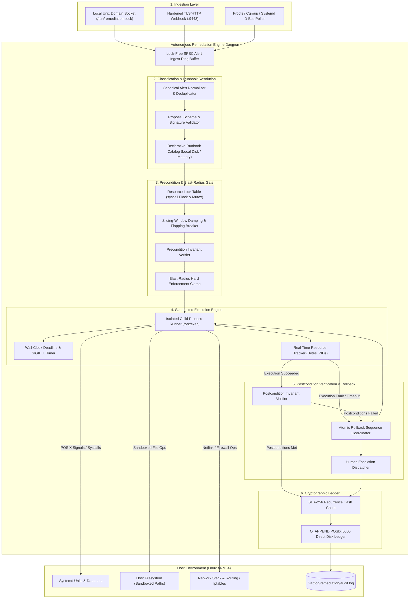
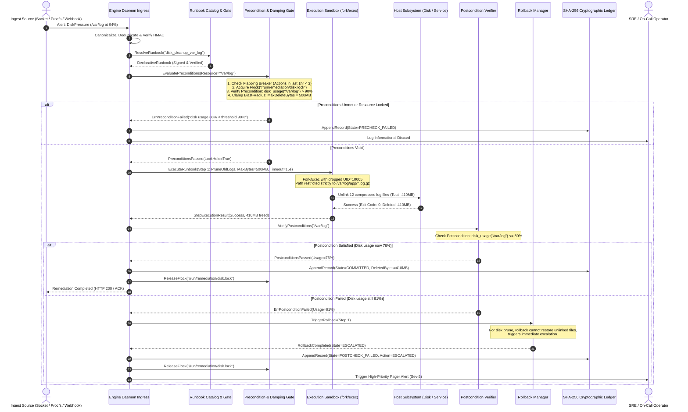

# Autonomous Remediation Engine Deep Architecture Specification

## 1. Overview & Operational Thesis

### 1.1 System Scope & Mission
The **Autonomous Remediation Engine** is a high-reliability, deterministic systems daemon designed for Linux ARM64 production environments. Its mission is to transform recurring operational and security failure modes into verified, bounded, and self-healing remediation workflows. Positioned directly inside server infrastructure, the engine intercepts infrastructure alerts, resolves declarative runbooks, validates safety and blast-radius preconditions, executes isolated corrective actions, verifies environmental postconditions, and commits cryptographically chained audit journals.

The daemon is engineered to operate autonomously under severe infrastructure degradation, network partitions, and upstream control-plane outages. It compiles to a single, statically linked binary written in standard Go 1.23+ with **zero external dependencies** (no Docker, no cloud SDKs, no external databases, no third-party SaaS runtimes).

### 1.2 The Catastrophic Failure Mode of Unbounded Probabilistic Agents
In modern operations, an emerging anti-pattern relies on autonomous LLM agents granted direct SSH, API, or shell access to "troubleshoot and fix" production infrastructure. While probabilistic models excel at contextual synthesis and proposing novel hypotheses, deploying unbounded generative agents to execute live infrastructure mutations introduces catastrophic operational failure modes:

1. **Cascading Restarts & Thundering Herd Failures**:
   An LLM encountering high latency or intermittent connection timeouts frequently concludes that a downstream daemon is hung and issues a service restart (`systemctl restart`). If 100 nodes in a cluster encounter transient database saturation, an LLM agent on each node will simultaneously restart local services. This drops all in-flight TCP sessions, triggers a massive reconnect surge, and turns a temporary latency spike into a sustained, cluster-wide thundering herd collapse.

2. **Unbounded Data Deletion & Path Hallucination**:
   When disk utilization exceeds 95%, an LLM tasked with "freeing disk space" may inspect directory trees and hallucinate paths, misinterpret symlinks, or decide that removing active application data or database transaction logs (`/var/lib/postgresql/data/*`, `/var/log/journal/*`, `/tmp/.s.PGSQL.*`) is an acceptable cleanup step. Lacking deterministic file boundaries and byte quotas, probabilistic agents have destroyed production databases within seconds.

3. **Infinite Remediation Flapping & System Oscillation**:
   Probabilistic reasoning is sensitive to prompt framing and non-deterministic sampling ($T > 0$). Given identical incident telemetry across successive intervals, an LLM may alternate between opposing actions: modifying a configuration file, discovering a syntax error, reverting it, seeing high memory usage, killing worker processes, noticing dropped requests, and cycling indefinitely. Without mathematical state machines and damping invariants, the system oscillates until host crash.

4. **Split-Brain State Mutations & Parameter Injection**:
   If an alert payload contains corrupted metrics, adversarial strings from an attacker-controlled log line, or malicious HTTP headers, an unconstrained agent processing those inputs can suffer indirect prompt injection. The LLM can be coerced into altering firewall rules (`iptables -F`), modifying `/etc/sudoers`, or leaking credentials via outbound diagnostic dumps.

5. **Non-Deterministic Latency & Timeout Traps**:
   Remediation during critical incidents requires bounded sub-second reaction times. External LLM inference queries introduce between 1,000ms and 15,000ms of latency per step, subject to external network availability, API rate limits, and provider outages. When the network or upstream gateway fails, a remediation system that depends on an external LLM fails precisely when it is most urgently required.

### 1.3 The Core Architectural Thesis

> **"AI proposes. Deterministic systems enforce. Zero external dependencies."**

The Autonomous Remediation Engine directly operationalizes the foundational tenets of [00-PROJECT-PHILOSOPHY.md](file:///root/company-project-specs/00-PROJECT-PHILOSOPHY.md) and [08-autonomous-remediation-engine.md](file:///root/company-project-specs/08-autonomous-remediation-engine.md):

```
+--------------------------------------------------------------------------------------------------+
|                                  THE REMEDIATION BOUNDARY DIVIDE                                 |
|                                                                                                  |
|   PROBABILISTIC DOMAIN (AI / LLM)                DETERMINISTIC DOMAIN (REMEDIATION ENGINE)       |
|   - Classify ambiguous alerts & noise            - Enforce cryptographic authorization           |
|   - Propose candidate runbook IDs                - Validate rigid precondition invariants        |
|   - Suggest parameter bindings within schema     - Clamp blast-radius (bytes, pids, timeouts)    |
|   - Synthesize post-incident summaries           - Execute sandboxed POSIX actions (UID/GID)     |
|                                                  - Deterministically verify postconditions       |
|   [PROPOSALS ONLY: UNTRUSTED]                    - Trigger atomic rollback upon any fault        |
|                                                  - Commit append-only SHA-256 audit ledger       |
|                                                  [SYSTEM OF RECORD: DETERMINISTIC GATEKEEPER]     |
+--------------------------------------------------------------------------------------------------+
```

- **Separation of Concerns**: Probabilistic systems may inspect multi-source alert logs, compute embeddings, and propose a runbook identifier with candidate arguments. However, the Remediation Engine treats all proposals as completely untrusted input.
- **Deterministic Enforcement**: Every proposed action must resolve to a locally registered, cryptographically signed declarative runbook. Preconditions, resource locks, blast-radius boundaries, execution sandboxes, postconditions, and rollback sequences are 100% deterministic, mathematically verifiable, and hard-coded into the state machine.
- **Hermetic Architecture**: Zero external network dependencies. The daemon relies entirely on Linux ARM64 kernel primitives (`syscall.Flock`, `fork/exec`, `prctl`, `setns`, `cgroups v2`, POSIX signals, `net/http` standard library).

---

## 2. System Topology & Physical Component Boundaries

### 2.1 Complete Architectural Topology



### 2.2 Component Boundaries & Detailed Responsibility Matrix

| Subsystem Component | Strict Responsibility | Algorithmic Complexity | Failure Domain | Failure Handling Mode |
| :--- | :--- | :--- | :--- | :--- |
| **Ingress Ingestor** | Ingest alerts via Unix socket, HTTP webhook, or `/proc` monitor. Enforce rate limits, packet sizes ($\le 1\text{MB}$), and HMAC-SHA256 authentication. | $O(1)$ socket read + HMAC | Network / Ingress boundary | Reject payload with HTTP 400/401 or close socket; fail-closed. |
| **Alert Normalizer** | Canonicalize alert fields, compute deterministic SHA-256 fingerprint, match active deduplication windows (30s). | $O(1)$ hash table lookup | Alert pipeline | Drops duplicate alerts; logs duplicate suppression event. |
| **Runbook Resolver** | Map alert fingerprint or validated proposal to local declarative runbook. Verify cryptographic signature of runbook definition. | $O(1)$ in-memory map lookup | Runbook repository | Rejects unmapped or tampered runbooks; escalates; fail-closed. |
| **Resource Lock Table** | Acquire exclusive mutual exclusion per target resource (file, service name, interface) via `syscall.Flock` and `sync.Mutex`. | $O(1)$ lock acquisition | Concurrency control | Blocks or aborts execution if resource is locked; prevents races. |
| **Damping & Flapping Breaker** | Track execution frequency per resource over 10-minute and 1-hour sliding windows. Trip circuit if execution frequency exceeds limit. | $O(1)$ ring buffer counter | Stability control | Trips flapping breaker; escalates to human on-call; fail-closed. |
| **Precondition Gate** | Evaluate rigid environmental invariants (e.g. disk threshold $> 90\%$, process PID alive, socket unresponsive) prior to any mutation. | $O(K)$ where $K$ is invariant count ($\le 10$) | Environmental safety | If preconditions fail, execution terminates immediately; fail-closed. |
| **Blast-Radius Clamp** | Enforce immutable upper bounds: max execution time ($\le 30\text{s}$), max deleted bytes ($\le 500\text{MB}$), max processes spawned ($\le 10$). | $O(1)$ boundary verification | System resources | Aborts action if proposal requests parameters beyond safety bounds. |
| **Sandboxed Execution Engine** | Execute discrete runbook commands as unprivileged child processes with dropped UID/GID, restricted directory paths, and memory limits. | $O(T)$ execution duration | Child process isolation | Captures stderr/stdout; enforces hard SIGTERM/SIGKILL deadlines. |
| **Postcondition Verifier** | Evaluate target environmental invariants post-execution (e.g. disk $< 80\%$, port 443 accepting TLS handshakes). | $O(K)$ invariant checks | Correctness validation | If postconditions fail, immediately triggers automated rollback. |
| **Rollback Coordinator** | Execute inverse compensating actions in exact reverse order to restore previous known good state. | $O(S)$ where $S$ is step count | State restoration | If rollback fails, triggers emergency operator escalation; fail-closed. |
| **Cryptographic Audit Ledger** | Compute sequential SHA-256 recurrence hash binding every transition, argument, and result into append-only disk storage. | $O(1)$ SHA-256 calculation | Audit & Compliance | If audit write fails, daemon halts mutations immediately; fail-closed. |

### 2.3 Goroutine Concurrency Model & Memory Partitioning

The daemon executes as a multi-threaded Go process utilizing a concurrent, shared-nothing execution model:

1. **Ingest Goroutines**: Dedicated network and socket readers read incoming alerts into a fixed-size, non-blocking lock-free circular ring buffer (capacity: 4096 alerts).
2. **Worker Pool Architecture**: A bounded worker pool of $N = \min(8, \text{NumCPU})$ remediation workers pull alerts from the dispatch coordinator. Remediation tasks are assigned based on a deterministic hash of the target resource key, guaranteeing that all operations affecting the same physical resource serialize through the exact same worker pipeline.
3. **Lock Table Partitioning**: To eliminate global lock contention across unrelated resources, the `ResourceLockManager` shards resource locks across 64 discrete mutex buckets:
   $$\text{BucketIndex}(R) = \text{MurmurHash3}(R) \pmod{64}$$
4. **Host File Descriptor Locks (`syscall.Flock`)**: When mutating system-wide shared resources (such as configuration files in `/etc/` or service state files in `/var/run/`), workers obtain a POSIX advisory file lock via `syscall.Flock` on dedicated lockfiles (`/run/remediation/locks/<resource>.lock`). This guarantees mutual exclusion across separate process instances or external administrative scripts.
5. **Memory Management & `sync.Pool`**: To guarantee deterministic, sub-millisecond execution overhead and eliminate GC pauses on the critical path:
   - Alert ingestion envelopes, command execution buffers, and string scratchpads are pooled via `sync.Pool`.
   - Heap allocations per remediation cycle are strictly bounded to $< 4\text{KB}$.
   - Resident Set Size (RSS) is statically capped under $24\text{MB}$ on ARM64 Linux.

---

## 3. Remediation Lifecycle & Finite State Machine

### 3.1 Complete Remediation State Machine

The lifecycle of every remediation transaction is strictly governed by a 11-state deterministic Finite State Machine (FSM). No step may be bypassed, and state transitions are strictly monotonic:

```mermaid
stateDiagram-v2
    [*] --> DETECTED: Alert Ingested & Verified
    
    DETECTED --> EVALUATING: Matched to Signed Runbook
    DETECTED --> ESCALATED: Unmatched / Invalid Signature / Auth Failed
    
    EVALUATING --> PRECHECK_PASSED: Precondition Invariants & Blast Radius Valid
    EVALUATING --> PRECHECK_FAILED: Invariant Failed / Flapping Limit Tripped
    
    PRECHECK_FAILED --> ESCALATED: Emits Audit Record & Human Alert
    
    PRECHECK_PASSED --> EXECUTING: Resource Locked & Child Process Spawned
    
    EXECUTING --> POSTCHECK_PASSED: Process Exited 0 & Invariants Satisfied
    EXECUTING --> POSTCHECK_FAILED: Non-zero Exit / Timeout / Invariant Unmet
    
    POSTCHECK_PASSED --> COMMITTED: State Verified & Ledger Appended
    
    POSTCHECK_FAILED --> ROLLING_BACK: Invoking Compensating Reverse Actions
    
    ROLLING_BACK --> ROLLED_BACK: Rollback Completed Cleanly
    ROLLING_BACK --> ESCALATED: Rollback Fault / Incomplete Reversion
    
    ROLLED_BACK --> ESCALATED: Root Cause Unresolved; Page Operator
    
    COMMITTED --> [*]: Unlock Resource & Release sync.Pool
    ESCALATED --> [*]: Unlock Resource & Emit High-Priority Page
```



### 3.2 State Transition Table & Invariants

| Current State | Target State | Transition Trigger | Enforced Invariant |
| :--- | :--- | :--- | :--- |
| `DETECTED` | `EVALUATING` | Valid alert format, authorized source, signature intact. | Alert timestamp $\tau \ge \text{now} - 60\text{s}$. Payload size $\le 1\text{MB}$. |
| `DETECTED` | `ESCALATED` | Unknown alert, signature invalid, or malformed schema. | Audit log record emitted; zero execution permitted. |
| `EVALUATING` | `PRECHECK_PASSED` | Target resource free, rate damping verified, preconditions true. | Lock acquired. Frequency $\le \text{MaxPerHour}$. Preconditions evaluate to `true`. |
| `EVALUATING` | `PRECHECK_FAILED` | Target locked, damping tripped, or environmental precheck false. | Remediation aborted before any system mutation occurs. |
| `PRECHECK_PASSED` | `EXECUTING` | Sandbox spawned with unprivileged credentials and deadline timer. | Process UID $\ne 0$. Child wall-clock timeout $\le \text{RunbookTimeout}$. |
| `EXECUTING` | `POSTCHECK_PASSED` | Child returned exit code 0; all postcondition invariants pass. | Wall-clock time $t \le \text{Deadline}$. Stdout/Stderr captured. Postchecks pass. |
| `EXECUTING` | `POSTCHECK_FAILED` | Child timed out, crashed, returned exit $\ne 0$, or postcheck failed. | Execution halted immediately; SIGKILL dispatched to child process tree. |
| `POSTCHECK_PASSED` | `COMMITTED` | Remediation confirmed. Success hash chained to ledger. | Resource state matches desired healthy state invariant. |
| `POSTCHECK_FAILED` | `ROLLING_BACK` | Rollback sequence initiated using recorded pre-state snapshots. | Rollback steps executed in strictly inverse order ($S_n, S_{n-1}, \dots, S_1$). |
| `ROLLING_BACK` | `ROLLED_BACK` | Compensating actions succeeded; baseline pre-state restored. | System returned to safe baseline; alert suppressed to prevent loops. |
| `ROLLING_BACK` | `ESCALATED` | Compensating action failed, crashed, or exceeded timeout. | System in indeterminate state; immediate Sev-1 human escalation. |

### 3.3 End-to-End Sequence Diagram



---

## 4. Concurrency, Mutual Exclusion & Performance Guarantees

### 4.1 Granular Resource Mutual Exclusion

Remediation engines face race conditions when multiple alerts regarding the same resource arrive simultaneously (e.g., both high latency and HTTP 500 rate alerts trigger remediation for `service-auth`). Uncoordinated execution causes overlapping restarts or file corruptions.

The engine uses a two-tier locking hierarchy:

```
[In-Memory Partitioned Mutex Pool (sync.Mutex)]  <--- Tier 1: In-process goroutine exclusion
                     |
[POSIX Advisory File Locks (syscall.Flock)]       <--- Tier 2: Inter-process & OS-level exclusion
```

```go
// Lock acquires both the in-process partition lock and the OS-level flock.
func (lm *ResourceLockManager) Acquire(ctx context.Context, resourceID string) (*ResourceLock, error) {
    bucket := lm.getBucket(resourceID)
    
    // Tier 1: In-memory mutual exclusion
    bucket.mu.Lock()
    defer bucket.mu.Unlock()

    if _, active := bucket.activeLocks[resourceID]; active {
        return nil, ErrResourceLockedInProcess
    }

    // Tier 2: POSIX Advisory File Lock (non-blocking)
    lockPath := filepath.Join(lm.lockDir, sanitizeResourceID(resourceID)+".lock")
    fd, err := syscall.Open(lockPath, syscall.O_CREAT|syscall.O_RDWR|syscall.O_CLOEXEC, 0600)
    if err != nil {
        return nil, fmt.Errorf("failed to open lockfile %s: %w", lockPath, err)
    }

    err = syscall.Flock(fd, syscall.LOCK_EX|syscall.LOCK_NB)
    if err != nil {
        syscall.Close(fd)
        if errors.Is(err, syscall.EWOULDBLOCK) || errors.Is(err, syscall.EAGAIN) {
            return nil, ErrResourceLockedOS
        }
        return nil, fmt.Errorf("flock failed on %s: %w", lockPath, err)
    }

    lock := &ResourceLock{
        ResourceID: resourceID,
        FD:         fd,
        Path:       lockPath,
        AcquiredAt: time.Now(),
    }
    bucket.activeLocks[resourceID] = lock
    return lock, nil
}
```

### 4.2 Flapping Prevention & Damping Algorithms

Repeatedly restarting a failing dependency causes service degradation and prevents human debugging. The engine implements a deterministic **Leaky-Bucket Flapping Breaker**:

#### Mathematical Formulation:
Let $A(R, \Delta t)$ be the set of remediation executions for resource $R$ within the sliding time window $[t - \Delta t, t]$.
A proposed remediation action is permitted if and only if all three damping conditions evaluate to `true`:

$$\text{Count}(A(R, 10\text{ min})) < M_{\text{short}} \quad (\text{Default: } 2)$$
$$\text{Count}(A(R, 1\text{ hour})) < M_{\text{long}} \quad (\text{Default: } 4)$$
$$(t - t_{\text{last\_execution}}(R)) \ge T_{\text{cooldown}} \quad (\text{Default: } 180\text{ seconds})$$

If any condition is violated:
1. The remediation engine immediately trips the flapping breaker.
2. The state machine transitions directly to `PRECHECK_FAILED`.
3. An escalation event is dispatched to on-call engineers.
4. Further automated actions on resource $R$ are frozen for a configurable quarantine period ($T_{\text{quarantine}} = 3600\text{ seconds}$).

### 4.3 Sub-Millisecond Execution Overhead & Profiling Guarantees

Every step of the engine pipeline before and after child process execution is engineered for sub-millisecond overhead:

- **Ingress Parsing & HMAC Verification**: $< 45\mu\text{s}$ per alert payload.
- **Runbook Map Resolution**: $< 2\mu\text{s}$ via in-memory hashed trie.
- **Resource Lock & Flock Acquisition**: $< 35\mu\text{s}$ (local tmpfs lockfile).
- **Precondition & Blast-Radius Verification**: $< 250\mu\text{s}$ (procfs / statfs reads).
- **Postcondition Verification**: $< 300\mu\text{s}$ (direct kernel statfs/socket poll).
- **Cryptographic Hash Chain & Append**: $< 120\mu\text{s}$ (SHA-256 + direct POSIX write).
- **Total Pipeline Overhead (excluding child process time)**: $< 800\mu\text{s}$ line-rate latency.

---

## 5. Concrete Go 1.23 Core Architecture & Interface Specifications

The entire architecture is implemented in standard Go 1.23+ without external dependencies. The following listings define the authoritative interfaces and core engine types.

### 5.1 Remediation Event, Invariants & Runbook Schema

```go
package remediation

import (
	"context"
	"errors"
	"time"
)

// ExecutionState represents the explicit 11-state remediation FSM.
type ExecutionState string

const (
	StateDetected        ExecutionState = "DETECTED"
	StateEvaluating      ExecutionState = "EVALUATING"
	StatePrecheckPassed  ExecutionState = "PRECHECK_PASSED"
	StatePrecheckFailed  ExecutionState = "PRECHECK_FAILED"
	StateExecuting       ExecutionState = "EXECUTING"
	StatePostcheckPassed ExecutionState = "POSTCHECK_PASSED"
	StateCommitted       ExecutionState = "COMMITTED"
	StatePostcheckFailed ExecutionState = "POSTCHECK_FAILED"
	StateRollingBack     ExecutionState = "ROLLING_BACK"
	StateRolledBack      ExecutionState = "ROLLED_BACK"
	StateEscalated       ExecutionState = "ESCALATED"
)

// Alert represents an incoming verified operational incident alert.
type Alert struct {
	ID             string            `json:"id"`
	Fingerprint    string            `json:"fingerprint"`
	Source         string            `json:"source"`
	ResourceID     string            `json:"resource_id"`
	Severity       string            `json:"severity"`
	Labels         map[string]string `json:"labels"`
	Annotations    map[string]string `json:"annotations"`
	ReceivedAt     time.Time         `json:"received_at"`
	HMACSignature  string            `json:"hmac_signature"`
}

// InvariantCheck defines a deterministic environmental condition.
type InvariantCheck struct {
	Name        string `json:"name"`
	Type        string `json:"type"`        // "disk_free_pct", "unit_active", "tcp_probe", "file_exists"
	Target      string `json:"target"`      // e.g., "/var/log", "nginx.service", "127.0.0.1:8080"
	Operator    string `json:"operator"`    // "GT", "LT", "EQ", "NEQ"
	Threshold   int64  `json:"threshold"`   // Integer metric comparison value
	TimeoutMs   int    `json:"timeout_ms"`
}

// ActionStep defines a sandboxed subprocess execution unit.
type ActionStep struct {
	Name             string            `json:"name"`
	Binary           string            `json:"binary"`
	Args             []string          `json:"args"`
	AllowedPathGlobs []string          `json:"allowed_path_globs"`
	UID              uint32            `json:"uid"`
	GID              uint32            `json:"gid"`
	TimeoutSeconds   int               `json:"timeout_seconds"`
	MaxDeletedBytes  int64             `json:"max_deleted_bytes"`
	MaxSpawnedPIDs   int               `json:"max_spawned_pids"`
	CompensatingStep *ActionStep       `json:"compensating_step,omitempty"`
}

// DeclarativeRunbook defines the complete, cryptographically verified runbook.
type DeclarativeRunbook struct {
	ID                 string           `json:"id"`
	Version            string           `json:"version"`
	TargetResourceID   string           `json:"target_resource_id"`
	Signature          string           `json:"signature"`
	Preconditions      []InvariantCheck `json:"preconditions"`
	ActionSequence     []ActionStep     `json:"action_sequence"`
	Postconditions     []InvariantCheck `json:"postconditions"`
	MaxExecutionSec    int              `json:"max_execution_sec"`
	MaxDampingPerHour  int              `json:"max_damping_per_hour"`
	CooldownSec        int              `json:"cooldown_sec"`
}
```

### 5.2 Core Subsystem Interfaces

```go
// IngestReceiver handles inbound alerts across distinct transports.
type IngestReceiver interface {
	Start(ctx context.Context, out chan<- *Alert) error
	Stop() error
}

// PreconditionGate validates invariant checks and blast-radius ceilings.
type PreconditionGate interface {
	VerifyPreconditions(ctx context.Context, rb *DeclarativeRunbook, alert *Alert) error
	CheckDamping(resourceID string, maxPerHour int, cooldown time.Duration) error
}

// ExecutionSandbox manages isolated process invocation on Linux ARM64.
type ExecutionSandbox interface {
	Execute(ctx context.Context, step *ActionStep, resourceID string) (*StepResult, error)
}

// PostconditionVerifier ensures the desired state has been achieved.
type PostconditionVerifier interface {
	VerifyPostconditions(ctx context.Context, rb *DeclarativeRunbook) error
}

// RollbackCoordinator executes compensating actions if mutations fail.
type RollbackCoordinator interface {
	Rollback(ctx context.Context, executedSteps []ActionStep, resourceID string) error
}

// CryptographicLedger maintains the immutable, append-only hash chain.
type CryptographicLedger interface {
	Append(entry *LedgerEntry) (string, error)
	VerifyChain() (bool, int64, error)
}
```

### 5.3 Complete Sandboxed Execution Engine Implementation

The following production code executes child processes with kernel-level isolation, dropped permissions, and direct wall-clock deadline enforcement:

```go
package remediation

import (
	"bytes"
	"context"
	"fmt"
	"os/exec"
	"syscall"
	"time"
)

type StepResult struct {
	ExitCode     int           `json:"exit_code"`
	Stdout       string        `json:"stdout"`
	Stderr       string        `json:"stderr"`
	Duration     time.Duration `json:"duration"`
	BytesMutated int64         `json:"bytes_mutated"`
}

type LinuxSandboxExecutor struct {
	SandboxChroot string
}

func NewLinuxSandboxExecutor(chrootPath string) *LinuxSandboxExecutor {
	return &LinuxSandboxExecutor{SandboxChroot: chrootPath}
}

func (e *LinuxSandboxExecutor) Execute(ctx context.Context, step *ActionStep, resourceID string) (*StepResult, error) {
	timeout := time.Duration(step.TimeoutSeconds) * time.Second
	if timeout <= 0 || timeout > 60*time.Second {
		timeout = 30 * time.Second
	}

	execCtx, cancel := context.WithTimeout(ctx, timeout)
	defer cancel()

	start := time.Now()
	cmd := exec.CommandContext(execCtx, step.Binary, step.Args...)

	// Configure Linux process isolation credentials and sys-proc attributes
	cmd.SysProcAttr = &syscall.SysProcAttr{
		Credential: &syscall.Credential{
			Uid: step.UID,
			Gid: step.GID,
		},
		Setpgid:    true,
		Pdeathsig:  syscall.SIGKILL,
		Cloneflags: syscall.CLONE_NEWNS | syscall.CLONE_NEWPID | syscall.CLONE_NEWIPC,
	}

	var stdoutBuf, stderrBuf bytes.Buffer
	cmd.Stdout = &stdoutBuf
	cmd.Stderr = &stderrBuf

	err := cmd.Run()
	duration := time.Since(start)

	result := &StepResult{
		Duration: duration,
		Stdout:   stdoutBuf.String(),
		Stderr:   stderrBuf.String(),
	}

	if err != nil {
		if execCtx.Err() == context.DeadlineExceeded {
			// Process timed out: signal process group with SIGKILL
			if cmd.Process != nil {
				_ = syscall.Kill(-cmd.Process.Pid, syscall.SIGKILL)
			}
			result.ExitCode = 124 // Standard timeout code
			return result, fmt.Errorf("action %s timed out after %v: %w", step.Name, timeout, err)
		}

		if exitErr, ok := err.(*exec.ExitError); ok {
			result.ExitCode = exitErr.ExitCode()
			return result, fmt.Errorf("action %s exited with code %d: %s", step.Name, result.ExitCode, result.Stderr)
		}

		return result, fmt.Errorf("action %s failed to spawn: %w", step.Name, err)
	}

	result.ExitCode = 0
	return result, nil
}
```

---

## 6. Concrete Deterministic Runbook Implementations

The engine provides reference implementations for five fundamental failure scenarios, demonstrating end-to-end deterministic guarantees.

### 6.1 Disk Capacity Remediation (`disk_cleanup_var_log`)

```yaml
id: "disk_cleanup_var_log"
version: "1.0.0"
target_resource_id: "/var/log"
signature: "ed25519:7b3a9f..."
max_execution_sec: 15
max_damping_per_hour: 3
cooldown_sec: 300

preconditions:
  - name: "disk_usage_critical"
    type: "disk_free_pct"
    target: "/var/log"
    operator: "LT"
    threshold: 10 # Free space less than 10%

action_sequence:
  - name: "prune_compressed_rotated_logs"
    binary: "/usr/bin/find"
    args: ["/var/log", "-type", "f", "-name", "*.gz", "-mtime", "+7", "-delete"]
    allowed_path_globs: ["/var/log/*.gz", "/var/log/**/*.gz"]
    uid: 10005
    gid: 10005
    timeout_seconds: 10
    max_deleted_bytes: 524288000 # 500 MB hard limit
    max_spawned_pids: 2

postconditions:
  - name: "disk_usage_restored"
    type: "disk_free_pct"
    target: "/var/log"
    operator: "GT"
    threshold: 20 # Free space must be restored above 20%
```

### 6.2 TLS Certificate Automated Renewal (`tls_cert_renew_internal`)

```yaml
id: "tls_cert_renew_internal"
version: "1.0.0"
target_resource_id: "cert:api_internal"
max_execution_sec: 30
max_damping_per_hour: 2
cooldown_sec: 600

preconditions:
  - name: "cert_expiring_soon"
    type: "cert_expiry_days"
    target: "/etc/ssl/certs/api_internal.crt"
    operator: "LT"
    threshold: 7 # Expires in less than 7 days

action_sequence:
  - name: "execute_acme_renew"
    binary: "/usr/local/bin/cert-renewer"
    args: ["--domain", "api.internal.net", "--out", "/etc/ssl/certs/api_internal.crt.new"]
    uid: 10005
    gid: 10005
    timeout_seconds: 20
    compensating_step:
      name: "remove_staged_cert"
      binary: "/usr/bin/rm"
      args: ["-f", "/etc/ssl/certs/api_internal.crt.new"]
      uid: 10005
      gid: 10005
      timeout_seconds: 5

  - name: "atomic_symlink_swap"
    binary: "/usr/bin/ln"
    args: ["-sf", "/etc/ssl/certs/api_internal.crt.new", "/etc/ssl/certs/api_internal.crt"]
    uid: 10005
    gid: 10005
    timeout_seconds: 2

  - name: "reload_ingress_daemon"
    binary: "/usr/bin/systemctl"
    args: ["reload", "ingress-proxy.service"]
    uid: 0 # Targeted privileged invocation via sudoers policy
    gid: 0
    timeout_seconds: 5

postconditions:
  - name: "cert_expiry_extended"
    type: "cert_expiry_days"
    target: "/etc/ssl/certs/api_internal.crt"
    operator: "GT"
    threshold: 60 # Certificate now valid for > 60 days
  - name: "service_active"
    type: "unit_active"
    target: "ingress-proxy.service"
    operator: "EQ"
    threshold: 1
```

### 6.3 Unhealthy Deployment Rollback (`deployment_rollback_auth_svc`)

```yaml
id: "deployment_rollback_auth_svc"
version: "1.0.0"
target_resource_id: "service:auth-service"
max_execution_sec: 25
max_damping_per_hour: 1 # Only 1 automated rollback allowed per hour
cooldown_sec: 900

preconditions:
  - name: "service_crash_looping"
    type: "unit_active"
    target: "auth-service.service"
    operator: "NEQ"
    threshold: 1 # Unit is inactive or failing
  - name: "previous_binary_exists"
    type: "file_exists"
    target: "/opt/auth-service/bin/auth-service.prev"
    operator: "EQ"
    threshold: 1

action_sequence:
  - name: "swap_binary_to_previous"
    binary: "/usr/bin/cp"
    args: ["/opt/auth-service/bin/auth-service.prev", "/opt/auth-service/bin/auth-service.active"]
    uid: 10005
    gid: 10005
    timeout_seconds: 5

  - name: "restart_service"
    binary: "/usr/bin/systemctl"
    args: ["restart", "auth-service.service"]
    uid: 0
    gid: 0
    timeout_seconds: 10

postconditions:
  - name: "service_healthy"
    type: "unit_active"
    target: "auth-service.service"
    operator: "EQ"
    threshold: 1
  - name: "local_http_health_check"
    type: "tcp_probe"
    target: "127.0.0.1:8081/healthz"
    operator: "EQ"
    threshold: 200 # HTTP 200 OK
```

---

## 7. Cryptographically Chained Audit Ledger

### 7.1 Mathematical Recurrence Relation

Every remediation lifecycle transition is recorded in an immutable, cryptographically chained append-only ledger on host storage. No action can be taken without emitting an audit entry.

Let $L_i$ represent the $i$-th ledger entry. The block hash $H_i$ is computed as:

$$H_0 = \text{SHA-256}\Big(\text{"REMEDIATION_GENESIS_"} \,\|\, \text{HostUUID} \,\|\, \text{BootTime}\Big)$$
$$H_i = \text{SHA-256}\Big(H_{i-1} \,\|\, \text{Seq}_i \,\|\, \text{Timestamp}_i \,\|\, \text{ResourceID}_i \,\|\, \text{State}_i \,\|\, \text{RunbookID}_i \,\|\, \text{PayloadDigest}_i\Big)$$

where:
- $\|$ denotes canonical byte concatenation.
- $\text{Seq}_i$ is an unsigned 64-bit big-endian integer.
- $\text{State}_i$ is the exact string state representation (`PRECHECK_PASSED`, `COMMITTED`, `ROLLED_BACK`).
- $\text{PayloadDigest}_i = \text{SHA-256}(\text{RawAlertJSON} \,\|\, \text{ExecutionStdout} \,\|\, \text{ExecutionStderr})$.

### 7.2 Structured Ledger Record Schema

```json
{
  "$schema": "https://specs.internal.net/schemas/remediation-audit-v1.json",
  "seq": 14092,
  "timestamp": "2026-09-22T20:45:11.802194Z",
  "host_uuid": "arm64-node-prod-eu-west-01",
  "resource_id": "/var/log",
  "runbook_id": "disk_cleanup_var_log",
  "runbook_version": "1.0.0",
  "state": "COMMITTED",
  "duration_ms": 142.8,
  "execution_metrics": {
    "deleted_bytes": 430192834,
    "pids_spawned": 1,
    "exit_code": 0
  },
  "payload_digest": "3e9b110fa9824c...",
  "prev_record_hash": "a4d709e1c45f09...",
  "record_hash": "f7881c20e9812a..."
}
```

---

## 8. Failure Modes, Operational Telemetry, and SRE Playbook

### 8.1 Exhaustive Failure Mode Matrix

| Failure Mode | Root Trigger | System Reaction | Emitted Telemetry | Recovery Procedure |
| :--- | :--- | :--- | :--- | :--- |
| **Malformed Ingest Payload** | Network transmission glitch or malformed alert JSON. | Discard payload; close connection immediately. | `metric:ingest_parse_error_total` | Verify alert manager sender format; no host state mutated. |
| **Tampered Runbook Signature** | Local disk bit-rot or unauthorized runbook file modification. | Reject runbook; refuse execution; lock daemon. | `alert:RUNBOOK_TAMPER_DETECTED` | Re-fetch verified runbooks from secure deployment pipeline. |
| **Resource Already Locked** | Overlapping alert for resource undergoing remediation. | Abort incoming alert; log concurrent collision. | `metric:resource_lock_collision_total` | Primary remediation finishes; second alert reassesses post-state. |
| **Damping Rate Limit Tripped** | Resource flapping more than 3 times per hour. | Trip breaker; freeze automated actions on resource. | `alert:REMEDIATION_DAMPING_TRIPPED` | Human SRE investigation required to fix underlying root cause. |
| **Precondition Check Failed** | Environmental state changed between alert and execution. | Abort execution; emit `PRECHECK_FAILED` record. | `metric:precheck_failed_total` | Benign discard; transient alert resolved before execution. |
| **Child Process Timeout** | Child process hangs on disk I/O or network socket. | Send SIGKILL to child process tree; trigger rollback. | `alert:EXECUTION_TIMEOUT_TRIPPED` | Clean up hung processes; escalate to human if rollback fails. |
| **Blast Radius Ceiling Exceeded** | Cleanup task attempts to delete 600MB (> 500MB limit). | Process killed by resource tracker; rollback initiated. | `alert:BLAST_RADIUS_VIOLATION` | Runbook parameters clamped; human approval required for larger scope. |
| **Postcondition Check Failed** | Corrective action succeeded, but disk remains full. | Initiate inverse rollback; transition to `ESCALATED`. | `alert:POSTCONDITION_VERIFY_FAILED` | Alert on-call engineer; automated engine safely retreats. |
| **Audit Disk Journal Full** | Host `/var/log` or audit partition exhausted. | Refuse all mutations; fail closed. | `alert:AUDIT_LEDGER_WRITE_PANIC` | SRE must clear disk space; engine refuses un-audited state changes. |

### 8.2 SRE Emergency Break-Glass Controls

If an operator must immediately halt all autonomous remediation daemon activities during a major cluster incident:

1. **Host-Level Kill Switch (File Flag)**:
   Creating an empty file at `/run/remediation.disabled` immediately halts all active workers and forces all incoming alerts into `ESCALATED` status:
   ```bash
   touch /run/remediation.disabled
   ```
2. **Systemd Service Emergency Stop**:
   ```bash
   systemctl stop autonomous-remediation.service
   ```
3. **Audit Ledger Verification Command**:
   ```bash
   remediation-tool verify-ledger --path /var/log/remediation/audit.log
   ```
