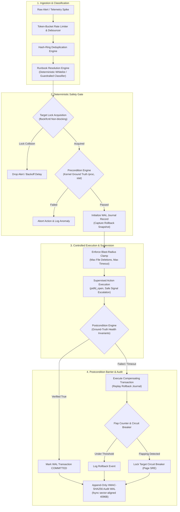
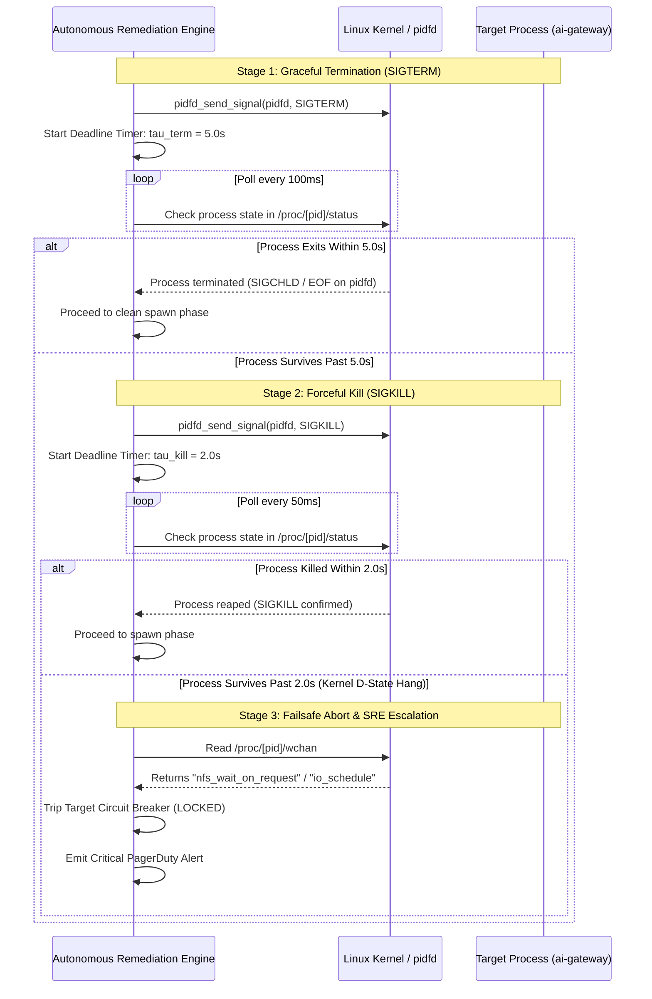

# Autonomous Remediation Engine Failure Modes and Effects Analysis (FMEA) & Systems Resilience Specification

## 1. Executive Summary & Reliability Philosophy

This document defines the comprehensive Failure Modes and Effects Analysis (FMEA), formal mathematical safety proofs, and operational containment architectures for the Autonomous Remediation Engine (`autonomous-remediation-engine`).

Following the foundational engineering principles in [00-PROJECT-PHILOSOPHY.md](file:///root/company-project-specs/00-PROJECT-PHILOSOPHY.md) and the operational mandate in [08-autonomous-remediation-engine.md](file:///root/company-project-specs/08-autonomous-remediation-engine.md), this daemon operates as an autonomous, self-contained, low-latency supervisor on Linux ARM64 platforms. It remediates infrastructure faults across critical systems, including the [ai-gateway](file:///root/company-project-specs/01-ai-gateway.md) and the [ai-security-guardrail-proxy](file:///root/company-project-specs/09-ai-security-guardrail-proxy.md). All operational thresholds, telemetry signals, and latency budgets referenced herein are formally bound in [SLO.md](file:///root/autonomous-remediation-engine/docs/SLO.md) and operationalized in [OPERATIONS.md](file:///root/autonomous-remediation-engine/docs/OPERATIONS.md).

### 1.1. Core Architectural Thesis

The Autonomous Remediation Engine enforces a strict, non-negotiable operational tenet:

$$\text{\bf AI proposes. Deterministic systems enforce.}$$

Modern probabilistic agents and Large Language Models (LLMs) may evaluate unstructured logs, classify ambiguous anomalies, and propose candidate remediation plans. However, probabilistic systems must **never** hold authority to execute privileged mutations or verify postconditions. Every state mutation executed against the host operating system - such as signal dispatch, process spawning, filesystem log rotation, configuration rollbacks, and network adjustments - must be strictly bounded, authorized, and verified through a deterministic state machine.

An action is considered incomplete and rejected until the system deterministically verifies its intended outcome against ground-truth kernel invariants.

### 1.2. Failure Taxonomy & Containment Strategy

Failures within an autonomous remediation engine introduce severe systemic risks. An automated system with privileged access can become an autonomous amplifier of outages if execution loops run unverified. We classify remediation failure modes into four threat domains:

1. **Target Unresponsiveness & Process Desynchronization**: Target processes ignoring signals (`SIGTERM`), entering uninterruptible kernel sleep (`TASK_UNINTERRUPTIBLE`), or dying while having their PIDs recycled by the kernel.
2. **Resource Exhaustion & Log Plane Starvation**: File descriptor depletion, write stalls, lock collisions, or filesystem exhaustion (`ENOSPC`) on the audit journal volume.
3. **Mid-Flight Crashes & Partial State Mutation**: Remediation supervisor panics, host power events, or sudden termination mid-execution, leaving configuration files or processes in half-mutated, corrupted states.
4. **Cascade Feedback Loops & Temporal Instability**: Alert flooding triggering flapping remediation actions, cascading restart storms, or clock jumps invalidating timeouts and cryptographic audit timestamps.

The remediation pipeline enforces explicit **Fail-Secure** boundaries across every stage:

| Remediation Pipeline Stage | Operational Risk | Default Failure Posture | Architectural Invariant |
| :--- | :--- | :--- | :--- |
| **1. Alert Ingestion & Debounce** | Cascading alert floods & CPU starvation | **Drop & Debounce** | Token-bucket rate limiting ($R = 50\,\text{alerts/s}$) with hash-ring deduplication. |
| **2. Runbook Resolution** | Ambiguous classification or invalid plan | **Reject & Escalate** | Strict schema validation; deterministic whitelist match; no unverified AI plans. |
| **3. Precondition Verification** | Remediating healthy or mismatched targets | **Halt Action** | Ground-truth kernel probe (`/proc`, `stat`, TCP); abort if assumptions fail. |
| **4. Mutual Exclusion Lock** | Concurrent conflicting mutations | **Fail-Fast (Non-blocking)** | Advisory file locks (`flock`/`fcntl`) per target; lock timeout strictly bounded. |
| **5. Action Execution** | Runaway blast radius / infinite loops | **Strict Clamp & Abort** | Execution hard timeout ($T \le 15.0\,\text{s}$); CPU/RAM limits; resource mutation caps. |
| **6. Postcondition Verification** | Unverified mutation / phantom recovery | **Atomic Rollback** | Assert ground-truth invariant; zero exit-code trust; fail triggers journal reversal. |
| **7. Rollback Journal Replay** | Secondary failure during compensation | **Quarantine & Alert** | Idempotent reverse operations; fail locks circuit breaker and pages human SRE. |
| **8. Cryptographic Audit Write** | Inability to record non-repudiation proof | **Fail-Secure Halt** | Append-only SHA-256 HMAC WAL; sector-aligned writes; failsafe read-only lock. |

---

## 2. End-to-End Remediation Pipeline & State Machine

The remediation engine processes alerts through a unidirectional, deterministic verification loop. Every state mutation is surrounded by a transactional pre/postcondition barrier and recorded in an atomic write-ahead journal.



---

## 3. Comprehensive Failure Modes and Effects Analysis (FMEA) Matrix

The following matrix catalogs the primary failure modes across the autonomous remediation lifecycle on Linux ARM64 systems:

| Failure ID | Subsystem | Failure Mode | Severity | Root Causes | Detection Telemetry | Immediate System Effect | Mitigation & Containment Strategy | Fail Policy |
| :--- | :--- | :--- | :--- | :--- | :--- | :--- | :--- | :--- | :--- |
| **FM-PRC-01** | Process Supervision | Target process deadlocks / ignores `SIGTERM` | **CRITICAL** | Target thread stuck in unhandled mutex lock, deadlocked userspace event loop, or kernel D-state (`TASK_UNINTERRUPTIBLE`). | `remediation_escalation_sigkill_total`; supervision timeout counter; `/proc/[pid]/wchan` probe. | Target process continues consuming memory/sockets; restart runbook hangs indefinitely. | **Graceful Escalation Ladder**: Send `SIGTERM` via `pidfd_send_signal`. Enforce hard timeout $\tau_{\text{term}} = 5.0\,\text{s}$. If process survives, escalate to `SIGKILL`. If still present after $\tau_{\text{kill}} = 2.0\,\text{s}$ (kernel D-state), abort, lock circuit, and page on-call. | Fail-Secure (Escalate to SIGKILL then Human) |
| **FM-PID-01** | Process Supervision | PID reuse / recycling race condition | **CRITICAL** | Target process exits naturally; Linux kernel reallocates its PID to an unrelated critical daemon before signal dispatch. | `remediation_pid_collision_prevented_total`; process start-time mismatch counter. | Remediation engine sends `SIGTERM`/`SIGKILL` to wrong operating system process. | **`pidfd` Kernel Pinning**: Open Linux file descriptor via `pidfd_open(2)`. Signals dispatched exclusively via `pidfd_send_signal(2)`. On kernels lacking `pidfd`, verify `/proc/[pid]/stat` `starttime` (tick count since boot) matches snapshot. | Fail-Closed (Abort Signal) |
| **FM-AUD-01** | Audit & Persistence | Audit log volume exhaustion (`ENOSPC`) | **CRITICAL** | Filesystem hosting `/var/lib/autonomous-remediation` fills up; zero free blocks or inodes remaining. | `remediation_audit_disk_errors_total`; `node_filesystem_free_bytes` $\le \text{Threshold}$; syscall error `ENOSPC`. | Audit engine cannot append cryptographic transaction record; non-repudiation compromised. | Pre-allocate dedicated 100MB circular journal partition or fallocate buffer. If free capacity $< 5\%$, reject all mutable remediation actions. Strict read-only lockdown: refuse mutations without audit proof. | Fail-Closed (Refuse Mutations) |
| **FM-ACT-01** | Action Execution | Remediation action crashes halfway | **HIGH** | Remediation daemon panics, receives `SIGKILL` from OOM-killer, or host suffers abrupt power loss mid-transaction. | `remediation_journal_recovery_events_total`; uncommitted WAL entry detected on daemon boot. | Target system left in half-modified state (e.g. log file deleted but symlink broken; config truncated). | **Two-Phase Write-Ahead Rollback Journal**: Before mutating host, write compensating inverse action to disk and `fsync`. On crash recovery during daemon startup, replay uncommitted journal records to revert to Last-Known-Good. | Self-Healing (Idempotent Rollback) |
| **FM-CFG-01** | Configuration Recovery | Corrupted target configuration prevents boot | **CRITICAL** | Target daemon config file truncated, contains syntax errors, or references nonexistent TLS certificates. | Target service fails restart; `remediation_postcondition_failed_total{reason="config_invalid"}`. | Managed service (e.g. `ai-gateway`) enters CrashLoopBackOff or fails to bind listening socket. | **Atomic Swap & Last-Known-Good (LKG)**: New configs written to tempfile and swapped via `renameat2(2)`. Pre-flight validation (`--test-config`) before reload. If restart fails, instantly restore verified LKG snapshot and re-assert postconditions. | Fail-Secure (Restore LKG) |
| **FM-ALT-01** | Alert Ingestion | Alert flooding / cascading storms | **HIGH** | Flapping network interface, flapping upstream model, or rapid metric oscillation emits thousands of alerts per second. | `remediation_alerts_dropped_total{reason="rate_limited"}`; ingestion queue watermark $> 80\%$. | High CPU utilization in remediation engine; lock contention; repeated redundant restarts of target services. | **Token-Bucket & Flap Damping**: Enforce token-bucket ingestion rate ($B=50, R=10/\text{s}$). Deduplicate identical alert fingerprints across 10-second sliding windows. Maximum 3 remediation attempts per target per 10 minutes; then lock circuit. | Drop & Throttle (Circuit Lock) |
| **FM-CLK-01** | Time & Scheduling | Clock skew / system time jumps | **MEDIUM** | Host NTP step adjustments, VM clock desynchronization, or leap second insertions jump wall-clock time forward or backward. | `remediation_clock_skew_detected_total`; monotonic vs wall clock delta gauge. | Premature timeout expiration, invalidation of cryptographic audit timestamps, or failure of flap decay math. | **Strict Monotonic Clocks**: All timeouts, deadlines, rate limiters, and flap decay dynamics utilize `CLOCK_MONOTONIC_RAW` (via Go `time.Since` monotonic readings). Wall clock (`CLOCK_REALTIME`) used solely for ISO 8601 audit display. | Fail-Safe (Monotonic Bound) |
| **FM-LCK-01** | Coordination | Lock collision & stale lockfiles | **MEDIUM** | Prior execution crashed without releasing lock, or concurrent remediation workers contend for single service. | `remediation_lock_acquisition_timeout_total`; `EWOULDBLOCK` counter. | Remediation blocked indefinitely, or duplicate conflicting mutations execute simultaneously. | **Kernel-Bound File Locks**: Use advisory kernel locks (`flock(2)` / `fcntl(2)` `F_SETLK`). Locks are tied to the open file descriptor in the kernel table and automatically released upon process death. Zero stale lockfile residue. | Fail-Fast (Drop or Backoff) |
| **FM-VER-01** | Verification Barrier | False positive postcondition check (Exit code 0 but service degraded) | **CRITICAL** | Target daemon restart command succeeds, but internal worker pool hangs or internal database connection deadlocks. | `remediation_postcondition_failed_total`; HTTP health probe failure on local loopback. | Outage remains unresolved while remediation engine marks alert as successfully remediated. | **Multi-Point Ground-Truth Invariant Check**: Never trust shell exit codes ($?=0$). Assert multi-layer postconditions: process state `R`/`S` in `/proc`, TCP socket listening in `/proc/net/tcp`, and HTTP 200 via authenticated `/healthz` probe. | Fail-Secure (Rollback & Page) |

---

## 4. In-Depth Engineering Analysis of Critical Failure Modes

---

### 4.1. Mathematical Analysis of PID Recycling Hazard and `pidfd` Invariants

#### 4.1.1. The PID Wrap Hazard on High-Throughput Linux Systems
On modern Linux kernels, the default maximum process ID limit is configured via `/proc/sys/kernel/pid_max`. In standard containerized or dense cloud environments, this value is often set to $2^{15} = 32{,}768$ (or $2^{22} = 4{,}194{,}304$ on 64-bit systems).

When an infrastructure alert triggers a remediation action targeting a specific process ID $P_{\text{target}}$, a non-zero time interval $\Delta t = t_{\text{signal}} - t_{\text{alert}}$ elapses. During $\Delta t$:
1. The target process may terminate or crash due to memory exhaustion.
2. The host kernel's PID allocator advances linearly through available integers.
3. Upon reaching `pid_max`, the allocator wraps around, recycling previously released integers.

Under high process churn rates (e.g. short-lived bash worker scripts, rapid health checks, fork-heavy microservices), the rate of process creation is $R_{\text{fork}}$ processes per second. The expected time for the PID allocator to wrap around completely is:

$$T_{\text{wrap}} = \frac{\text{PID}_{\max} - \text{PID}_{\text{active}}}{R_{\text{fork}}}$$

For $\text{PID}_{\max} = 32{,}768$, $\text{PID}_{\text{active}} \approx 2{,}000$, and $R_{\text{fork}} = 1{,}000\,\text{forks/sec}$:

$$T_{\text{wrap}} = \frac{30{,}768}{1{,}000} \approx 30.77\,\text{seconds}$$

If the remediation engine experiences an alert delay or execution queue wait $\Delta t > 0$, the probability of a PID collision $P(\text{collision})$ over time window $\Delta t$ approaches:

$$P(\text{collision}) \approx 1 - \exp\left( - \frac{R_{\text{fork}} \cdot \Delta t}{\text{PID}_{\max}} \right)$$

Dispatching `kill(P_{\text{target}}, SIGKILL)` without cryptographic process identity guarantees carries an existential risk of terminating an innocent, unrelated production workload (e.g. the primary database, hypervisor agent, or reverse proxy).

#### 4.1.2. Kernel-Level Mitigation: `pidfd_open(2)` and `/proc` Stat Invariants
To eliminate PID recycling hazards, the Autonomous Remediation Engine implements a two-tier verification protocol:

##### Primary Defense: Linux 5.3+ `pidfd` Primitive
On Linux ARM64 systems running kernel 5.3 or higher, the engine opens a process file descriptor using the `pidfd_open(2)` system call:

```go
// Direct syscall invocation for pidfd_open(pid, flags)
// SYS_PIDFD_OPEN on Linux ARM64 = 434
fd, _, errno := syscall.Syscall(434, uintptr(targetPID), 0, 0)
if errno != 0 {
    // Target PID does not exist or died before handle acquisition
    return nil, fmt.Errorf("pidfd_open failed for pid %d: %w", targetPID, errno)
}
```

The resulting `pidfd` holds a direct, non-reusable reference to the specific kernel `struct task_struct` representing that exact process instance. Even if the process terminates and PID $P_{\text{target}}$ is re-allocated to a new process, the open `pidfd` continues to reference the dead process (which now acts as an inert handle). Subsequent signal dispatch via `pidfd_send_signal(2)`:

```go
// SYS_PIDFD_SEND_SIGNAL on Linux ARM64 = 424
_, _, errno = syscall.Syscall6(424, uintptr(pidfd), uintptr(syscall.SIGTERM), 0, 0, 0, 0)
```

will fail safely with `ESRCH` (No such process), mathematically guaranteeing that a recycled PID will **never** receive a signal meant for a prior process.

##### Fallback Defense: `/proc/[pid]/stat` Start-Time Invariant
On older kernels where `pidfd_open` is unavailable, the engine asserts process identity using the kernel boot tick counter. In `/proc/[pid]/stat`, the 22nd field (`starttime`) represents the time the process started after system boot, expressed in clock ticks (`USER_HZ`, typically 100 Hz):

$$I_{\text{process}} = \langle P_{\text{target}}, T_{\text{start}} \rangle$$

The remediation engine validates:
$$\text{Check}(P_{\text{target}}) = \begin{cases} 
\text{Valid} & \text{if } \text{ReadStartTime}(P_{\text{target}}) == T_{\text{start\_recorded}} \\
\text{Abort} & \text{otherwise}
\end{cases}$$

If the recorded start-time diverges by even a single tick, the remediation engine halts execution immediately with an audit log alert `PID_RECYCLED_ABORT`.

---

### 4.2. Flap Damping Circuit Breaker & Decay State Dynamics

When a target service suffers from an unrecoverable root cause (such as a poisoned database state, missing configuration file, or kernel hardware fault), naive automated remediation loops will repeatedly trigger restarts. This behavior causes **remediation flapping**, which thrashes system resources, exhausts CPU, and destroys diagnostic logs.

#### 4.2.1. Mathematical Formulation of Flap Penalty
The remediation engine implements an exponential penalty accumulator based on the classic flap-damping algorithm. Each remediation action on target $k$ adds a penalty increment $W = 1000$. Between actions, the accumulated penalty $P_k(t)$ decays exponentially over time according to:

$$P_k(t) = P_k(t_0) \cdot e^{-\lambda (t - t_0)} + W$$

where:
- $t_0$ is the timestamp of the previous action.
- $t$ is the current timestamp.
- $\lambda$ is the decay constant, derived from the half-life $T_{1/2} = 300\,\text{seconds}$ (5 minutes):

$$\lambda = \frac{\ln(2)}{T_{1/2}} = \frac{0.69315}{300} \approx 0.00231\,\text{s}^{-1}$$

- $W$ is the execution penalty weight ($W = 1000$).

```
Penalty P_k(t)
   |
   |              Action 3
3000-------------+----------- CRITICAL TRIP THRESHOLD (Circuit Locks)
   |            /
   |     Action 2
2000----+      /
   |     \    /
   |      \  /  Exponential Decay (T_1/2 = 300s)
1000--+    \/
   |   \
   |    \
   +---------------------------------------------> Time (seconds)
```

#### 4.2.2. State Transition Boundaries
The target's execution circuit breaker enforces three discrete operational states:

1. **CLOSED (Normal Operation)**:
   $$P_k(t) < P_{\text{warn}} \quad (P_{\text{warn}} = 1500)$$
   Remediation actions execute automatically without delay.
2. **HALF-OPEN (Throttled Operation)**:
   $$P_{\text{warn}} \le P_k(t) < P_{\text{trip}} \quad (P_{\text{trip}} = 2500)$$
   Remediation actions require mandatory $30.0\,\text{s}$ pre-execution settling delay and human alert emission.
3. **OPEN / LOCKED (Remediation Inhibit)**:
   $$P_k(t) \ge P_{\text{trip}} \quad (P_{\text{trip}} = 2500)$$
   **Hard Circuit Lock**: The engine refuses all further automated actions on target $k$. All incoming alerts for target $k$ are suppressed, and an immediate Sev-1 on-call incident is dispatched to human SREs.
   
The circuit breaker will remain **LOCKED** until human operators explicitly issue:
```bash
autonomous-remediation-ctl circuit reset --target=ai-gateway
```
or until the penalty decays below $P_{\text{clear}} = 500$, requiring:

$$t_{\text{inhibit}} = \frac{\ln(P_k / 500)}{\lambda} \approx \frac{\ln(2500/500)}{0.00231} \approx 696.7\,\text{seconds} \approx 11.6\,\text{minutes}$$

---

### 4.3. Two-Phase Transactional Rollback Journal

To prevent leaving systems in corrupted or indeterminate states when a remediation script fails or the host crashes midway through execution, all filesystem and process mutations are executed under a strict Write-Ahead Log (WAL) two-phase transaction protocol.

#### 4.3.1. Journal State Invariants
Each transaction maintains an atomic state machine:

$$\text{State} \in \{ \text{PLANNED}, \text{PREPARED}, \text{EXECUTING}, \text{VERIFYING}, \text{COMMITTED}, \text{ROLLING\_BACK}, \text{ABORTED} \}$$

Before any mutating operating system call (e.g. `unlink`, `truncate`, `write`, `kill`) is executed:
1. **Compensating Action Registration**: The exact reverse operation $f^{-1}(s)$ is recorded in the transaction journal:
   - For file deletion: A copy of the target file is archived in `/var/lib/autonomous-remediation/staging/[txid]/`.
   - For file modification: The original file's SHA-256 hash, POSIX permissions, owner UID/GID, and complete byte stream are staged.
   - For service restarts: The previous process environment, configuration path, and PID are snapshotted.
2. **Synchronous Disk Flush**: The WAL record is flushed to persistent storage via `fsync(2)` or `fdatasync(2)`. The mutation is prohibited from executing until the kernel confirms the WAL entry is durable.

#### 4.3.2. Idempotent Rollback Recovery State Machine
If postcondition verification evaluates to `FALSE`, or if a runtime panic occurs, the remediation supervisor enters the `ROLLING_BACK` phase:

```
[Target Mutated State S_t+1]
             │
             ▼
   Postcondition Fails
             │
             ▼
   [Read WAL Record TXID]
             │
             ▼
   [Execute Compensating Operations In Reverse Order: f_n^-1, f_n-1^-1, ... f_1^-1]
             │
             ▼
   [Verify Restored State Invariant == S_t]
             │
       ┌─────┴─────┐
    Success     Failure
       │           │
       ▼           ▼
[State: ABORTED] [State: CORRUPTED_QUARANTINE]
(Lock Released)  (Trip Circuit Breaker & Page SRE)
```

Every compensating action must satisfy strict mathematical idempotency:

$$f^{-1}(f^{-1}(s)) = f^{-1}(s)$$

Replaying a rollback multiple times (e.g. following multiple crash cycles) will always converge to the identical Last-Known-Good state without side effects.

---

### 4.4. Clock Monotonicity & Time Jump Defenses

#### 4.4.1. The Hazard of `CLOCK_REALTIME`
In cloud and virtualized infrastructure, system wall-clock time (`CLOCK_REALTIME`) is vulnerable to discontinuities:
- Network Time Protocol (NTP) slews and sudden step corrections (e.g. `chronyd -q 'server pool.ntp.org iburst'`).
- VM hypervisor pauses, live migrations, or host resume events.
- Historical leap second insertions ($23:59:60$).

If a remediation engine calculates timeouts, rate limits, or flap decay using wall-clock time:
- A step backward of $-60\,\text{s}$ makes a $5.0\,\text{s}$ deadline take $65.0\,\text{s}$, causing long supervisory hangs.
- A step forward of $+300\,\text{s}$ triggers premature timeouts, instantly failing valid restart actions and triggering destructive rollbacks.
- Negative time deltas $\Delta t < 0$ cause mathematical exceptions in flap decay calculations:

$$P(t) = P(t_0) \cdot e^{-\lambda (-60)} = P(t_0) \cdot e^{+0.1386} > P(t_0)$$

which erroneously inflates penalties.

#### 4.4.2. Implementation of Monotonic Invariants
The Autonomous Remediation Engine strictly partitions its time references:

1. **Deadlines, Rate Limits, and Decays**: Handled exclusively via `CLOCK_MONOTONIC_RAW` (or Go's runtime monotonic timer via `time.Now()`). Monotonic time represents absolute hardware oscillator ticks since system boot and is mathematically guaranteed to be strictly non-decreasing:

$$\forall t_2 > t_1 \implies T_{\text{mono}}(t_2) \ge T_{\text{mono}}(t_1)$$

2. **Cryptographic Ledger & Human Audits**: Wall clock (`CLOCK_REALTIME`) is captured strictly as metadata for logging human ISO 8601 strings. If a wall-clock jump occurs, it is recorded as an anomaly metric `remediation_clock_skew_detected_total`, but has zero effect on operational deadlines or rollback decisions.

---

### 4.5. Target Deadlock Escalation Mechanics

When a target process enters a deadlock or hang, standard graceful shutdowns (`SIGTERM`) frequently fail. The remediation engine enforces an automated 3-stage escalation ladder:



If the target process remains visible in the process table after `SIGKILL` ($t > \tau_{\text{term}} + \tau_{\text{kill}}$), the thread is trapped in an uninterruptible kernel sleep state (`D` state in `ps`/`top`), typically caused by hung NFS mounts, dead NVMe controllers, or corrupted kernel locks. In this scenario:
- Further userspace signaling is completely futile.
- Spawning a duplicate process may trigger severe lock or port collisions.
- The engine aborts remediation, marks the target as `UNREMEDIABLE_KERNEL_HANG`, locks the circuit breaker, and notifies on-call engineering immediately.

---

### 4.6. Blast-Radius Clamping & Resource Invariant Enforcement

To eliminate catastrophic systemic risk (e.g. an errant runbook clearing the entire filesystem or terminating all host processes), every remediation action is clamped by compile-time and runtime invariant boundaries.

#### 4.6.1. Spatial Blast-Radius Bounds
1. **Path Prefix Whitelist**: The engine rejects file operations targeting paths outside explicit, hardcoded production directories:
   $$\text{AllowedPaths} = \{ \text{`/var/log/ai-gateway/`}, \text{`/var/log/guardrail-proxy/`}, \text{`/etc/ai-gateway/`}, \text{`/etc/guardrail-proxy/`} \}$$
   Any path resolving to `/`, `/bin`, `/usr`, `/lib`, `/boot`, or `/root` causes an instant security tripwire abort.
2. **Maximum File Deletions ($N_{\text{del}} \le 10$)**: A single log drain runbook cannot remove more than 10 files in a single execution pass.
3. **Maximum Bytes Freed ($B_{\text{freed}} \le 50\,\text{GiB}$)**: Disk clearance is throttled to prevent thrashing storage controllers.
4. **Target Process Cardinality ($N_{\text{proc}} \equiv 1$)**: Process actions must target exactly one tracked PID. Mass signaling (`killall` or process group kills) is architecturally prohibited.

#### 4.6.2. Temporal Blast-Radius Bounds
1. **Maximum Execution Deadline ($T_{\text{action}} \le 15.0\,\text{s}$)**: Any action exceeding 15 seconds is forcibly cancelled via Go context deadline.
2. **Precondition Timeout ($T_{\text{pre}} \le 1.0\,\text{s}$)**: Ground-truth kernel checks must complete in under 1 second.
3. **Postcondition Verification Deadline ($T_{\text{post}} \le 5.0\,\text{s}$)**: Services must return to verified health within 5 seconds of mutation completion.

---

## 5. Verification, Evidence, and Audit Trail Guarantees

Every remediation cycle concludes with the generation of a tamper-evident audit record, cryptographically bound into an append-only SHA-256 HMAC ledger:

$$H_i = \text{HMAC-SHA256}\Big(K_{\text{audit}}, \; H_{i-1} \parallel T_i \parallel \text{TargetID} \parallel \text{ActionName} \parallel \text{Outcome} \parallel \text{JournalHash}\Big)$$

Where:
- $H_i$ is the 32-byte cryptographic digest of the current record.
- $H_{i-1}$ is the digest of the preceding record (Merkle chain link).
- $K_{\text{audit}}$ is the host-local cryptographic audit key.
- $T_i$ is the monotonic/wall timestamp pair.
- $\text{Outcome} \in \{ \text{SUCCESS}, \text{ROLLED\_BACK}, \text{ABORTED}, \text{CIRCUIT\_LOCKED} \}$.

This cryptographic hash chain provides mathematically provable non-repudiation. Any retroactive tampering, record deletion, or log truncation by an adversary or buggy script invalidates the chain checksum upon startup, triggering an immediate security lockdown.
