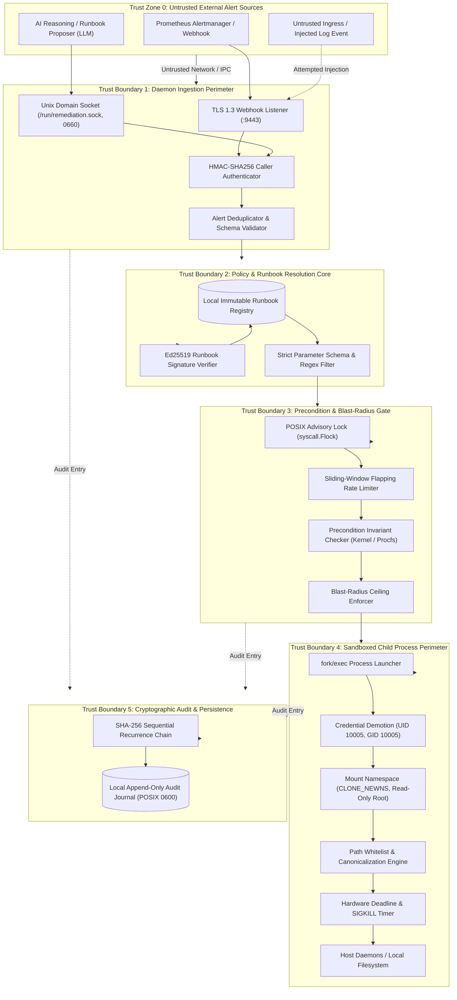

# Security Model, Trust Boundaries & Cryptographic Invariants

## Status
Living Technical Specification / Production Standard

## Domain
Cloud Infrastructure Security / Site Reliability Engineering / Systems Architecture / Cryptographic Systems

## Architectural Thesis
The Autonomous Remediation Engine executes autonomous corrective operations on Linux ARM64 production infrastructure. In accordance with the foundational engineering thesis:

> AI proposes. Deterministic systems enforce.

Under no circumstances is an unconstrained probabilistic model permitted to execute arbitrary commands, resolve system paths, or alter host state. Probabilistic models (whether remote LLM inference clusters or local models) may inspect telemetry, classify anomalies, and propose candidate runbook identifiers with arguments. However, the Autonomous Remediation Engine treats all proposals as completely untrusted input.

Every remediation action is governed by deterministic safety gates:
1. Strict process identity and privilege demotion (UID/GID constraints).
2. Linux kernel namespace isolation and read-only root guarantees.
3. Path canonicalization and directory tree whitelisting to eliminate path traversal and arbitrary deletion attacks.
4. Hard blast-radius bounds on mutated bytes, spawned processes, and execution duration.
5. Invariant contracts verified before (preconditions) and after (postconditions) every mutation.
6. A tamper-evident, append-only SHA-256 cryptographically chained audit ledger.

## Related Specifications and Architecture Documents
- Foundational Philosophy: [00-PROJECT-PHILOSOPHY.md](file:///root/company-project-specs/00-PROJECT-PHILOSOPHY.md)
- System Specification: [08-autonomous-remediation-engine.md](file:///root/company-project-specs/08-autonomous-remediation-engine.md)
- Architecture Specification: [ARCHITECTURE.md](file:///root/autonomous-remediation-engine/docs/ARCHITECTURE.md)
- Threat Model & STRIDE Analysis: [THREAT-MODEL.md](file:///root/autonomous-remediation-engine/docs/THREAT-MODEL.md)
- Reference Security Specification: [SECURITY-BOUNDARIES.md](file:///root/ai-security-guardrail-proxy/docs/SECURITY-BOUNDARIES.md)

---

## 1. Core Security Principles

```
+--------------------------------------------------------------------------------------------------+
|                              ZERO-TRUST REMEDIATION PERIMETER                                    |
|                                                                                                  |
|   +--------------------------+    +--------------------------+    +--------------------------+   |
|   | Deterministic Ingress    |    | Deterministic Core Gate  |    | Sandboxed Execution      |   |
|   | - HMAC-SHA256 Auth       |    | - Ed25519 Signed Runbook |    | - Dropped UID 10005      |   |
|   | - POSIX 0660 Unix Socket |--->| - Flock Mutual Exclusion |--->| - Read-Only Root Mount   |   |
|   | - Rate Damping Clamps    |    | - Precondition Invariant |    | - Path Whitelist Check   |   |
|   | - Alert Canonicalization |    | - Blast-Radius Envelope  |    | - Hard Wall-Clock Cap    |   |
|   +--------------------------+    +--------------------------+    +--------------------------+   |
|                 |                              |                               |                 |
|                 v                              v                               v                 |
|   +------------------------------------------------------------------------------------------+   |
|   |                              CRYPTOGRAPHIC AUDIT LEDGER                                  |   |
|   |      Sequential SHA-256 Hash Chain: H_i = SHA256(H_{i-1} || Ts || ResID || State || Hash) |   |
|   |      WORM Append-Only Storage | POSIX 0600 File Permissions | Non-Repudiable Log         |   |
|   +------------------------------------------------------------------------------------------+   |
+--------------------------------------------------------------------------------------------------+
```

### 1.1 Zero Trust on Ingested Telemetry and LLM Proposals
Every alert, webhook payload, and AI proposal entering the engine is classified as untrusted input:
- **Alert Payloads Untrusted**: Metrics, labels, and error messages originate from distributed services that may be compromised, misconfigured, or subject to log injection attacks.
- **AI Proposals Untrusted**: Proposals from external or local LLMs can contain hallucinated shell commands, parameter tampering, or jailbreaks triggered by adversarial log data.
- **Strict Canonical Validation**: No alert parameter is passed directly to a shell or command execution primitive. Arguments are bound strictly to typed schema variables validated against compile-time regular expressions.

### 1.2 Deterministic Enforcement ("AI Proposes. Deterministic Systems Enforce")
Security decisions and blast-radius gates must be mathematically provable, bounded in algorithmic complexity, and invariant under repetition:
- **No Probabilistic Logic in the Execution Path**: The decision to execute, abort, or roll back an action is made entirely by compiled Go code evaluating boolean preconditions and mathematical invariants.
- **Guaranteed Polynomial-Time Gate Checks**: Precondition evaluations execute in $O(1)$ or $O(K)$ time (where $K$ is the number of static checks, bounded to $K \le 10$). Catastrophic delays on safety checks are architecturally impossible.

### 1.3 Hermetic Execution with Zero External Dependencies
- **Self-Contained Linux Daemon**: The engine runs as a statically compiled ARM64 Linux ELF binary with zero dependencies on external cloud APIs, Docker daemons, or Python/Node runtimes.
- **Survivability Under Partition**: If the host loses network connectivity, DNS resolution, or cloud control-plane access, the engine continues to execute local safety runbooks (e.g. disk capacity remediation, cert renewal) using local system calls.

### 1.4 Verifiable Auditability and Non-Repudiation
- Every state transition in the 11-state remediation state machine emits an immutable, cryptographically chained audit record.
- Historical records cannot be altered, truncated, or reordered without invalidating the mathematical SHA-256 recurrence relation:
  $$H_i = \text{SHA-256}(H_{i-1} \,\|\, \text{Timestamp} \,\|\, \text{ResourceID} \,\|\, \text{State} \,\|\, \text{PayloadDigest})$$

### 1.5 Defense in Depth & Least Privilege
- The daemon demotes execution credentials to an unprivileged dedicated service user (`remediation-agent`, UID 10005, GID 10005) before executing action binaries.
- Where superuser privileges are mandatory (e.g. `systemctl restart service`), execution is restricted to targeted, immutable sudoers entries with full argument locking, forbidding interactive shells.

---

## 2. Trust Boundaries and Threat Surfaces



### 2.1 Boundary 1: Daemon Ingestion Perimeter
- **Physical Interfaces**:
  1. Local Unix Domain Socket: `/run/remediation.sock` with POSIX permissions `0660`, owned by `root:remediation-agent`.
  2. Ingress HTTP Webhook: TLS 1.3 listener on `127.0.0.1:9443` (or private management interface).
- **Threat Surface**: Malformed alert packets, forged alert triggers, packet floods, ReDoS payloads in annotations, replay attacks.
- **Enforcement Mechanisms**:
  - Mutual TLS (mTLS) or shared HMAC-SHA256 secret (`X-Remediation-Signature: sha256=<hex>`) verified using constant-time comparison (`crypto/subtle.ConstantTimeCompare`).
  - Strict payload size limit: `http.MaxBytesReader` configured to $1\text{ MB}$.
  - Ingestion timeout: $2.0\text{s}$ deadline for complete header and body consumption.
  - JSON decoding with `DisallowUnknownFields()` enabled; unknown fields trigger immediate `400 Bad Request`.

### 2.2 Boundary 2: Policy & Runbook Resolution Core
- **Physical Interface**: In-memory registry loaded from local filesystem directory `/etc/remediation/runbooks/`.
- **Threat Surface**: Altered runbook YAML files, malicious parameter binding, unapproved action injection.
- **Enforcement Mechanisms**:
  - Runbooks are signed offline using asymmetric Ed25519 private keys. The public key is compiled directly into the Go daemon binary or stored in `/etc/remediation/pubkey.ed25519` owned by `root:root` with permissions `0400`.
  - The engine verifies the signature of every runbook file prior to registration. Unsigned or modified runbooks cause daemon startup failure or immediate alert escalation.

### 2.3 Boundary 3: Precondition & Blast-Radius Gate
- **Physical Interface**: Host kernel `/proc`, `/sys`, filesystem metadata (`statfs`), and local lock directory `/run/remediation/locks/`.
- **Threat Surface**: Concurrent remediation execution, race conditions, remediation loops (flapping), execution against healthy targets.
- **Enforcement Mechanisms**:
  - Mandatory mutual exclusion: `syscall.Flock(fd, syscall.LOCK_EX | syscall.LOCK_NB)` per target resource.
  - Flapping breaker: hard clamp on execution frequency ($\le 2$ runs per 10 minutes, $\le 4$ runs per hour).
  - Precondition invariants: automated verification that the fault actually exists before spawning any child process.

### 2.4 Boundary 4: Sandboxed Child Process Perimeter
- **Physical Interface**: Linux kernel process execution (`fork/exec`), namespaces, filesystem mounts.
- **Threat Surface**: Arbitrary command injection, shell metacharacter expansion, path traversal (`../../etc/shadow`), unauthorized file unlinking, memory/CPU exhaustion, orphaned zombie processes.
- **Enforcement Mechanisms**:
  - Direct syscall invocation (`execve` without `/bin/sh`). Shell metacharacters (`|`, `;`, `&`, `$`, `` ` ``) are never parsed or evaluated.
  - Process credential demotion: Child processes run as UID 10005 (`remediation-agent`) and GID 10005.
  - Filesystem path whitelisting: Strict canonicalization via `filepath.EvalSymlinks` and prefix matching.
  - Mount namespace isolation: Private mount namespace with root filesystem remounted read-only (`MS_RDONLY`).
  - Wall-clock deadlines: Hard timeout with automatic process group termination via `SIGKILL`.

### 2.5 Boundary 5: Cryptographic Audit & Persistence
- **Physical Interface**: Local disk file `/var/log/remediation/audit.log` (POSIX `0600`).
- **Threat Surface**: Audit modification, retrospective record tampering, repudiation of destructive actions.
- **Enforcement Mechanisms**:
  - Sequential SHA-256 hash chaining.
  - Direct POSIX append operations (`O_APPEND | O_WRONLY | O_CREATE`).
  - Fail-closed write guarantees: If disk space is exhausted or write errors occur, the daemon immediately refuses all mutations.

---

## 3. Strict Sandboxing & OS-Level Isolation Architecture

### 3.1 Process Identity & Privilege Demotion
Running autonomous remediation as root (`UID 0`) is an unacceptable operational risk. A single programming flaw or flawed parameter binding in an action step could destroy the host.

The daemon enforces a strict dual-tier execution model:

```
[Daemon Process (root / UID 0)]  <--- Holds capabilities only for namespaces & flock
              |
              | fork / clone(CLONE_NEWNS | CLONE_NEWPID)
              v
[Child Wrapper: Demotes Credentials]
  - setgroups([])
  - setgid(10005)
  - setuid(10005)
  - prctl(PR_SET_NO_NEW_PRIVS, 1)
  - prctl(PR_SET_PDEATHSIG, SIGKILL)
              |
              v execve(targetBinary, args...)
[Unprivileged Target Action (UID 10005, GID 10005)]
```

#### Linux Privilege Dropping Implementation:
```go
package sandbox

import (
	"fmt"
	"os/exec"
	"syscall"
)

// ConfigureIsolation applies Linux kernel security boundaries to an exec.Cmd.
func ConfigureIsolation(cmd *exec.Cmd, targetUID, targetGID uint32) {
	cmd.SysProcAttr = &syscall.SysProcAttr{
		// Demote process credentials to unprivileged user
		Credential: &syscall.Credential{
			Uid:         targetUID,
			Gid:         targetGID,
			Groups:      []uint32{targetGID},
			NoSetGroups: true,
		},
		// Establish discrete process group for clean group termination
		Setpgid: true,
		// Ensure child process receives SIGKILL immediately if the parent daemon crashes
		Pdeathsig: syscall.SIGKILL,
		// Unshare namespaces to isolate mounts, IPC, and PID trees
		Cloneflags: syscall.CLONE_NEWNS | syscall.CLONE_NEWIPC | syscall.CLONE_NEWPID,
	}
}
```

#### Sudoers Policy for Targeted Privileged Actions:
When an action step requires root authority (e.g., reloading a systemd daemon), it is strictly prohibited from running arbitrary commands. It must invoke a hardened wrapper via `/etc/sudoers.d/remediation` containing exact, immutable argument specifications:

```sudoers
# /etc/sudoers.d/remediation - Strictly bounded execution policy
Defaults:remediation-agent !requiretty
Defaults:remediation-agent secure_path="/usr/sbin:/usr/bin:/sbin:/bin"

remediation-agent ALL=(ALL) NOPASSWD: /usr/bin/systemctl reload ingress-proxy.service
remediation-agent ALL=(ALL) NOPASSWD: /usr/bin/systemctl restart auth-service.service
remediation-agent ALL=(ALL) NOPASSWD: /usr/bin/systemctl restart backend-worker.service
```

### 3.2 Filesystem Path Whitelisting & Traversal Elimination
Remediation actions that perform file cleanup (such as log pruning or cache clearing) present a high risk of path traversal. Attackers can inject strings like `../../etc/shadow` or `/var/lib/postgresql/data` through alert labels.

To eliminate this vulnerability, the engine enforces a three-stage validation pipeline on every candidate file path:

```
[Candidate Path String]
          |
          v Stage 1: Lexical Cleaning (filepath.Clean)
[Cleaned Syntactic Path]
          |
          v Stage 2: Symlink Resolution & Canonicalization (filepath.EvalSymlinks)
[Absolute Canonical Path on Physical Filesystem]
          |
          v Stage 3: Prefix Tree Allowlist Matching against Runbook AllowedPathGlobs
[MATCH: Execute Action]  OR  [MISMATCH: Abort & Escalate (Fail-Closed)]
```

#### Canonical Path Validation Implementation:
```go
package sandbox

import (
	"errors"
	"fmt"
	"path/filepath"
	"strings"
)

var (
	ErrPathForbidden      = errors.New("target path violates security whitelist")
	ErrSymlinkEscape      = errors.New("target path resolves outside allowed directory root")
	ErrForbiddenSystemDir = errors.New("target path intersects forbidden system hierarchy")
)

// ForbiddenSystemPrefixes represents directories that can NEVER be targeted for file mutation.
var ForbiddenSystemPrefixes = []string{
	"/bin", "/boot", "/dev", "/etc", "/lib", "/lib64",
	"/proc", "/root", "/run", "/sbin", "/sys", "/usr",
	"/var/lib",
}

// ValidateSandboxedPath verifies that a target path resides strictly inside an allowed directory.
func ValidateSandboxedPath(targetPath string, allowedPrefixes []string) (string, error) {
	// 1. Syntactic cleaning
	cleaned := filepath.Clean(targetPath)
	if !filepath.IsAbs(cleaned) {
		return "", fmt.Errorf("path must be absolute: %s", targetPath)
	}

	// 2. Resolve all symbolic links to determine physical on-disk location
	canonical, err := filepath.EvalSymlinks(cleaned)
	if err != nil {
		return "", fmt.Errorf("failed to evaluate symlinks for %s: %w", cleaned, err)
	}

	// 3. Blacklist check against critical operating system roots
	for _, forbidden := range ForbiddenSystemPrefixes {
		if canonical == forbidden || strings.HasPrefix(canonical, forbidden+"/") {
			// Exception: explicit /etc/ssl/certs cert renewal allowed if explicitly whitelisted
			if !strings.HasPrefix(canonical, "/etc/ssl/certs/") {
				return "", fmt.Errorf("%w: %s matches forbidden root %s", ErrForbiddenSystemDir, canonical, forbidden)
			}
		}
	}

	// 4. Whitelist check against runbook allowed prefixes
	matched := false
	for _, allowed := range allowedPrefixes {
		cleanAllowed := filepath.Clean(allowed)
		if canonical == cleanAllowed || strings.HasPrefix(canonical, cleanAllowed+string(filepath.Separator)) {
			matched = true
			break
		}
	}

	if !matched {
		return "", fmt.Errorf("%w: path %s not within allowed prefixes %v", ErrPathForbidden, canonical, allowedPrefixes)
	}

	return canonical, nil
}
```

### 3.3 Read-Only Root & Mount Namespace Guarantees
During child process invocation, the execution sandbox creates a private mount namespace using Linux `CLONE_NEWNS`. Inside this namespace:
1. The root filesystem (`/`) is remounted as strictly read-only (`MS_RDONLY | MS_BIND | MS_REMOUNT`).
2. Only explicitly declared temporary spool directories (e.g. `/tmp/remediation-spool/`) are mounted as writable `tmpfs`.
3. Even if a child process binary is hijacked or attempts unauthorized file modifications, the Linux kernel rejects the write system calls with `EROFS` (Read-only file system).

---

## 4. Blast-Radius Bounds & Safety Contracts

Every automated action executed by the daemon is constrained within an immutable mathematical envelope known as the **Blast-Radius Safety Contract**. If any action violates or attempts to exceed these bounds, the execution engine terminates the process immediately.

```
+--------------------------------------------------------------------------------------------------+
|                                    BLAST-RADIUS ENVELOPE                                         |
|                                                                                                  |
|   1. MUTATION CEILING:       MaxDeletedBytes <= 524,288,000 (500 MB)                             |
|   2. PROCESS FORK CEILING:   MaxSpawnedPIDs <= 10 (cgroups pids.max)                             |
|   3. EXECUTION DEADLINE:     TimeoutSeconds <= 30.0s (SIGKILL enforcement)                       |
|   4. DAMPING FREQUENCY:      Count(Runs, 1hr) <= 4, Cooldown >= 300s                             |
|   5. CONCURRENCY:            MaxActiveRemediations == 1 per Physical Resource                   |
+--------------------------------------------------------------------------------------------------+
```

### 4.1 Maximum Mutation Bounds (Bytes Deleted or Modified)
For remediation tasks performing disk reclamation or file transformation:
- **Hard Ceiling**: Maximum allowable deletion or mutation volume per execution is $500\text{ MB}$ ($524,288,000\text{ bytes}$).
- **Pre-Execution Estimation**: Before issuing deletions, the engine scans the target directory and aggregates candidate file sizes. If the calculated deletion total exceeds $B_{\text{max}}$, execution is halted in state `PRECHECK_FAILED`.
- **Runtime Tracking**: In-process file unlinking updates an atomic byte counter. If the counter reaches $B_{\text{max}}$, subsequent unlinks are aborted, and the engine evaluates postconditions on the partially pruned set.

### 4.2 Process Fork Clamps (Cgroups v2 `pids.max`)
To prevent fork bombs or runaway script cascades:
- Child processes are assigned to an ephemeral remediation cgroup (`/sys/fs/cgroup/remediation/worker-<id>`).
- The kernel parameter `pids.max` is clamped to $10$.
- Any attempt by the child process or its subprocesses to fork beyond 10 total tasks is blocked by the kernel with `EAGAIN`.

### 4.3 Hard Wall-Clock Deadlines & Termination Ladder
To guarantee that remediation cannot hang indefinitely on blocking network calls, hung disk I/O, or uninterruptible locks:
- Every runbook declares an explicit `timeout_seconds` attribute (default: $15\text{s}$, maximum: $30\text{s}$).
- The execution engine implements a two-stage termination ladder:
  1. **$t = T_{\text{timeout}} - 2.0\text{s}$**: Send `SIGTERM` to the child process group (`-pgid`), allowing graceful file buffer flushes.
  2. **$t = T_{\text{timeout}}$**: Send uncatchable `SIGKILL` to the child process group (`-pgid`), instantly reclaiming CPU and memory.

### 4.4 Rate Limits on Remediation Frequency (Damping & Flapping)
To prevent infinite flapping and destructive oscillation:
- Let $R$ be the unique target resource identifier (e.g. `service:ingress-proxy`, `/var/log`).
- The engine enforces three mathematical rate bounds:
  $$\text{Executions}(R, \text{Window}=10\text{m}) \le 2$$
  $$\text{Executions}(R, \text{Window}=60\text{m}) \le 4$$
  $$t_{\text{current}} - t_{\text{last\_execution}}(R) \ge 300\text{s}$$
- Violation of any bound immediately trips the flapping breaker, suppressing further actions on $R$ for $3600\text{ seconds}$ and paging on-call staff.

---

## 5. Precondition and Postcondition Invariant Contracts

Remediation without deterministic verification is an anti-pattern. Every runbook is defined as a formal mathematical contract:

$$\mathcal{C} = \Big(\mathcal{P}_{\text{pre}}, \; \mathcal{A}, \; \mathcal{P}_{\text{post}}, \; \mathcal{R}\Big)$$

where:
- $\mathcal{P}_{\text{pre}}$ is the set of required initial environmental invariants.
- $\mathcal{A}$ is the bounded, sandboxed execution sequence.
- $\mathcal{P}_{\text{post}}$ is the set of required terminal environmental invariants.
- $\mathcal{R}$ is the inverse compensating rollback sequence.

```
       [Fault Event Detected]
                 |
                 v
   +---------------------------+
   | Precondition Verification | ===(Preconditions False)===> [ABORT & ESCALATE]
   +---------------------------+
                 | (All Invariants True)
                 v
   +---------------------------+
   | Sandboxed Action Sequence | ===(Execution Error)=======> [TRIGGER ROLLBACK]
   +---------------------------+
                 | (Exit Code 0)
                 v
   +---------------------------+
   | Postcondition Verification| ===(Invariants Unmet)======> [TRIGGER ROLLBACK]
   +---------------------------+
                 | (All Invariants True)
                 v
   +---------------------------+
   | Commit to Audit Ledger    |
   +---------------------------+
```

### 5.1 Precondition Invariant Catalog

Preconditions ensure that the incident is genuine and that the host is in an expected, remediable state before any mutation occurs:

| Invariant Type | Kernel / System Probe | Condition Evaluated | Safety Purpose |
| :--- | :--- | :--- | :--- |
| `disk_free_pct` | `syscall.Statfs(mountPoint, &stat)` | $\frac{\text{stat.Bavail}}{\text{stat.Blocks}} \times 100 < \text{Threshold}$ | Prevents pruning files when disk space is already adequate. |
| `unit_active` | Systemd D-Bus / `systemctl is-active` | $\text{UnitState} \ne \text{"active"}$ | Prevents restarting healthy, running production services. |
| `cert_expiry_days` | Parse X.509 cert in target path | $(\text{NotAfter} - \text{Now}) < \text{ThresholdDays}$ | Prevents unnecessary certificate renewal operations. |
| `file_exists` | `os.Stat(targetPath)` | File exists and is regular file | Confirms rollback binaries or configuration targets exist. |
| `tcp_probe` | `net.DialTimeout("tcp", addr, timeout)` | Connection fails or returns HTTP 5xx | Confirms network service degradation before intervening. |

### 5.2 Postcondition Invariant Verification

Postconditions verify that the action achieved its intended outcome. If any postcondition evaluates to `false`, the remediation is declared a failure, and rollback is triggered immediately:

```go
package invariants

import (
	"context"
	"crypto/x509"
	"encoding/pem"
	"fmt"
	"os"
	"syscall"
	"time"
)

// EvaluateDiskFree verifies that the free disk space percentage exceeds threshold.
func EvaluateDiskFree(mountPoint string, minFreePct int64) (bool, error) {
	var stat syscall.Statfs_t
	err := syscall.Statfs(mountPoint, &stat)
	if err != nil {
		return false, fmt.Errorf("statfs failed for %s: %w", mountPoint, err)
	}

	if stat.Blocks == 0 {
		return false, fmt.Errorf("statfs returned zero total blocks for %s", mountPoint)
	}

	freePct := int64(stat.Bavail * 100 / stat.Blocks)
	return freePct >= minFreePct, nil
}

// EvaluateCertExpiry verifies that a certificate's remaining lifetime exceeds thresholdDays.
func EvaluateCertExpiry(certPath string, minRemainingDays int64) (bool, error) {
	rawPEM, err := os.ReadFile(certPath)
	if err != nil {
		return false, fmt.Errorf("failed to read cert file %s: %w", certPath, err)
	}

	block, _ := pem.Decode(rawPEM)
	if block == nil {
		return false, fmt.Errorf("failed to parse PEM block from %s", certPath)
	}

	cert, err := x509.ParseCertificate(block.Bytes)
	if err != nil {
		return false, fmt.Errorf("failed to parse x509 certificate: %w", err)
	}

	remainingDuration := time.Until(cert.NotAfter)
	remainingDays := int64(remainingDuration.Hours() / 24)

	return remainingDays >= minRemainingDays, nil
}
```

### 5.3 Rollback Coordinator & Non-Reversible Operations
When an action step fails or a postcondition check fails:
1. **Reversible Actions**: If the runbook defined compensating steps (e.g. reverting a configuration symlink, restoring a binary backup), the `RollbackCoordinator` executes them in reverse order ($S_n, S_{n-1}, \dots, S_1$).
2. **Non-Reversible Actions (Unlink Operations)**: Certain operations (such as unlinking rotated log files) cannot be restored from a local undo buffer. For non-reversible actions:
   - The runbook must enforce a pre-execution staged quarantine or verify that target files are expendable archives (`*.gz`).
   - If postconditions fail after a non-reversible action, the engine transitions immediately to `ESCALATED`, freezes the resource, and pages human operators.

---

## 6. Fail-Closed vs. Fail-Open Policy Matrix

The Autonomous Remediation Engine enforces a strict, system-wide **Fail-Closed** security posture. Under no circumstances does a failure, panic, or unhandled exception permit unverified state changes.

| Pipeline Subsystem | Failure Condition | Enforcement Policy | Emitted State | System Recovery Procedure |
| :--- | :--- | :--- | :--- | :--- |
| **Ingress Webhook** | Invalid HMAC signature or unknown key | **FAIL-CLOSED** | Socket Closed / 401 | Payload dropped; security event logged to audit chain. |
| **Alert Normalizer** | JSON parsing error or unmarshaling failure | **FAIL-CLOSED** | Socket Closed / 400 | Discard payload; no state allocated or mutated. |
| **Runbook Resolver** | Runbook file modified or Ed25519 signature bad | **FAIL-CLOSED** | `ESCALATED` | Refuse execution; alert SRE team of runbook tampering. |
| **Resource Lock** | Target resource lockfile held by another process | **FAIL-CLOSED** | Abort Request | Discard alert; primary execution retains sole mutation right. |
| **Damping Breaker** | Execution count exceeds limit (>4 per hour) | **FAIL-CLOSED** | `PRECHECK_FAILED` | Freeze automated actions on resource; escalate to on-call. |
| **Precondition Gate** | Invariant check returns false or times out | **FAIL-CLOSED** | `PRECHECK_FAILED` | Abort remediation; release resource lock; emit audit record. |
| **Execution Engine** | Child process times out or returns exit code $\ne 0$ | **FAIL-CLOSED** | `POSTCHECK_FAILED` | Kill child process tree with SIGKILL; initiate rollback. |
| **Postcondition Gate** | Post-mutation environment fails invariant test | **FAIL-CLOSED** | `POSTCHECK_FAILED` | Initiate compensating rollback steps; escalate to human. |
| **Rollback Manager** | Compensating rollback step fails or times out | **FAIL-CLOSED** | `ESCALATED` | Emergency halt; raise critical Sev-1 incident to on-call. |
| **Audit Ledger** | Disk full or filesystem permission error | **FAIL-CLOSED** | Engine Lock | Refuse all further remediation mutations until ledger healthy. |

---

## 7. Cryptographic Invariants Summary

The security architecture of the Autonomous Remediation Engine is anchored in four formal mathematical invariants:

1. **Runbook Cryptographic Authenticity ($I_{\text{Sig}}$)**:
   $$\forall \text{ Runbook } R, \quad \text{Verify}_{\text{Ed25519}}(K_{\text{pub}}, \; \text{Digest}(R), \; \text{Sig}(R)) = \text{True}$$
   No runbook may be executed unless its static definition is cryptographically validated against the authoritative public key.

2. **Filesystem Sandbox Containment ($I_{\text{Path}}$)**:
   $$\forall p \in \text{TargetPaths}, \quad \text{EvalSymlinks}(p) \subseteq \bigcup_{i} \text{AllowedPrefix}_i \quad \land \quad \text{EvalSymlinks}(p) \cap \text{ForbiddenRoots} = \emptyset$$
   No file operation may escape the declared directory boundaries or intersect forbidden operating system hierarchies.

3. **Blast-Radius Invariant ($I_{\text{Blast}}$)**:
   $$\text{BytesMutated} \le B_{\text{max}} \quad \land \quad \text{PIDsSpawned} \le P_{\text{max}} \quad \land \quad \text{Duration} \le T_{\text{max}}$$
   Resource consumption and system mutations are strictly bounded by compile-time and runbook ceilings.

4. **Audit Ledger Chaining Invariant ($I_{\text{Ledger}}$)**:
   $$\forall j \ge i, \quad \text{SHA-256}(H_{j-1} \,\|\, \text{EntryData}_j) = H_j \implies \text{Record } L_i \text{ is immutable and verified}$$
   No entry in the audit history can be modified, removed, or inserted without breaking the cryptographic hash chain.

---

## 8. Automated Verification & Compliance Reference Tool

The verification tool is implemented as a standalone CLI in standard Go 1.23+ with zero dependencies:

```go
package main

import (
	"bufio"
	"crypto/sha256"
	"encoding/hex"
	"encoding/json"
	"fmt"
	"io"
	"os"
)

type LedgerRecord struct {
	Seq            uint64 `json:"seq"`
	Timestamp      string `json:"timestamp"`
	HostUUID       string `json:"host_uuid"`
	ResourceID     string `json:"resource_id"`
	RunbookID      string `json:"runbook_id"`
	State          string `json:"state"`
	PayloadDigest  string `json:"payload_digest"`
	PrevRecordHash string `json:"prev_record_hash"`
	RecordHash     string `json:"record_hash"`
}

func main() {
	if len(os.Args) < 2 {
		fmt.Fprintf(os.Stderr, "Usage: %s <audit.log>\n", os.Args[0])
		os.Exit(1)
	}

	filePath := os.Args[1]
	file, err := os.Open(filePath)
	if err != nil {
		fmt.Fprintf(os.Stderr, "Error opening audit log: %v\n", err)
		os.Exit(1)
	}
	defer file.Close()

	scanner := bufio.NewScanner(file)
	var expectedPrevHash string
	var expectedSeq uint64 = 0

	for scanner.Scan() {
		line := scanner.Bytes()
		if len(line) == 0 {
			continue
		}

		var rec LedgerRecord
		if err := json.Unmarshal(line, &rec); err != nil {
			fmt.Fprintf(os.Stderr, "Malformed JSON at sequence %d: %v\n", expectedSeq, err)
			os.Exit(2)
		}

		if rec.Seq != expectedSeq {
			fmt.Fprintf(os.Stderr, "Sequence discontinuity: expected %d, got %d\n", expectedSeq, rec.Seq)
			os.Exit(3)
		}

		if expectedSeq > 0 && rec.PrevRecordHash != expectedPrevHash {
			fmt.Fprintf(os.Stderr, "Hash chain break at seq %d: prev hash %s != expected %s\n",
				rec.Seq, rec.PrevRecordHash, expectedPrevHash)
			os.Exit(4)
		}

		// Recompute hash
		h := sha256.New()
		h.Write([]byte(rec.PrevRecordHash))
		h.Write([]byte(rec.Timestamp))
		h.Write([]byte(rec.ResourceID))
		h.Write([]byte(rec.State))
		h.Write([]byte(rec.RunbookID))
		h.Write([]byte(rec.PayloadDigest))
		computed := hex.EncodeToString(h.Sum(nil))

		if computed != rec.RecordHash {
			fmt.Fprintf(os.Stderr, "Hash mismatch at seq %d: computed %s != recorded %s\n",
				rec.Seq, computed, rec.RecordHash)
			os.Exit(5)
		}

		expectedPrevHash = rec.RecordHash
		expectedSeq++
	}

	if err := scanner.Err(); err != nil {
		fmt.Fprintf(os.Stderr, "Scanner error: %v\n", err)
		os.Exit(1)
	}

	fmt.Printf("Audit ledger verified successfully. Total records checked: %d. Chain intact.\n", expectedSeq)
}
```
